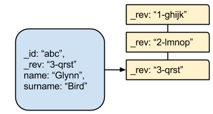
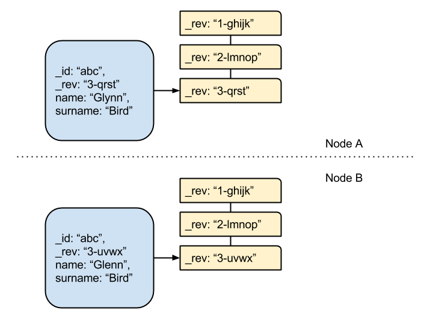
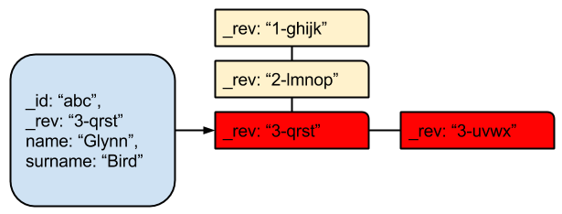

This is the first of a three-part blog series on how to deal with conflicts in the IBM Cloudant JSON document store. This blog assumes you have a working knowledge of Cloudant's database, and its API.

In part one, we introduce the concept of a document conflict, describe what it looks like, and explain what happens if conflicts are left unresolved. Later in this series, we show how to tidy up conflicts, and discuss how they can be avoided.

## Introduction

Cloudant allows data to be stored as JSON documents in a highly-resilient cluster of connected nodes. Cloudant's HTTP interface can be accessed natively through a web browser, through an interactive dashboard, or through programming languages for most platforms. Cloudant is a distributed system, with Replication at it's heart. It enables mobile developers to replicate their data to portable devices, and allows data to be replicated across the globe. The effect is similar to a content delivery network (CDN) for your data.

The [Consistency, Availability and Partition tolerance (CAP)](https://en.wikipedia.org/wiki/CAP_theorem) theorem states that a distributed system can have only two of the three characteristics. In Cloudant, Consistency is sacrificed in favour of availability and partition tolerance. Specifically, Cloudant is an eventually consistent database, which means that no locking occurs when data is written. This characteristic enables the system to offer best-of-class uptime and scalability.

In order to keep the service available at all times, Cloudant must allow the same document id to be altered on different nodes in the database. To reconcile the data, Cloudant maintains a revision history for every document in the database. This is a timeline of changes to the document; not the document body itself, only a history of the revision tokens:



In this example, document "abc" has had three revisions. The revision token is made up of a sequential number and a hash of the document content. For convenience, a shortened version of the hash appears in the diagram.

One of the consequences of eventual consistency is that documents might enter a conflicted state if the **same version of a document is modified in different ways on two disconnected nodes**. An exception is where the change made on the two nodes is the same change, to the same revision of the document. In this case, no conflict is generated, because the hash remains the same.



In the above example there are two Cloudant databases (A and B) that are not connected. They both have the same document, with identical revision histories for revisions 1 and 2. At revision 3, the databases diverged. If we replicate database A to B, or alternatively replicate database B to A (in Cloudant, bi-directional replication is simply two separate replication processes in opposite directions), then the document enters a conflicted state:



## How Can Conflicts Arise in Your Application?

The three scenarios below are essentially descriptions of the same thing, but with different application architectures:

### Mobile apps

Many Cloudant customers create one database for every one of their users. This architecture is especially suited to mobile app developers as it allows the app to continue to function offline and can sync its data to the cloud whenever it is connected. A document might become conflicted if it is modified on the app (via the phone) and on Cloudant itself (via a web dashboard, for example) and then the two copies are subsequently synced.

### Replication

A Cloudant customer might have two clusters hosted in separate geographic locations. The clusters are connected by continuous replication. If the same document is modified in each cluster while the inter-site connection is down, a conflict is recorded when the clusters are reconnected.

### Race condition

Even in a small Cloudant cluster, a conflict can arise if changes to the same document are sent to two nodes at the same time.

## What Does A Conflict Look Like?

Normally, when retrieving a single document, we would receive only the latest revision:

```
GET /mydb/0f900fc85f2c5249759d9dd939b9c080 
{
  "_id": "0f900fc85f2c5249759d9dd939b9c080",
  "_rev": "3-cb1624f72667f6f0378d628e0e065f24",
  "name": "Glynn Bird",
  "age": 24
 }
 ```

If we additionally pass in the parameter ?conflicts=true, Cloudant will return the document and a list of conflicting revision tokens:

```
GET /mydb/0f900fc85f2c5249759d9dd939b9c080?conflicts=true 
{
  "_id": "0f900fc85f2c5249759d9dd939b9c080",
  "_rev": "3-cb1624f72667f6f0378d628e0e065f24",
  "name": "Glynn Bird",
  "age": 24,
  "_conflicts": [
    "3-ba7697cffda8cdfdfc63267473ffaf7d"
  ]
}
```

If no _conflicts parameter is returned, then the document is conflict-free.

## What Happens If I Ignore Conflicts In My Database?

Cloudant continues to serve out the documents as before, but if a conflict occurs:

- Cloudant returns what it considers to be the "winning" revision while retaining the "non-winning" revisions internally. The algorithm that determines the winner is deterministic; different nodes with the same conflict scenario will return the same winner but the revision that Cloudant considers to be the winner may not be your idea of the winner. Your application should either resolve the conflicts as they arise to publish the document that your application needs, or should adopt a design pattern that avoids the generation of conflicts in the first place.
- the database's size is inflated because Cloudant keeps the bodies of unresolved conflicts in full.
- performance suffers if there are many conflicts in the same document.

It is good practice, as an application developer, to deal with any conflicts that arise in your documents. The benefit is a reduction in data size, and an optimised performance.

In [Part Two](/blog/2015-01-20-introduction-to-conflicts-part-two/) of this series, we'll return to this subject, and show how conflicts can be dealt with in your application.
