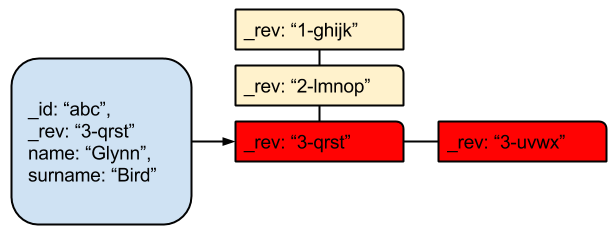
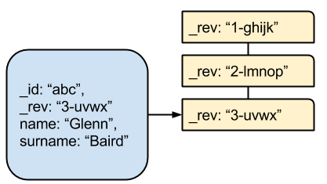

---

title: Introduction to Conflicts - 2/3
pubDate: 2015-01-20T09:00:00.000Z
description: Detecting and resolving Cloudant document conflicts.
heroImage: ../../assets/cloudvisual-208962-unsplash.jpg
relCanonical: https://blog.cloudant.com/2015/01/20/Introduction-to-Conflicts-Part-Two.html
---


In [Part One](/blog/2015-01-12-introduction-to-conflicts-part-one/) of this series we looked at:

- what are document conflicts in Cloudant?
- how do they arise?
- what does a conflict look like?
- the consequences of conflicts

In this blog we will discuss how we can detect conflicts and how we should go about resolving them.

Conflicts are most often a natural side-effect of having a distributed database architecture. Conflicts retain the history of a document, keeping versions of a document that has been modified in different ways on two independent systems (e.g on a mobile app & on the server). It is the application's responsibility to detect the conflicts and resolve them.

## Detecting Conflicts - Piecemeal

When fetching single documents, simply adding `?conflicts=true` will ask Cloudant to additionally return a `_conflicts` key, listing conflicting revisions:

```
GET /mydb/0f900fc85f2c5249759d9dd939b9c080?conflicts=true

{
    "_id": "0f900fc85f2c5249759d9dd939b9c080",
    "_rev": "3-cb1624f72667f6f0378d628e0e065f24",
    "name": "Glynn Bird",
    "age": 24,
    "_conflicts": [
        "3-ba7697cffda8cdfdfc63267473ffaf7d"
    ]
}
```

If we fetch the document again, but this time with the parameter `?open_revs=all`, Cloudant will return an array of the conflicting documents, including their bodies:

```
GET /mydb/0f900fc85f2c5249759d9dd939b9c080?open_revs=all
[
  {
    "ok": {
      "_id": "0f900fc85f2c5249759d9dd939b9c080",
      "_rev": "3-ba7697cffda8cdfdfc63267473ffaf7d",
      "name": "Glenn Bard",
      "age": 24
    }
  },
  {
    "ok": {
      "_id": "0f900fc85f2c5249759d9dd939b9c080",
      "_rev": "3-cb1624f72667f6f0378d628e0e065f24",
      "name": "Glynn Bird",
      "age": 24
    }
  }
]
```

## Detecting Conflicts – Bulk

To detect which of the documents in your database are conflicted requires a map/reduce view to be created:

```
map:
  function(doc) {
    if (doc._conflicts) {
      emit(null, null);
    }
  }

reduce:
  _count
```

We can then use this view to:

- determine the number of documents in conflict
- fetch a list of document ids whose conflicts need resolving

For example, a script could page through the documents in the view, resolving the conflicts as it goes.

## How Do I Resolve A Conflict?

Resolution of a conflict is to:

- delete the conflicting revisions
- optionally, post a new version of the document (e.g. a document that you consider to be the winner)



In the above example, if we decided that "3-uvwx" should be the winning revision, all we would have to do is delete revision "3-qrst" which would leave the document without conflicts, restoring revision "3-uvwx" to the head of the revision list (as it is the only remaining "revision 3"):

```
DELETE "/test/abc?rev=3-qrst"
```



## Resolving Conflicts In Bulk

In more complicated examples, where there are lots of conflicts to fix, it is more efficient to delete the unwanted revisions in bulk:

```
POST /test/_bulk_docs
{ "docs": [ 
    { "_id": "abc", "_rev": "3-uvwx", "_deleted": true}, 
    { "_id": "abc", "_rev": "2-qrst", "_deleted": true} 
  ]
}
```

N.B. this technique is only useful if you are deleting conflicting revisions that are not the "winning" revision and should be limited to a maximum of 500 deletions per request.

## Conflict Resolution Strategies

Most often, resolution of a conflict isn't as simple as removing old conflicting revisions; that is simply destroying data. What if the old revisions contain something you want to keep? What if you need to merge two documents together?

That is where Cloudant respectfully says "that is an application-specific" problem. In other words, Cloudant will never try to merge two JSON documents together to form a hybrid.

Imagine an email application. There is a mobile application with a synced copy of an inbox and a copy of the same inbox on the server. What should happen if an item is marked "read" on the server and "unread" on the phone? The answer is that only your application can make that decision.

Your application should have a conflict resolution algorithm (perhaps with a suite of automated tests); a sandbox where all of the possible conflict scenarios can be simulated and solved in a way that makes sense to your application. Options include:

timestamp each document. When a conflict arises, always favour the most recent change
if your application has different levels of user access, discard 'standard' user edits over 'admin' user changes
if your document schema is suitable, data can be merged from conflicting revisions
or a combination of the above; it's up to you
Conflicts are not an error condition, they are the result of your infrastructure allowing the same data set to be modified across disconnected systems. The introduction of such conflicts in such a topology is the expected behaviour and their programmatic resolution is a core piece of application logic.


## But I'm Getting Conflicts And I'm Not Even Using Replication!

Even on a Cloudant cluster, with no replication to remote databases, conflicts can arise if the same document is updated in different ways on two nodes, before the two nodes have had chance to communicate with each other.

The solution to that problem is subject of the [Part Three](/blog/2015-01-26-Introduction-to-Conflicts-Part-Three/) of this series, we'll look at ways you can avoid conflicts arising in the first place by employing conflict-proof design patterns.
