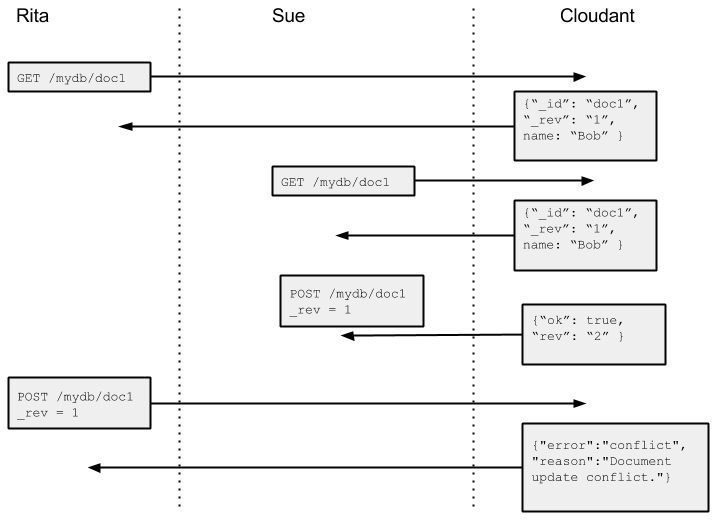

In [Parts One](/blog/2015/01/12/introduction-to-conflicts-part-one.html/) and [Two](/blog/2015/01/20/introduction-to-conflicts-part-two/) of this series, we looked at:

- what are document conflicts in Cloudant?
- how do they arise?
- what does a conflict look like?
- the consequences of conflicts
- how to detect conflicts singly and in bulk
- how to resolve conflicts

If your application replicates data between Cloudant and mobile device and the data is allowed to be modified (like an email inbox), then conflicts will arise in your application when the two replicas are combined, and the resolution of those conflicts is your application's responsibility.

Some Cloudant users are surprised to find conflicts arising in their application even when they are not replicating to and from a remote database. It is this manifestation of conflicts that we will be addressing in this post.

But first, we should answer the question "what is a 409"?

## I'm Getting A HTTP 409 Error When I Try To Write A Document

Imagine your application pulls a document from a Cloudant database (say revision 1), makes a change to the document and posts the new document back to Cloudant, but Cloudant replies back with a HTTP 409 status code and the message

```js
{"error":"conflict","reason":"Document update conflict."}
```

This means that the document (id + revision) you are trying to edit has already been updated and your change has been rejected. This isn't a conflict as such (the conflict is not stored in the database), it is Cloudant preventing a conflicting revision from happening in the first place by indicating to you that you are trying to modify an old version of the document.

This set of circumstances is visualised in the diagram below:



In the time it has taken Rita to fetch the document and post a new revision, Sue has beaten her to it and posted her own change first. In order for Rita to commit her change, she needs to:

- pull the document again, to get the latest revision (revision 2)
- apply the change to the document (assuming it doesn't clash with Sue's change)
- write a third revision of the document

If this is happening frequently, or indeed if you find you're modifying the same document over and over, then you may want to consider a different approach.

## Preventing Conflicts By Design

If your application is the recording of website events in a Cloudant database, it is tempting to design a schema like this:

```js
{
  "website": "http://mydomain.com",
  "impressions": 70252,
  "visitors": 1556,
  "avg_page_delivery_time": 0.52
}
```

As each page view occurs, you increment the "impressions" element of the document. This is a bad way to store data in Cloudant because:

- every write requires the client to read the document before it can be updated
- with even a moderate amount of traffic, 409s will start to occur as reads and writes overlap each other
- conflicts will be created and stored because different Cloudant nodes will accept a revision before data is synced between nodes

A better way to store such data is to store one document per event:

```js
{
   "date": "2014-11-01 23:59:02 UTC",
   "website": "http://mydomain.com",
   "event_type": "impression",
   "delivery_time": 0.3
}
```

We can then create a design document to create materialized views of data. e.g.

- page impression counts grouped hierarchically by year/month/day/hour etc
- average/min/max page delivery times by time
- total traffic breakdown by site and time

Storing the events is simplified because data is only ever written to the database meaning that document conflicts can never occur. This write-only design pattern is used widely with Cloudant e.g.

- a blogging platform, instead of having one document per post (a document which is updated every time the post is modified), could have a document for each version of the post. Not only does this avoid conflicts, it gives a persistent revision history for each post. (Although Cloudant maintains revision tokens for each document change, document revisions cannot be relied on to provide rollback or a full revision history)
- a cache framework, instead of having one document per cache key (which is updated as the key's value changes), could have one document for each version of the key. A timestamp in the document would allow the latest key/value pair to be extracted.

## Conclusion

Cloudant is a distributed database built to store data at a massive scale, whether through volume of data or concurrent user count. To be able to scale out horizontally, Cloudant imposes no locking of documents between nodes. Each shard of the database acts independently of each other, allowing your service to be always-available and able to survive a network partition.

A by-product of this is that when disconnected nodes finally communicate, a document may have been modified in a different way on separate nodes. A conflict is stored in the document, with a copy of each competing revision and the application is able resolve the conflict with no data loss.

Mobile applications need this flexibility because if a mobile phone had to connect to the internet for every operation then it would not be able to function offline, in a tunnel or with flaky reception. Cloudant's conflict storage mechanism allows you to build intelligent mobile applications, collecting data offline and syncing with the cloud when an internet connection is available.

In some cases, document conflicts can be avoided altogether by adopting a write-only design pattern and using Cloudant Query or Map/Reduce views to aggregate the data on a massive scale.
