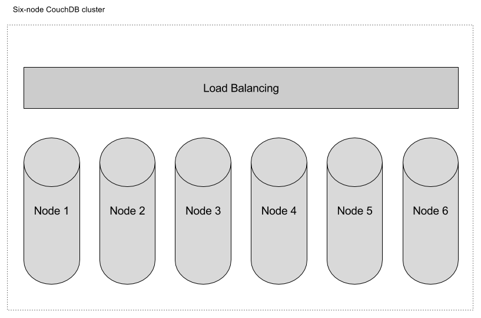
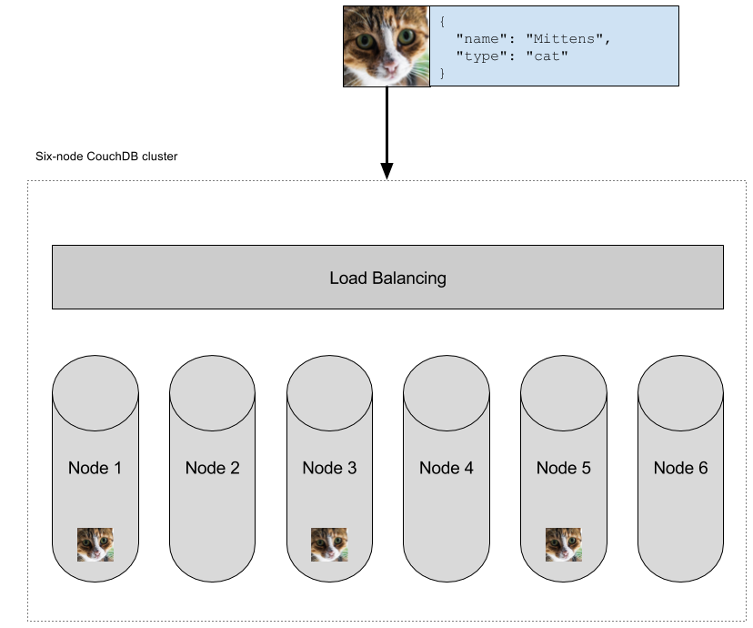
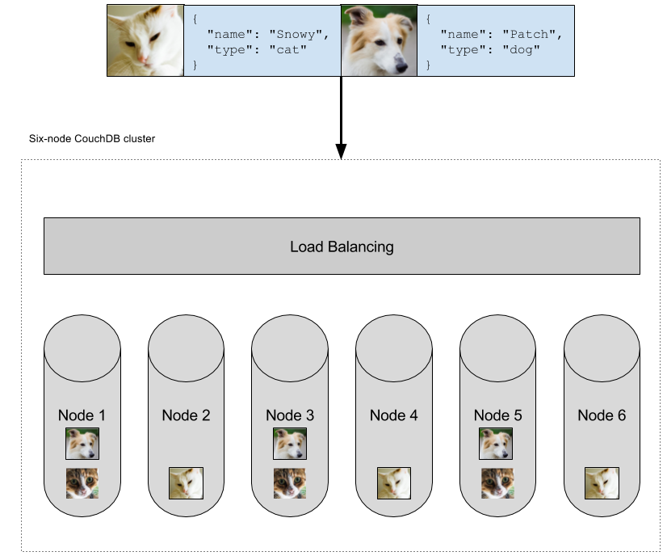
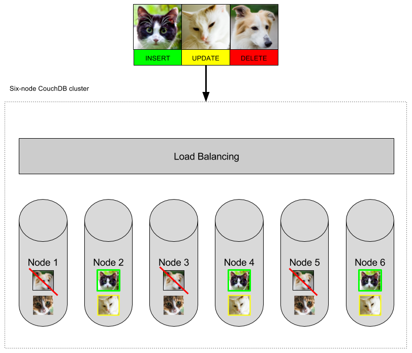

There are many different deployment models for CouchDB-style databases, but thankfully [CRUD operations](https://en.wikipedia.org/wiki/Create,_read,_update_and_delete) work the same across all of them. Apache CouchDB&trade; is a database, specifically a JSON document store, with an HTTP API. IBM Cloudant is Apache CouchDB with a few extra bells and whistles run as-a-service in pay-as-you go, dedicated and local configurations.

In this article, I'm going to explain your options for writing data using the CouchDB API, the different calls, and the tradeoffs therein. First, however, it will help to understand the basics of CouchDB as a distributed system, and what the database means when it says your writes are written.

## CouchDB clusters 101

A CouchDB cluster is a distributed system that exposes a single API&mdash;you treat your CouchDB cluster as a single data store, but behind the scenes your database is divided into *shards* and multiple copies of your documents are stored on separate machines.



The larger the number of nodes in the cluster, the greater the volume of data and the number of concurrent requests it can handle.

When you write data to a CouchDB cluster (or a Cloudant service), by default, two or more copies of your document are persisted **on disk** (for example, on 2 or more machines in a 3-node cluster). Other database systems may give you the thumbs-up to your write requests *before* the data is written to disk as a speed optimisation&mdash;behaviour that risks data loss in the event of a node failure.

Now that you know the basics of what's happening behind the scenes, I'll cover the API calls that allow you to write data to CouchDB and the options you have that trade-off storage guarantees and performance.

## Piecemeal writes

Writing data to CouchDB is simply an HTTP POST request:

```sh
curl -v -X POST \
     -H 'Content-type: application/json' \
     -d '{"name": "Mittens", "type": "cat"}' \
     "$COUCH_URL/animals"

HTTP/1.1 201 Created
Cache-Control: must-revalidate
Content-Length: 95
Content-Type: application/json
Date: Fri, 02 Jun 2017 06:33:08 GMT
Location: http://localhost:5984/animals/

{"ok":true,"id":"7bff55e2a7f9fa3a999c1f76bd00044b","rev":"1-76558a77771fb4c1f81d4d91144dc83f"}
```

Here, I POST a JSON document to my database, and the reply indicates the auto-generated `id` of the document that was created. The "201" response code indicates success and guarantees that the document was stored on a [quorum of servers](https://en.wikipedia.org/wiki/Quorum_(distributed_computing)) in the cluster (at least 2 of 3, in this case).



This process is important for mission-critial data. It means that if the servers were abruptly powered off, your data would be safe on disk on mulitple machines. 

## Bulk writes

If you have lots of data to write to the database, then a single bulk API request is more efficent than making several individual API calls. More efficicent in terms of fewer HTTP round trips, and more efficient for the database cluster too:

```sh
curl -v -X POST \
     -H 'Content-type: application/json' \
     -d '{"docs": [{"name": "Snowy", "type": "cat"},{"name": "Patch", "type": "dog"}]}' \
     "$COUCH_URL/animals/_bulk_docs"

HTTP/1.1 201 Created
Cache-Control: must-revalidate
Content-Length: 192
Content-Type: application/json
Date: Fri, 02 Jun 2017 06:44:45 GMT

[{"ok":true,"id":"7bff55e2a7f9fa3a999c1f76bd001d39","rev":"1-263fbfee100b3417c513b14f4dacd776"},{"ok":true,"id":"7bff55e2a7f9fa3a999c1f76bd00202b","rev":"1-591fadc21c08df0ba8efa5c5912c1cfb"}]
```



In this case I supply an object containing an array of documents and, in reply, I receive an array of objects. The body can contain inserts, updates, and deletes:

```js
{
  "docs": [
    { "name": "Paws", "type": "cat" },
    { "_id": "7bff55e2a7f9fa3a999c1f76bd001d39", "_rev": "1-263fbfee100b3417c513b14f4dacd776", "name": "Snowie", "type": "cat"},
    { "_id": "7bff55e2a7f9fa3a999c1f76bd00202b", "_rev": "1-591fadc21c08df0ba8efa5c5912c1cfb", "_deleted": true} 
  ]
}
```



Is there a limit to how many documents should be posted in a single bulk request? There isn't a limit *per se*, but 500 small documents is a reasonable rule of thumb.

> Note: The pay-as-you-go Cloudant plans limit the size of POST requests to 1MB.

## Batch writes

In some circumstances, it is not possible to combine writes into fewer bulk requests. If your application is running on a serverless platform, then your code has no visibility into the other serverless actions that are performing similar requests concurrently.

This is where [batch mode](https://docs.couchdb.org/en/stable/api/database/common.html#api-doc-batch-writes) may be of use. By supplying `?batch=ok` to a single write request, you are indicating to the server that you permit CouchDB to buffer the document in memory before writing it to disk in batches:

```sh
curl -v -X POST \
     -H 'Content-type: application/json' \
     -d '{"name": "Tiddles", "type": "cat"}' \
     "$COUCH_URL/animals?batch=ok"

HTTP/1.1 202 Accepted
Cache-Control: must-revalidate
Content-Length: 52
Content-Type: application/json
Date: Fri, 02 Jun 2017 07:01:50 GMT

{"ok":true,"id":"7bff55e2a7f9fa3a999c1f76bd002cec"}
```

In this case, I get a "202" response, indicating that the document is accepted but not written to disk (yet). This behavoir is faster and more efficient than piecemeal "write" performance, but doesn't provide any persistance guarantees. Batch mode should not be used for writing critical data to the database but may be useful for some applications.

## References

If you want to read a more scholarly article on how CouchDB handles writes, then [this blog by Mike Rhodes](
https://dx13.co.uk/articles/2015/10/19/couchdb-20s-read-and-write-behaviour-in-a-cluster.html) is a great place to start.
