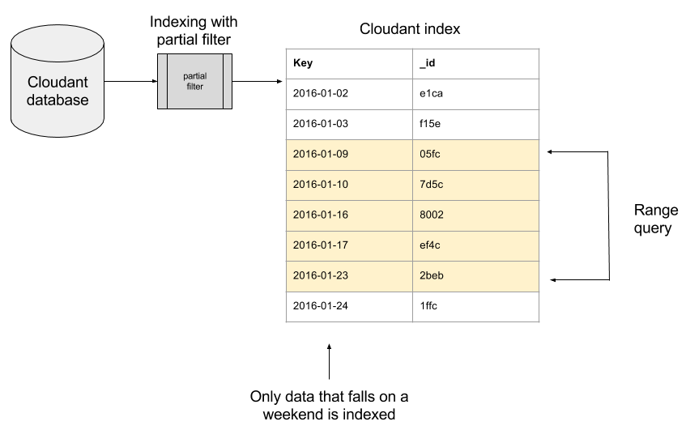

Indexing is what makes database queries fast and scalable. Without and index, a database is forced to trawl through *every record* to calculate the answer to a query. A carefully designed index allows a query to be answered with a fraction of a work by jumping to the pertinent portion.

## Indexing basics

Let's dive in with the example of [road safety data](https://data.gov.uk/dataset/road-accidents-safety-data) from the UK government's open data portal. There is a record for each traffic accident that looks like this once de-normalised and imported into a Cloudant database:

```js
{
  "_id": "200901BS70015",
  "_rev": "1-e2a972623f4402f3af7f43ecc376de0a",
  "Longitude": -0.206779,
  "Latitude": 51.498778,
  "Police_Force": "Metropolitan Police",
  "Accident_Severity": "Slight",
  "Number_of_Vehicles": 2,
  "Number_of_Casualties": 1,
  "Date": "2009-01-12",
  "Day_of_Week": "Monday",
  "Time": "14:00",
  "Road_Type": "Single carriageway",
  "Speed_limit": 30,
  "Road_Surface_Conditions": "Wet or damp",
  "year": 2009,
  "month": 1,
  "day": 12,
  "Road_Class": "A",
  "Road_Number": 3220
}
```

There are 1,176,672 records in the database, so flying without an index is going to be an expensive operation. In fact, if you attempt to make a query without first creating an index, Cloudant will oblige but issue a warning in the returned data:

```js
{
  "docs": [ ],
  "warning": "no matching index found, create an index to optimize query time"
}
```

The fields you need to index are related to the fields that you use in the *selector* object in your query. If we are going to be making queries between two dates, then it makes sense to create an index on the *Date* field:

```sh
curl -X POST \ 
     -d'{"index":{"fields":["Date"]}}' \
     -H 'Content-type: application/json' \
     https://U:P@host.cloudant.com/accidents/_index
```

We are making a call to the `_index` endpoint of our Cloudant database, passing in a JSON object that describes the index we wish to create:

```js
{
  "index": {
    "fields": [
      "Date"
    ]
  }
}
```

In this case we only need to index the `Date` field. 

On receiving this request, Cloudant trawls through each document in the database and creates an index where each record is organised into `Date` order. On a large data set this can take some time - check the progress in the "Active Tasks" tab of your Cloudant dashboard or call the [`_active_tasks` endpoint](https://cloud.ibm.com/docs/Cloudant?topic=Cloudant-active-tasks#retrieving-a-list-of-active-tasks).


Once the index is built, we can then query this index, passing in a date or a range of dates, and Cloudant will use the index to fulfill the request:

```sh
# fetch documents from the 1st January 2015
curl -X POST \
     -d'{"selector":{"Date":"2015-01-01"}}' \
     -H 'Content-type: application/json' \
     https://U:P@host.cloudant.com/accidents/_find
```

```sh
# fetch documents from the year 2015 only 
curl -X POST \
     -d'{"selector":{"Date":{ "$gte":"2015-01-01", "$lt":"2016-01-01"}}}' \
     -H 'Content-type: application/json' \
     https://U:P@host.cloudant.com/accidents/_find
```

## Building an index with a partial filter

The first index we created stored an entry for each of the 1m+ records. This may be exactly what we intended, but in some cases we may only ever be interested in a subset of the data. 

Let's say we are only interested querying accidents that occur during a weekend&mdash;there is little point indexing those that occur during the week. This is where Cloudant's index definitions with a `partial_filter_selector` are useful.

```sh
# create index with partial filter
curl -X POST \ 
     -d'{"index":{"fields":["Date"],"partial_filter_selector":{"$or":[ {"Day_of_Week": "Saturday"}, {"Day_of_Week":"Sunday"}]}},"ddoc":"date-index2"}' \
     -H 'Content-type: application/json' \
     https://U:P@host.cloudant.com/accidents/_index
```

The `partial_filter_selector` parameter instructs the indexer to filter the data *prior to indexing*, meaning that the index no longer holds data for every record in the database, only the ones that match the supplied selector.



At query-time, you can further winnow the data on the fields you chose to index:

```sh
# cloudant query
curl -X POST \
     -d'{"selector":{"Date": {"$gte":"2015-01-01", "$lt":"2015-02-01"}},"ddoc":"date-index2"}' \
     -H 'Content-type: application/json' \
     https://U:P@host.cloudant.com/accidents/_find
```

Our query for 2015 accidents using this partial index now only contains accidents that occurred during the weekend.

For extra code readability, you can also include the original partial selector in your query-time selector:

```js
{
  "$and": {
    "Date": {
      "$gte": "2015-01-01",
      "$lt": "2015-02-01"
    },
    "$or": [
      { "Day_of_Week": "Saturday"}, 
      { "Day_of_Week": "Sunday"}]
  }
}
```

Cloudant will only use a partial index to answer a query if you specify either the `ddoc` or `use_index` fields at query time. See [the documentation for full details](https://cloud.ibm.com/docs/Cloudant?topic=Cloudant-creating-selector-expressions).

## Why partial indexes?

Partial indexes pre-filter the data before it is written to the index. This can make your indicies smaller, leaner and quicker for Cloudant to work with. Also, as Cloudant pay-as-you-go services charge per GB of data (which includes the data used to store your core JSON and index data), smaller indexes can help keep your costs down too!
