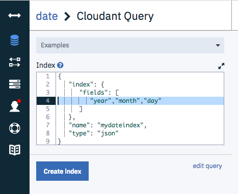
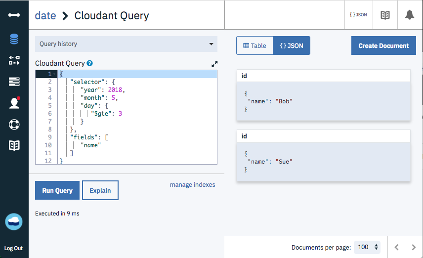

[Apache CouchDB](http://couchdb.apache.org/) and IBM Cloudant are JSON document stores and as such don't have a native _date_ type - only the data primitives allowed in the JSON specification. 

Before discussing date storage formats, we should first tackle the issue of timezones. Timezones are [utterly baffling](https://www.youtube.com/watch?v=cGXp34c_o48&feature=youtu.be&t=12s) so best practice is to store dates in the **UTC timezone** in the database even if your data originated from many places across the globe. Storing data in the same univeral timezone in the database means all the dates and times in our date store are in the same "units". There's nothing stopping your front end app converting these dates into a format according to the locale of each of your users. Using UTC also neatly sidesteps the issue of Daylight Savings Time!

As to storage formats, there are three options in common use.

## 1. Store date as a single ISO-8601 string

There's an [international standard](https://www.iso.org/iso-8601-date-and-time-format.html) for storing date and time as a human and machine readable string:

```js
{
  "name": "Glynn",
  "datetime": "2018-05-02T15:02:40.628Z"
}
```

In JavaScript you can create this format with:

```js
new Date().toISOString()
```

It consists of:

- year, month and day separated by hyphens.
- a "T" character to separate the date and time elements.
- hour, minute and second (to microsecond precision) separated by colons.
- UTC timezone indicated by `Z`, which refers to the military timezone [Zulu](https://en.wikipedia.org/wiki/List_of_military_time_zones).

This is a good general-purpose format that is compact, sorts in date/time order and can be returned to a date object in the constructor of the JavaScript _Date_ object e.g when manipulating dates in a [MapReduce view](https://cloud.ibm.com/docs/Cloudant?topic=Cloudant-creating-views-mapreduce):

```js
function(doc) {
  var d = new Date(doc.datetime);
  var month = d.getMonth() + 1; // 0 - 11
  var year = d.getFullYear();
  emit([year, month], doc.name);
}
```

which when packaged into a [Design Document](https://cloud.ibm.com/docs/Cloudant?topic=Cloudant-design-documents) with a built-in reducer can be queried with:

```sh
curl "$URL/_design/mydesigndoc/_view/myview?group=true"
```

This produces time-ordered, hierarchical, grouped aggregations of your data.

What is less obvious is that if you had chosen to store the data in different format, such as `2018-05-02 15:02:40`, then the call to `new Date(doc.datetime)` would have failed. This is due to the older version of the SpiderMonkey JavaScript engine used by CouchDB & Cloudant being unable to parse this unrecognised date format.

## 2. Store date as a timestamp

Instead of storing your date and time as a string, you could opt to store an integer timestamp instead - specifically, the number of milliseconds since 1 January 1970 00:00:00 UTC.  

```js
{
  "name": "Glynn",
  "timestamp": 1525273360628
}
```

Although this is not as human-readable as the ISO-8601 string, it is still machine-readable, sorts in date & time order and can be easily converted back into a _Date_ object in a map function:

```js
function(doc) {
  var d = new Date(doc.timestamp);
  var month = d.getMonth() + 1; // 0 - 11
  var year = d.getFullYear();
  emit([year, month], doc.name);
}
```

This format is not really suitable for storing dates before 1970 (although negative timestamps do work!) but it may be useful for simple date arithmetic as one timestamp can be subtracted from another to calculate the time difference.

```js
// calculate days since presidential inauguration
var a = new Date('2017-01-20T17:00:00.000Z');
var b = new Date();
var diff = b.getTime() - a.getTime();
var days = diff / 1000*60*60*24;
// 467.9
```

## 3. Store date and time components in separate fields

The third option is to store each date and time component separately:

```js
{
  "name": "Glynn",
  "year": 2018,
  "month": 5,
  "day": 2,
  "hour": 15,
  "minute": 2,
  "second": 40,
  "millsecond": 628
}
```

This is more verbose than the previous two solutions but has the advantage that the data is ready for querying and indexing without any pre-processing. This is particularly important when using [Cloudant Query](https://cloud.ibm.com/docs/Cloudant?topic=Cloudant-query) - MapReduce views are commonly used to pre-process data before it is *emitted* into the index but there is no such facility when using Cloudant Query. For Cloudant Query, the data *has* to be in the document and in the correct format.

Create an index with the `/db/_index` endpoint or through the dashboard:



and query the index using the `/db/_find` endpoint or again, using the dashboard:



If the data were stored in ISO-8601 format, it would not be possible to index or query a single component (e.g. the year) on its own using Cloudant Query.

## Date & time gotchas

- Remember that the JavaScript `Date.getMonth()` and `Date.setMonth()` functions use number 0-11 to represent months January to December.
- When extracting data from a Javascript _Date_ object, remember it's `getDate()`, `getMonth()+1` and `getFullYear()`, not the function names you might expect!
- The JavaScript engine used in the MapReduce engine can't parse many date formats in its constructor. It can deal with ISO-8601 format and milliseconds  since 1970, and that's about it.
- If you use string manipulation to split up a date you may be run into this conundrum in your map function

```js
function(doc) {
  // split up the date 2018-08-09
  var bits = doc.date.split('-');
  var year = parseInt(bits[0]);
  var month = parseInt(bits[1]);
  var day = parseInt(bits[2]);
  emit([year, month, day], doc.temperature);
}
```

In the above code we've elected to store only the date as a string. We're splitting the string by the `-` character, turning the year/month/day pieces into integers and using them to create a hierarchical index. What's the problem with this approach?

Take the date `2018-08-09` (9th of August). In this case the data calculated would be:

- year - 2018
- month - 0
- day - 1

Why? Because the indexer's SpiderMonkey JavaScript engine interprets the leading zero on `08` and `09` to indicate that you wish the date to be parsed as [Octal](https://en.wikipedia.org/wiki/Octal) numbers! It can be remedied with:

```js
  var month = parseInt(bits[1], 10);
  var day = parseInt(bits[2], 10);
```

This indicates that your strings are in decimal.
