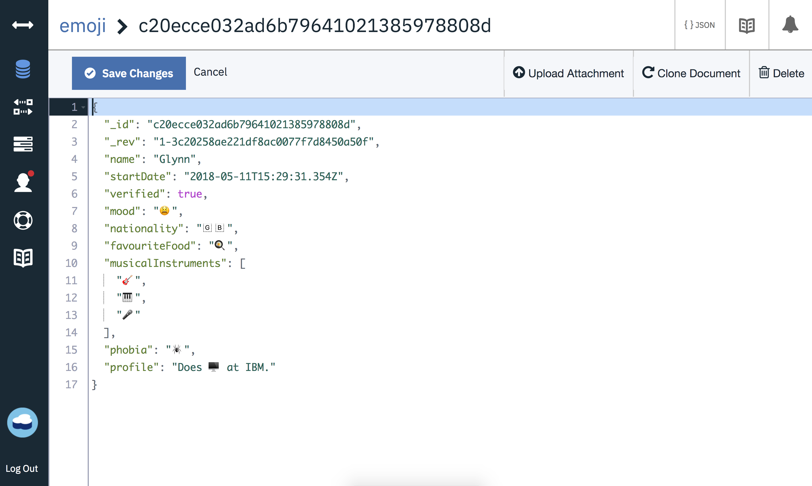
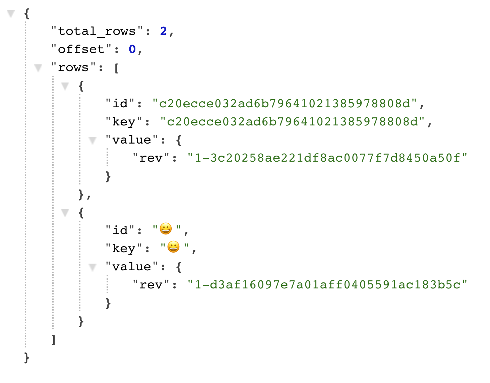
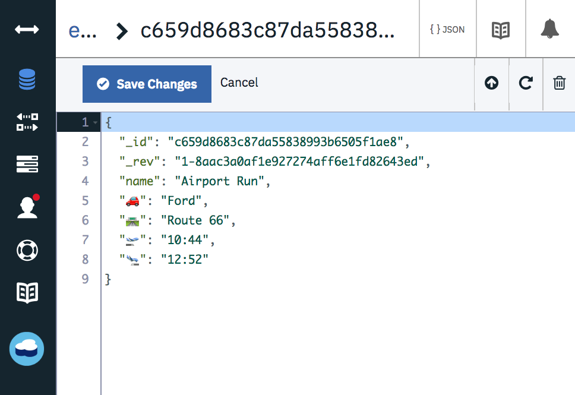
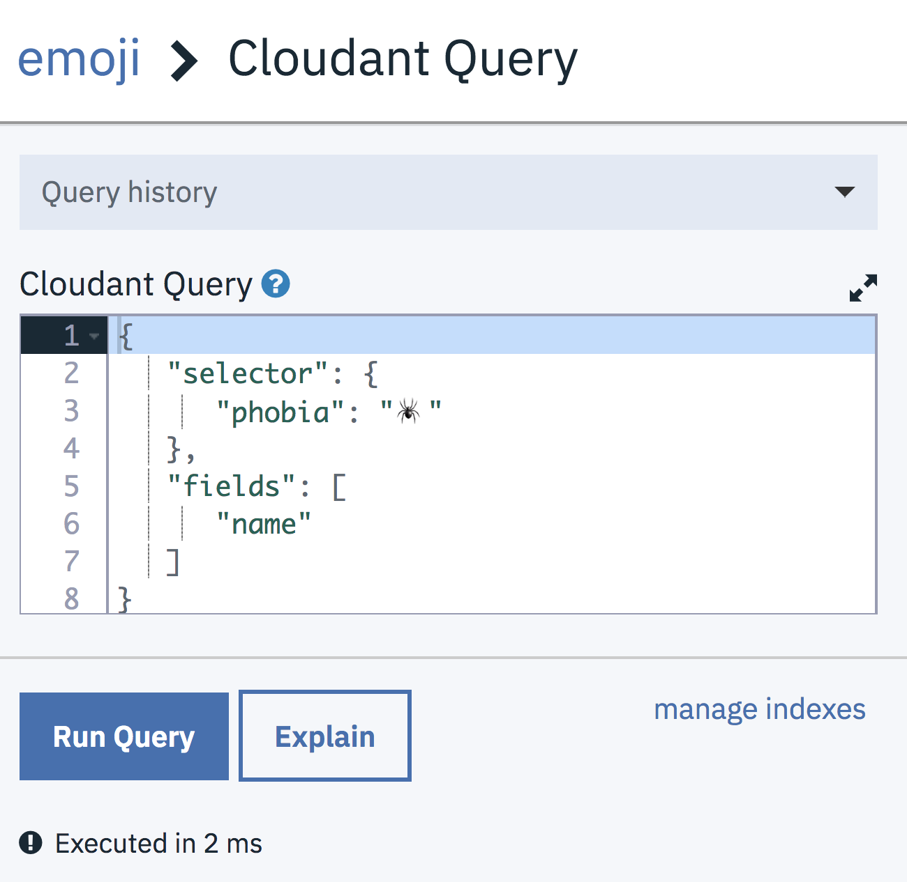

Cloudant and Apache CouchDB databases store their data as JSON documents so there's only a handful of data types to choose from: strings, booleans, numbers, objects and arrays.

Here's a document representing a person in a JSON:

```js
{
  "name": "Glynn",
  "startDate": "2018-05-11T15:29:31.354Z",
  "verified": true,
  "mood": "tired",
  "nationality": "British",
  "favouriteFood": "Eggs",
  "musicalInstruments": ["Guitar","Piano","Voice"],
  "phobia": "Spiders",
  "profile": "Does computers at IBM."
}
```

Long gone are the days when we were limited to the [ASCII](https://www.asciitable.com/) character set in our code. In recent years, the characters we use to form sentences have go a lot more colourful.

Let's try remodelling our document by using Emoji:

```js
{
  "name": "Glynn",
  "startDate": "2018-05-11T15:29:31.354Z",
  "verified": true,
  "mood": "😫",
  "nationality": "🇬🇧",
  "favouriteFood": "🍳",
  "musicalInstruments": ["🎸","🎹","🎤"],
  "phobia": "🕷",
  "profile": "Does 🖥 at IBM."
}
```

Is this valid? Will Cloudant accept documents like this? It turns out we're good to go!



Cloudant is happy to store any valid JSON containing Unicode strings. Sometimes the Emojis render differently across devices depending on the character set used. 

## Can I use an Emoji as a key field?

Yes you can:



## Can I use an Emoji as a document attribute?

Yes you can:



## What about in Map functions?

In JavaScript map functions, values of fields containing Emoji can be tested and Emoji keys and values can be emitted:


## Can I query using Emoji?

Yes you can:



## Why would I want an Emoji in a JSON document?

Just because you can do something, doesn't mean you should. 

In the above examples, I'm using Emojis like an enumerated data type where the symbols represent one of a set of allowed data values 

- Nationality: 🇬🇧 🇫🇷 🇩🇪 🇨🇳 🇯🇵
- Mood: 😀 🤔 😐 ☹
- Weather:  ☀ ⛅ 🌧 🌪

Another use-case is the storage of Twitter, Slack, SMS or other strings that happen to contain Emoji in a JSON database. The data will be indexed correctly and can be queried and aggregated like any other data.
