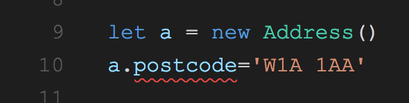
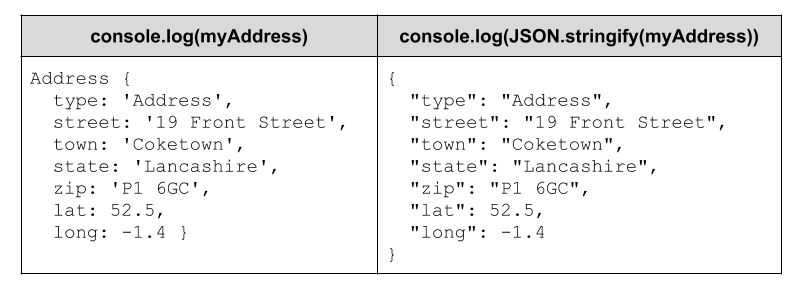
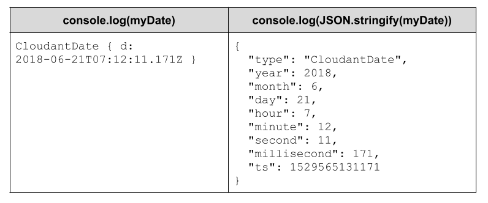
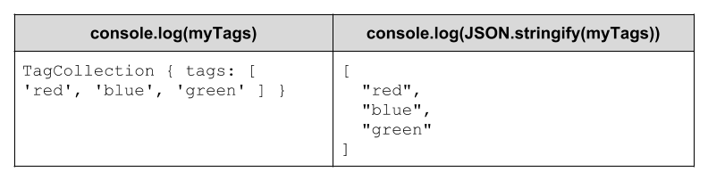
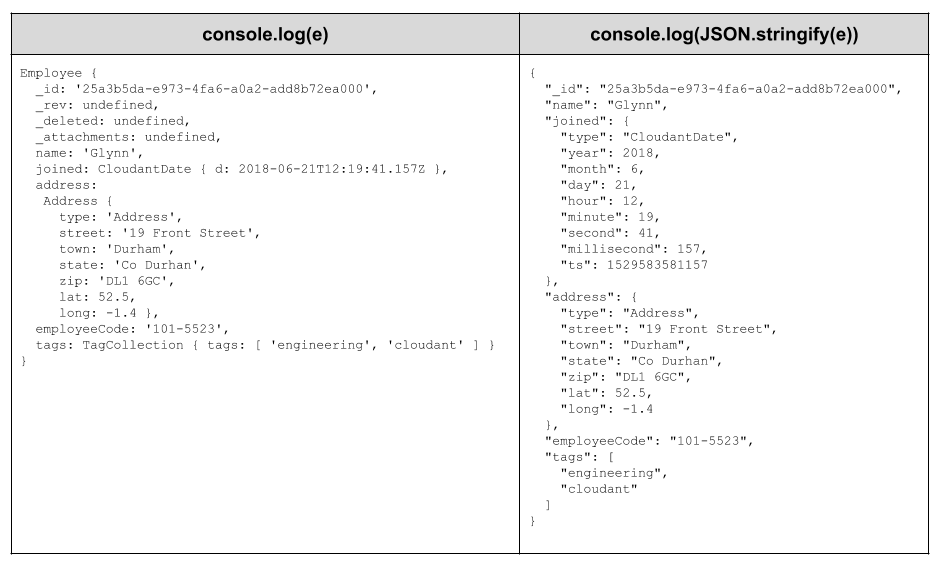

[TypeScript](https://www.typescriptlang.org/) is a programming language that is a super-set of JavaScript written by Microsoft. TypeScript code compiles to various flavours of JavaScript to run in the browser, in Node.js or in concert with frameworks such as React, Angular, Vue.js etc. Programming in TypeScript brings you the luxury of:

- type checking for function parameters, return values etc
- default and optional values for function parameters
- interfaces, for defining the shape of objects being passed in and out of functions
- classes with constructors, inheritance & access modifiers
- enumerations
- iterators
- module import/export 
- and lots more

Ultimately your TypeScript code is transpiled into JavaScript, targetted for your destination platform, so it can't _do_ any more than JavaScript. The advantage of TypeScript code is that you get to apply greater rigour in your code, have access to lots of "grown up" programming features and a receive lots of help in the code editor. 



In the above example, the red line indicates that there is no 'postcode' property of the `Address` class. Catching mistakes like this in the editor saves lots of time later, chasing down errors and figuring out why the code isn't doing what is expected. 

Typescript is [open-sourced](https://github.com/Microsoft/TypeScript) and Microsoft's popular [VS Code](https://code.visualstudio.com/) editor is itself written in TypeScript!

## Data modelling with Cloudant

Let's say we want to store employee records in Cloudant. As Cloudant stores JSON objects, we can use plain JavaScript objects in our code that are transformed to JSON with `JSON.stringify`:

```js
var obj = {
  name: "Glynn",
  joined: 1529060008135,
  address: {
    street: "15 Front Street",
    city: "Coketown",
    state: "Yorkshire",
    zip: "N1 2BX",
    lat: 52.1,
    long: -1.5
  },
  employeeCode: "101-5523",
  tags: ["tech","uk"]
}
```

To take advantage of the features of TypeScript, it would be better if we could use classes instead of generic objects. We could build:

- a Date object to represent the time the employee joined.
- an Address object with custom methods that formats address labels.
- a TagsCollection object with methods that allow new tags to be added and prevents duplicates.

Ideally, an *Employee* class containing these building-block classes would have a usuable JSON representation that could be stored in Cloudant. In addtion, the JSON string could be returned to a concrete class after retrieving data from the database.

There is a solution to this, so let's start with a custom *Address* class.

## Address class

We can create a custom TypeScript class that embodies a postal address and geo-location:

```typescript
// Address.ts

// the iAddress Interface - the shape of an address object
export interface iAddress {
  street: string
  town: string
  state: string
  zip: string
  lat: number
  long: number
}

// the Address class
export class Address implements iAddress {
  type: string
  street: string
  town: string
  state: string
  zip: string
  lat: number
  long: number

  constructor() {
    this.type = 'Address'
  }

  // return an address label string
  getLabel() {
    return [this.street, this.town, this.state, this.zip].join(', ')
  }

  // turn an object into an Address
  static fromObject(a: iAddress): Address {
    let obj = new Address()
    Object.assign(obj, a)
    return obj
  }
}
```

It's worth explaining that [TypeScript Interfaces](https://www.typescriptlang.org/docs/handbook/interfaces.html) define the *forms of objects* - the attributes and types that make up an object. They are useful when defining functions that take objects as parameters - this allows the TypeScript compiler to check the form of the object at compile-time and allows your editor to check your code as you type.

This *Address* object is pretty simple. It has a number of public attributes that define the address, a `getLabel` function that returns a postage label and a static `fromObject` function that can resurrect an Address object from a generic object that conforms to the _iAddress_ interface.

A simple class like *Address* that only uses JavaScript primitive types turns into a sensible form of JSON - an object which looks like the _iAddress_ interface: 



We'll see how to incorporate this into our *Employee* class later, but first let's look at how we can use a similar technique to model a date.

## The CloudantDate class

In [this blog post](https://medium.com/@glynn_bird/date-formats-for-apache-couchdb-and-cloudant-1c017b7b878b), I discussed various ways of representing a date/time in Cloudant JSON. I concluded that it's good to have the constituent date/time parts (day, month, year) present in the object to allow [Cloudant Query](https://cloud.ibm.com/docs/Cloudant?topic=Cloudant-query) to access them and a "seconds since 1970" integer or an ISO-8601 string for sorting purposes.

To represent a [JavaScript Date](https://developer.mozilla.org/en-US/docs/Web/JavaScript/Reference/Global_Objects/Date) object in our *Employee* class, we're going to create a wrapper class called *CloudantDate* which has a trick up its sleeve:

```typescript
// CloudantDate.ts

// the iCloudantDate interface - the shape the object 
export interface iCloudantDate {
  type: string,
  year: number,
  month: number,
  day: number,
  hour: number,
  minute: number,
  second: number,
  millisecond: number,
  ts: number
}

// the CloudantDate class
export class CloudantDate {
  d: Date

  // if a date is supplied, it is used, otherwise 'now' is used
  constructor(c?: any) {
    this.d = c ? new Date(c) : new Date()
  }

  // override toJSON to provide a custon JSON representation
  toJSON(): iCloudantDate {
    return {
      type: 'CloudantDate',
      year: this.d.getUTCFullYear(),
      month: this.d.getUTCMonth() + 1,
      day: this.d.getUTCDate(),
      hour: this.d.getUTCHours(),
      minute: this.d.getUTCMinutes(),
      second: this.d.getUTCSeconds(),
      millisecond: this.d.getUTCMilliseconds(),
      ts: this.d.getTime()
    }
  }

  // convert an object to a CloudantDate (only the 'ts' is used)
  static fromObject(o: iCloudantDate): CloudantDate {
    return new CloudantDate(o.ts)
  }
}
```

The *CloudantDate* class stores its value in a standard JavaScript *Date* class and like *Address*, implements a static `fromObject` function to allow a class to be reconstituted from an plain object. *CloudantDate*'s real party piece is overridng the `toJSON` function, which is used by `JSON.stringify` to turn an instance of the class into JSON.

If we create a *CloudantDate* object and `JSON.stringify` it, the resultant string contains all the date and time pieces broken out:



This allows us to have dates that are useable `Date` classes in our code and have the constituent parts broken down in the Cloudant database, where they are accessible to the Cloudant indexing engine.

## TagCollection class

Our final storage class is *TagCollection* which stores an array of strings. It has a couple of helper functions (`add` and `remove`) and also overrides the `toJSON` function to ensure that only an array of strings appears in the JSON:

```typescript
// TagCollection.ts

// TagCollection class
export class TagCollection {
  tags: string[]

  constructor() {
    this.clear()
  }

  // wipe all tags
  clear() {
    this.tags = []
  }

  // add a tag (with de-dupe)
  add(s: string):boolean {
    if (this.tags.indexOf(s) === -1) {
      this.tags.push(s)
      return true
    }
    return false
  }

  // remove a tag
  remove(s: string):boolean {
    let i = this.tags.indexOf(s)
    if (i > -1) {
      this.tags.splice(i, 1)
      return true
    }
    return false
  }

  // override toJSON to only output the tags array
  toJSON(): string[] {
    return this.tags
  }

  // reconstitue 
  static fromObject(t: string[]): TagCollection {
    let tc = new TagCollection()
    tc.tags = t
    return tc
  }
}
```




## Assembling the Employee class

Now we have all the pieces in place, we can create a top level "Employee" class that uses our custom classes:

```typescript
// Employee.ts

import { Address } from './Address'
import { CloudantDate } from './CloudantDate'
import { CloudantDocument } from './CloudantDocument'
import { TagCollection } from './TagCollection'

// the Employee class
export class Employee extends CloudantDocument {
  name: String
  employeeCode: String
  salary: number
  joined: CloudantDate
  address: Address
  tags: TagCollection
  
  constructor(name: String, address: Address) {
    super()
    this.name = name
    this.joined = new CloudantDate()
    this.address = address
  } 
  
  // convert plain object to Employee
  static fromObject(parsed: any): Employee {
    let obj = new Employee(parsed.name, parsed.address)
    obj._id = parsed._id
    obj._rev = parsed._rev
    obj.joined = CloudantDate.fromObject(parsed.joined)
    obj.address = Address.fromObject(parsed.address)
    obj.tags = TagCollection.fromObject(parsed.tags)
    obj.employeeCode = parsed.employeeCode
    return obj
  }

  // parse JSON and then convert to Employee
  static fromJSON(json: string): Employee {
    let parsed = JSON.parse(json)
    return Employee.fromObject(parsed)
  }
}
```

We have a base class that handles the Cloudant-specific fields (`_id`, `_rev` etc) which we can reuse across all of our Cloudant storage classes:

```typescript
// CloudantDocument.ts

import * as uuid from 'uuid'

export interface CloudantAPIResponse {
  ok: boolean
  id: string
  rev: string
}

export class CloudantDocument {
  _id: string
  _rev: string
  _deleted: boolean
  _attachments: object

  constructor() {
    this.clear()
  }

  private clear() {
    this._id = undefined
    this._rev = undefined
    this._deleted = undefined
    this._attachments = undefined
  }

  generateId() {
    this.clear()
    this._id = uuid.v4()
  }

  processAPIResponse(response: APIResponse) {
    if (response.ok === true) {
      this._id = response.id
      this._rev = response.rev
    }
  }
}
```

We can then use the *Employee* class in our own code and pass instances of *Employee* to the [official Node.js Cloudant library](https://www.npmjs.com/package/@cloudant/cloudant) to be stored in the database:

```typescript
import { Employee } from './Employee'
import { Address } from './Address'
import { TagCollection } from './TagCollection'
import * as Cloudant from '@cloudant/cloudant'

// make an address object
let a = new Address()
a.street = '19 Front Street'
a.town = 'Coketown'
a.state = 'Lancashire'
a.zip = 'L1 6GC'
a.lat = 52.56
a.long = -2.7

// create employee
let newEmployee = new Employee('Glynn', a)
newEmployee.generateId()
newEmployee.employeeCode = '101-5523'


// tags
newEmployee.tags = new TagCollection()
newEmployee.tags.add('engineering')
newEmployee.tags.add('cloudant')

// initialise Cloudant library
let client = Cloudant(process.env.CLOUDANT_URL)
let db = client.db.use('employees')
db.insert(newEmployee, (err, data) => {
  if (err) throw new Error(err)
  newEmployee.processAPIResponse(data)
})
```

The Cloudant library converts the our custom object to JSON, which invokes our custom `toJSON` overrides:



The Cloudant document can be restored into an *Employee* class later, if we use our static `Employee.fromObject` method to reconstitute the class from its JSON form:

```js
let client = Cloudant(process.env.CLOUDANT_URL)
let db = client.db.use('employees')
let e:Employee = null
db.get('0ef9a2bd-e738-43bb-9bb6-06385e5ac541', (err, data) => {
  if (err) throw new Error(err)
  e = Employee.fromObject(data)
})
```

## Typescript conclusions

Writing in TypeScript adds some of the rigour of writing Java code to JavaScript, including strong typing and classes with inheritance & access control. This allows the developer to build neat, consistent code with the code editor advising at every turn. TypeScript is transpiled, whether your target is a minified package for a web app, a server-side Node.js module or a native Electron app. 

Overriding the `toJSON` function in your custom TypeScript classes allows you to use classes in your code and pass them to the Cloudant Node.js library to be saved in a form of JSON of your choice. 
