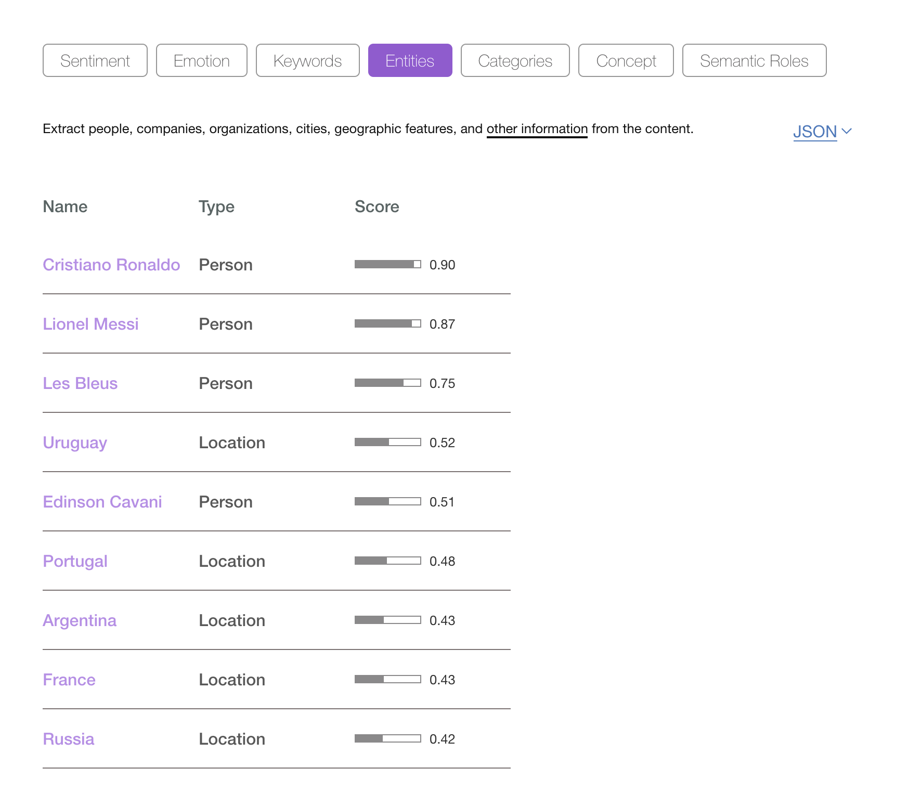

Cloudant Search is the free-text search technology built in to the Cloudant database that is powered by [Apache Lucene](http://lucene.apache.org/). Lucene-based indexes are used for:

- finding documents that best match a supplied string.
- constructing fielded queries in Lucene's query language  e.g. `state:florida AND (status:provisional OR status:published)`.
- counting facets, that is counts of repeating values within the result set.
- or all of the above.

When creating a Cloudant Search index, thought must be given as to which fields from your documents *need* to indexed and *how* they are to be indexed. 

One aspect of the indexing process is the choice of *analyzer*. An analyzer is code that may:

- lowercase the string - making the search case-insensitive.
- tokenise the string - breaking a sentence into individual words.
- stem the words - removing language-specific word endings e.g. *farmer* becomes *farm*
- remove stop words - ignoring words like *a*, *is* *if* can make the index smaller and more efficient.

At indexing-time source data is processed using the analyzer logic prior to sorting and storage in the index. At query-time the search terms are processed using the same analyzer code before interrogating the index.

## Testing the analyzer

There is a [Cloudant Search API call](https://cloud.ibm.com/docs/Cloudant?topic=Cloudant-cloudant-search#testing-analyzer-tokenization) that will apply one of the built-in Lucene analyzers to a supplied string to allow you to see the effect of each analyzer.

To look at each anaylzer in turn, I'm going to pass the same string to each analyzer to measure the effect:

> "My name is Chris Wright-Smith. I live at 21a Front Street, Durham, UK - my email is chris7767@aol.com."

### Standard analyzer

> {"tokens":["my", "name", "chris", "wright", "smith", "i", "live", "21a", "front", "street", "durham", "uk", "my", "email", "chris7767", "aol.com"]}

- punctation removed
- words split on spaces and punctuation
- stop words removed (no 'is', 'at')
- all lowercase
- note how "aol.com" remains intact

### Keyword analyzer

> {"tokens":["My name is Chris Wright-Smith. I live at 21a Front Street, Durham, UK - my email is chris7767@aol.com."]}

- string remains intact

### Simple analyzer

> {"tokens":["my", "name", "is", "chris", "wright", "smith", "i", "live", "at", "a", "front", "street", "durham", "uk", "my", "email", "is", "chris", "aol","com"]}

- punctuation removed
- words split on spaces and punctuation
- no stop words (notice "is", "at")
- all lowercase
- note how "chris7767" became "chris" and "21a" becomes "a"


### Whitespace analyzer

> {"tokens":["My", "name", "is", "Chris", "Wright-Smith.", "I", "live", "at", "21a", "Front", "Street,", "Durham,", "UK", "-" , "my" ,"email", "is", "chris7767@aol.com."]}

- some punctuation removed
- words split on spaces
- no stop words (notice "is", "at")
- case sensitive
- note how email remains intact
 
### Classic analyzer

> {"tokens":["my", "name", "chris", "wright", "smith", "i", "live", "21a", "front", "street", "durham", "uk", "my", "email", "chris7767@aol.com"]}

- punctation removed
- words split on spaces and punctuation
- stop words removed (no 'is', 'at')
- all lowercase
- email remains intact

### English analyzer

> {"tokens":["my", "name","chri", "wright", "smith", "i", "live", "21a", "front", "street", "durham", "uk", "my", "email", "chris7767","aol.com"]}

- punctation removed
- words split on spaces and punctuation
- words stemmed (notice "chris" becomes "chri")
- stop words removed (no 'is', 'at')
- all lowercase
- email remains intact

The language-specific analyzers make the most changes to the source data:

```
The quick brown fox jumped over the lazy dog.
{"tokens":["quick","brown","fox","jump","over","lazi","dog"]}

Four score and seven years ago our fathers brought forth, on this continent, a new nation, conceived in Liberty, and dedicated to the proposition that all men are created equal.
{"tokens":["four","score","seven","year","ago","our","father","brought","forth","contin","new","nation","conceiv","liberti","dedic","proposit","all","men","creat","equal"]}
```

## Which analyzer should I pick?

It depends on your data. If you have structured data (email addresses, zip codes, names etc in separate fields), then it's worth picking an analyzer that retains the data you need to keep *intact* for your search needs. 

Only index the fields that you need. Keeping the index small helps to improve performance.

Let's deal with common data sources and look at best analyzer choices.

### Names

It's likely that name fields should use an analyzer that doesn't stem words. The **Whitespace** analyzer retains the words' case (meaning the search terms would have to be a full, case-senstive match) and leaves double-barrelled names intact. If you want to split up double-barrelled names, then the **Standard** analyzer would do the job.

### Email addresses

There is a built-in **Email** analyzer for just this purpose which lowercases everything and then behaves like the **Keyword** analyzer. 

### Unique id

Order numbers, payment references and UUIDs such as "A1324S", "PayPal0000445" and "ABC-1412-BBG" should be retained without any pre-processing, so the **Keyword** analyzer is preferred.

### Country codes

Country codes such as "UK" should also use the **Keyword** analyzer to prevent the removal of stopwords that match the country codes e.g. "IN" for India. Note that the Keyword Analzer is case-sensitive.

### Text

A block of free-form text is best processed with a language-specific analyzer such as the **English** analyzer or in a more general case, the **Standard** analyzer.


## Store: true or include_docs=true?

When returning data from a search there are two options

- at index-time, choose the `{store: true}` option to indicate that that the field you dealing with needs to be stored inside the index. A field can be "stored" even if it isn't used for indexing itself e.g. you may want to "store" a telephone number, even if your search algorithm doesn't allow search by phone number. 
- or, pass `?include_docs=true` at query-time to indicate to Cloudant that you want the entire bodies of each matching document to be returned.

The former option means having a larger index but is the fastest way of retrieving data. The latter option keeps the index small but adds extra query-time work for Cloudant as it has to fetch document bodies after the search result set is calculated. This can be slower to execute and add a further burden to a Cloudant cluster.

If possible, choose the former option: 

- only index the fields that are to be searchable.
- only store the fields you need retrieving at query-time.

## Entity extraction

Providing a good search experience depends on the alignment of your users' search needs with structure in the data. Throwing lots of unstructured data at an indexing engine gets you only so far; if you can add further structure to unstructured data, then the search experience will benefit as fewer "false positives" will be returned. Let's take an example:

> "Edinson Cavani scored two superb goals as Uruguay beat Portugal to set up a World Cup quarter-final meeting with France. Defeat for the European champions finished Cristiano Ronaldo's hopes of success in Russia just hours after Lionel Messi and Argentina were knocked out, beaten 4-3 by Les Bleus."
> 
> Source: BBC News https://www.bbc.co.uk/sport/football/44439361

From this snippet, I would manually extract the following "entities":

- Edinson Cavani - a footballer
- Uruguay - a country
- Portugal - another country
- World Cup - a football competition
- Cristiano Ronaldo - a footballer
- Russia - a country
- Lionel Messi - a footballer 
- Argentina - a country
- Les Bleus - a nickname of the French national football team

Entity extraction is the process of locating known entities (given a database of such entities) and storing the entities in the search engine instead of or as well as the source text. The [Watson Natural Language and Understanding API](https://www.ibm.com/watson/services/natural-language-understanding/) can be fed raw text and will return entities it knows about (you can provide your own enitity model for your domain-specific application):



As well as entities, the API can also place the article in a hierarchy of categories. In this case, Watson suggested:

- / travel / tourist destinations / france
- / sports / soccer
- / sports / football

Pre-processing your raw data, by calling the Watson API for each document and storing a list of entities/concepts/categories in your Cloudant document, provides automatic meta data about your free-text information and can provide an easier means to search and navigate your app.


