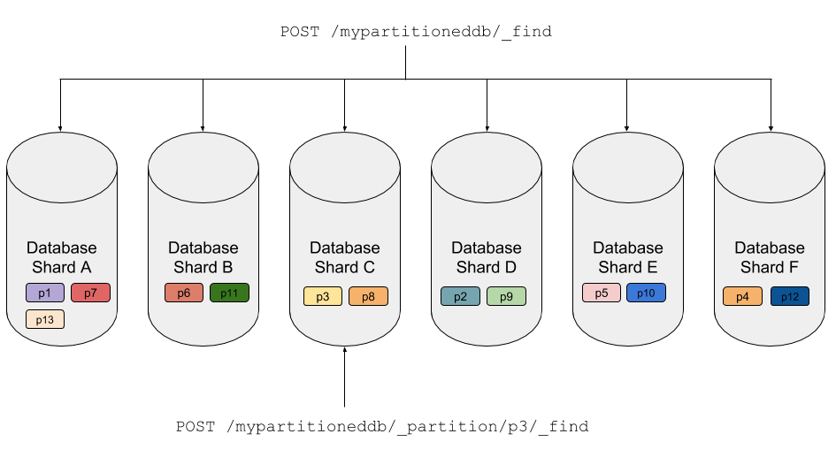

Cloudant has a new feature called *Partitioned Databases* which makes querying faster to execute while being cheaper per query request. In this article, we'll find out what Partitioned Databases are, how to set them up and how they work. Other posts provide a deep dive into data modelling and data migration.

## Creating a partitioned database

Normally a database is created with the `PUT /db` API endpoint:

```sh
$ curl -X PUT "$URL/mydb"
{"ok": true}
```

To specify that you want a *partitioned database*, simply add `?partitioned=true` to the URL:

```sh
$ curl -X PUT "$URL/mypartitioneddb?partitioned=true"
{"ok": true}
```

The `partitioned` flag can only be supplied when creating the database - an existing database cannot be transformed into a partitioned database after the fact.

## The two-part _id field

Partitioned database documents still have a unique `_id` field, but with a twist - the `_id` field is in two parts:

1. The partition key
2. The document key

separated by a ":" character:


The whole `_id` must be unique in the database, but there can be many documents with the same partition key. Documents sharing a partition key are stored together on the same database *shard* making it inexpensive for the database to find and query them collectively.

A database created with `?partitioned=true` will insist on a two-part `_id` field for each of its documents. If you attempt to create a document in a partitioned database with an invalid `_id`, your request will receive a `400 - Bad Request` response.

## How Cloudant stores data in a partitioned database

Each Cloudant service is hosted on multi-server distributed system. When you create a database, whether it be partitioned or not, the documents in the database are spread around the database cluster with the database being split into mulitple *shards*. In a *partitioned database* the partition key defines the location of the data in the cluster, with all documents that share the same partition key residing on the same shard (the same document ids in a non-partitioned database would be scattered around the cluster).

At query-time, we can direct queries to a single *partition*. As Cloudant knows on which shard each partition resides in the cluster, it need only query *that shard*. This saves computation expense, generates fewer network requests and the benefits are passed on to the caller in terms of performance and per-query cost.



The above diagram shows in simplistic terms that a full-database query hits every shard in the database, but a query directed to a single partition is only directed to one.

In reality, there is more complexity at play: multiple *copies* of each shard are distributed around the cluster, but for the purposes if this post it's a detail that needn't concern us. If you ignore the concept of shards and that there are multiple copies of each, you can imagine your database split into a number of logical partitions, determined by the value of the partition key you supply in the `_id` field.

## What makes a good partition key?

A good partition key should have:

- Many values - lots of small partitions are better than a few large ones.
- No hot spots - avoid designing a system that makes one partition handle a high proportion of the workload. If the work is evenly distributed around the partitions, the database will perform more smoothly.
- Repeating - If each partition key is unique, there will be one document per partition. To get the best out of partitioned databases, there should be multiple documents per partition - documents that logically belong together.

Let's look at some use-cases and some good and bad choices for a partition key.

| Use-case                   | Description                 | Partition Key | Effectiveness                                                                                                     |
|----------------------------|-----------------------------|---------------|------------------------------------------------------------------------------------------------------------------|
| E-commerce system - orders | One document per order.     | user_id       | Good - all of a user's orders will be kept together.                                                             |
| E-commerce system - orders | One document per order.     | order_id      | Neutral - one document per partition is fine, but doesn't take full advantage of Partition Queries               |                                                            
| E-commerce system - orders | One document per order      | status        | Bad - grouping orders by a handful of status values (provisional, paid, refunded, cancelled) will create too few over-large partitions  |
| Blogging platform          | One document per blog post. | author_id     | Good - as long as there are many authors. Easy to query each author's posts.                                     |
| IOT - sensor readings      | One document per reading    | device_id     | Good - if there are many devices. Make sure that one device is not producing many more readings than the others. |
| IOT - sensor readings      | One document per reading    | date          | Bad - current readings will cause a "hot spot" on the current date's partition.                                  |

There are some use-cases where there isn't a viable choice for a partition key. In these situations, it's likely that a non-partitioned database is the best choice e.g. a database of users storing email address, password hash and a last-login date. None of these fields make for a suitable partition key, so a normal non-partitioned database should be used instead.

## Partition database CRUD

Once you've created a database with `PUT /mydb?partitioned=true`, documents are added, updated and fetched in the [usual way](https://cloud.ibm.com/docs/Cloudant?topic=Cloudant-documents):

```html
PUT /<database>/<partitionkey>:<dockey>
POST /<database>  (supplying a JSON document with a two-part _id)
GET /<database><partitionkey>:<dockey>
DELETE /<database>/<partitionkey>:<dockey>?rev=<revision>
POST /<database>/_bulk_get
POST /<database>/_bulk_docs
```

All of the Create/Read/Update/Delete (endpoints) behave as normal except that they will enforce rules to ensure that your `_id` field meets the format expected of a partitioned database.

## Querying a single partition

Directing a query at a single partition is the key to achieving great performance and lower per-query prices. There's a whole raft of new API calls that allow data from a single partition to be fetched. Partitioned queries are subject to a timeout of five seconds and a maximum of 2000 results per query. See [the documentation](https://cloud.ibm.com/docs/Cloudant?topic=Cloudant-database-partitioning#querying) for more details.

In partitioned databases, indexes are partitioned by default. Index definitions may contain a `partitioned: false` flag to override this behaviour to make q *global* index(as they would be for a non-partitioned databases) - a global index will then only work for global queries. See [the documentation](https://cloud.ibm.com/docs/Cloudant?topic=Cloudant-database-partitioning#querying) for more details.

### Cloudant Query _find

A new API endpoint allows a [Cloudant Query](https://cloud.ibm.com/docs/Cloudant?topic=Cloudant-query) to be directed to a single partition:

```
POST /<database>/_partition/<partitionkey>/_find
```

As with the global `_find` endpoint, queries against a pre-existing [Cloudant Query index](https://cloud.ibm.com/docs/Cloudant?topic=Cloudant-working-with-indexes) will yield the best performance.

### Cloudant Query MapReduce

Similarly, a [MapReduce view](https://cloud.ibm.com/docs/Cloudant?topic=Cloudant-creating-views-mapreduce) can be queried on a single partition:

```
GET /<database>/_partition/<partitionkey>/_design/<name>/_view/<view_name>
```

Advanced MapReduce features such as custom JavaScript reducers, rewrites, lists, shows, updates, filters and validators are not permitted on partitioned indexes.

### Cloudant Search

A Cloudant Search index can be queried on a single partition:

```
GET /<database>/_partition/<partitionkey>/_design/<name>/_search/<index_name>
```

### All documents

All documents from a partition can be fetched with the partition's _all_docs endpoint:

```
GET /<database>/_partition/<partitionkey>/_all_docs
```

## Pricing

The current Cloudant pricing information can be found [here](https://cloud.ibm.com/docs/Cloudant?topic=Cloudant-pricing).


