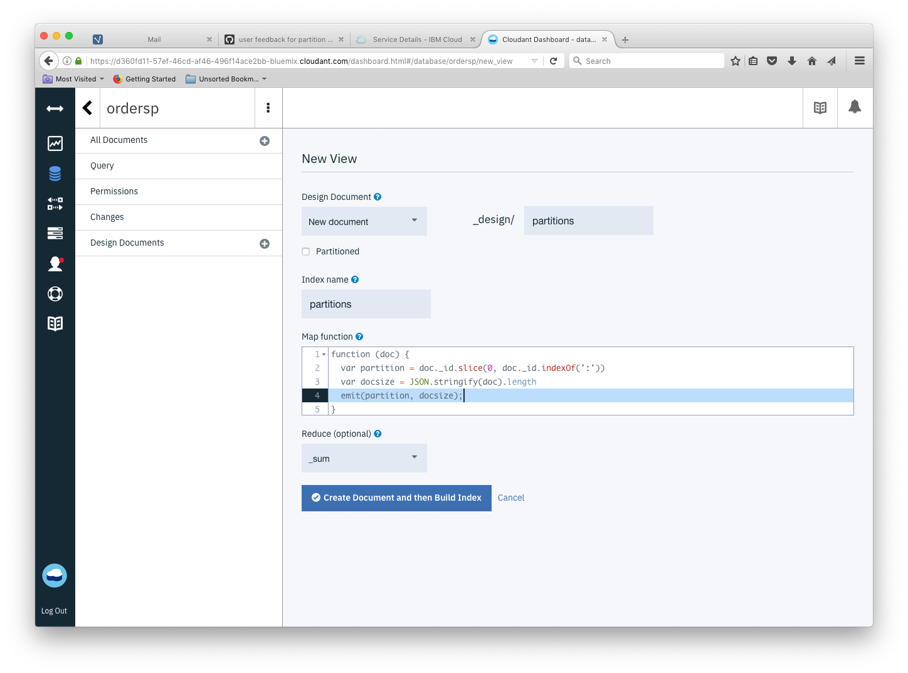
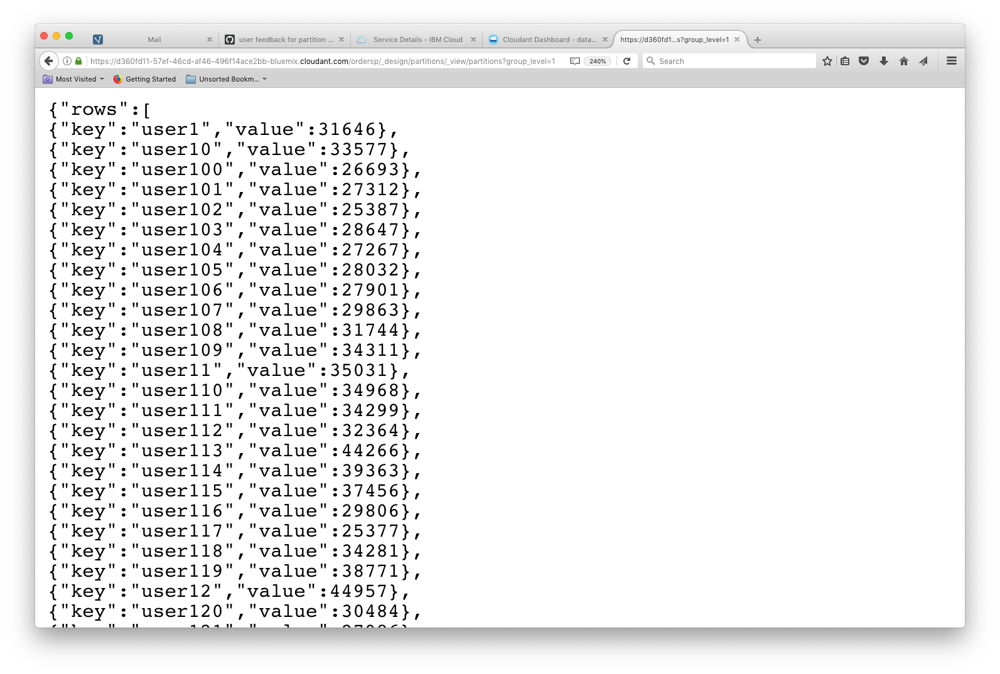

Choosing a partition key for a partitioned Cloudant databases is about selecting an attribute that has:

- Many values - lots of small partitions are better than a few large ones.
- No hot spots - avoid designing a system that makes one partition handle a high proportion of the workload. If the work is evenly distributed around the partitions, the database will perform more smoothly.
- Repeating - If each partition key is unique, there will be one document per partition. To get the best out of partitioned databases, there should be multiple documents per partition - documents that logically belong together.

We don't want a single partition to get too big (bigger than a handful of GB) or to have to handle a disproportionate amount of the database's workload. 

Although there are no API calls that can deliver a league table of the largest partitions in your database, it's simple enough to generate a [MapReduce view](https://cloud.ibm.com/docs/Cloudant?topic=Cloudant-creating-views-mapreduce) to estimate the size of each partition. Here's how.

## Creating a MapReduce view to estimate partition size

MapReduce views are defined as JavaScript functions that are executed for each document in the database. We want to extract the *partition key* from each document's `_id` field and use that as the view's key.

```js
function (doc) {
  // extract the document _id's partition key
  var id = doc._id
  var partition_key = id.slice(0, id.indexOf(':'))
  
  // calculate size of document
  var docsize = JSON.stringify(doc).length
  
  // create view where the key is the partition_key and the value is the document size
  emit(partition_key, docsize);
}
```

The view can be defined by pasting the JavaScript into the Cloudant dashboard (Design Documents `+` New View):



If we choose the `_sum` reducer, we get the sum of the document sizes by partition (not including conflicts or attachments) - if we choose the `_count` reducer we get the number of documents per partition.

## Querying the view

The MapReduce view can be queried with `group_level=1` to generate totals/counts by the view's key (the partition key):

```sh
curl '$URL/$DB/_design/partitions/_view/partitions?group_level=1'
```



To sort the data set we can pipe this data into [jq](https://stedolan.github.io/jq/manual/#sort,sort_by(path_expression)) and sort the array by `value` (to get the biggest or fullest partitions last in the list):

```sh
curl '$URL/$DB/_design/partitions/_view/partitions?group_level=1'| jq '.rows | sort_by(.value)'
[
  {
    "key": "user649",
    "value": 18370
  },
  {
    "key": "user278",
    "value": 18977
  },
  {
    "key": "user245",
    "value": 19048
  },
  ...
  {
    "key": "user489",
    "value": 45121
  },
  {
    "key": "user755",
    "value": 46365
  },
  {
    "key": "user970",
    "value": 46513
  }
]
```

## Top ten partition count

To produce a "top ten" list of partitions by document count, we're going to need a custom "reduce" function.

### Map

Our map function  simply emits a value of "1" for each document against a key of the document's *partition key*:

```js
function (doc) {
  var partition = doc._id.slice(0, doc._id.indexOf(':'))
  emit(partition, 1);
}
```

### Reduce

The custom reducer (written by [Adam Kocoloski](https://twitter.com/kocolosk)) pushes responsibility for the secondary aggregation of the list of partition document counts to the database by employing a second "reduction" phase. This is neat in terms of the form of the returned data but custom-reducers are difficult to write, debug and maintain and are not to be recommended for general use in Cloudant as they lead to poor database performance.

```js
function (keys, values, rereduce) {
  var topTenPlusBoundaryKeys = function(partitions) {
    // preserve boundary keys because we may not have the correct count for them yet
    // not that it matters, but the array is reversed so these labels are correct
    var first = partitions.pop();
    var last = partitions.shift();

    // sort the remaining entries by value
    partitions.sort(function(p1, p2) { return p2.count - p1.count; });

    // return the top ten partitions, plus the boundary partitions, all sorted
    var topTen = partitions.slice(0, 10);
    if(first) { topTen.push(first) };
    if(last) { topTen.push(last) };
    topTen.sort(function(p1, p2) { return p2.count - p1.count; });
    return topTen;
  };

  if (rereduce) {
    // account for boundary keys by summing over each partition
    var totals = values.reduce(function(acc, currentVals) {
      currentVals.forEach(function(elem) {
        if(acc[elem.partition]) {
          acc[elem.partition] += elem.count;
        } else {
          acc[elem.partition] = elem.count;
        }
      });
      return acc;
    }, {});
    
    // convert back into an Array with expected structure
    var reduced = [];
    for (var elem in totals) {
      reduced.push({partition: elem, count: totals[elem]})
    };
    // sort in reverse order just to stay consistent with rereduce=false
    // again, all that's required is to find the boundary keys
    reduced.sort(function(p1, p2) {
      if(p2.partition < p1.partition) {
        return -1;
      }
      if(p1.partition < p2.partition) {
        return 1;
      }
      return 0;
    });

    return topTenPlusBoundaryKeys(reduced);
  }
  else {
    // compute the number of index entries per partition
    var reduced = keys.reduce(function(output, currentKey, index) {
      if(currentKey[0] == output[0].partition) {
        output[0].count += values[index]
      }
      else {
        output.unshift({partition: currentKey[0], count: values[index]})
      }
      return output;
    }, [{partition: keys[0][0], count: 0}]);
    
    return topTenPlusBoundaryKeys(reduced);
  }
}
```

### Querying the top-ten view

Query the view without any parameters produces a list of the partitions with the most documents.

```sh
curl '$URL/$DB/_design/partitions/_view/topten'
{"rows":[
{"key":null,"value":[
{"partition":"user970","count":73},
{"partition":"user755","count":73},
{"partition":"user489","count":71},
{"partition":"user396","count":71},
{"partition":"user12","count":71},
{"partition":"user816","count":70},
{"partition":"user113","count":70},
{"partition":"user9","count":69},
{"partition":"user815","count":69},
{"partition":"user662","count":69},
{"partition":"user1","count":50},
{"partition":"user999","count":44}]}
]}
```

