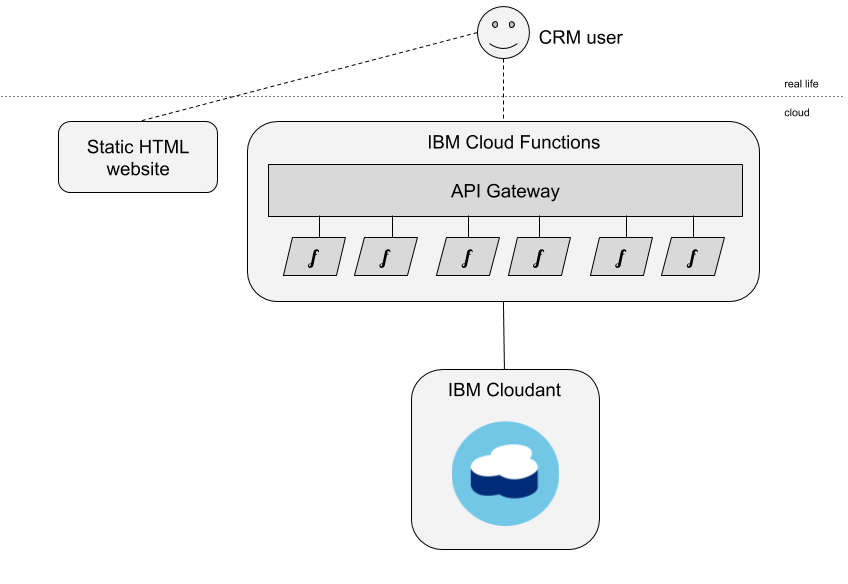
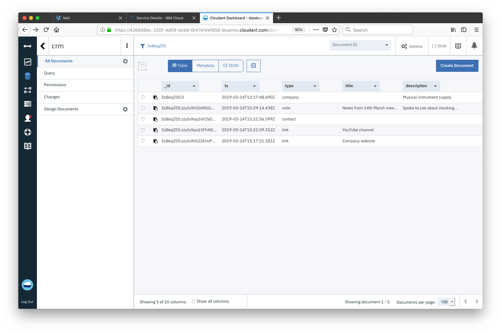
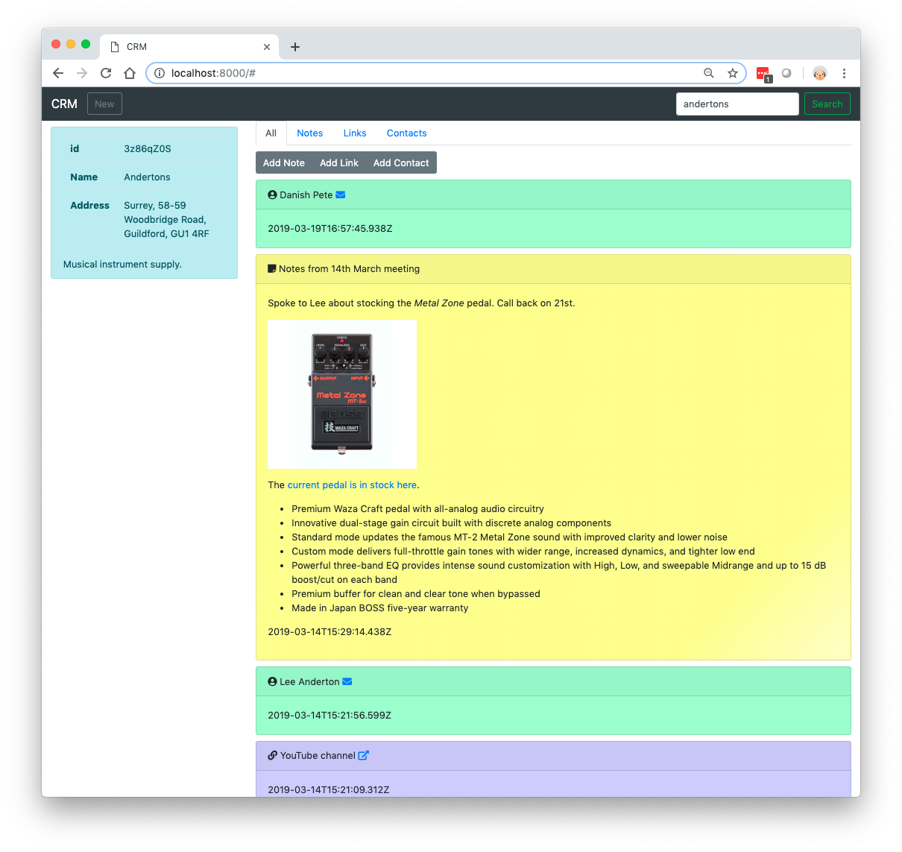

A Customer Relationship Management (CRM) system is simply a means of recording your business's relations with your customers. It may consist of:

- a searchable database of your customers, with the customer name, description and contact details.
- a time-ordered list of notes detailing the interactions you have had with the customer.
- a list of contact details of the people  you have relationships with at that company.

It may also store other "per customer" objects e.g. sales made, appointments set or  anything else that you need to keep track of your relationship with the customer. CRM systems tend to be multi-user to allow several people in your organisation to manage the relationship with your customers.

Lots of people choose off-the-shelf CRM solutions such as [Salesforce](https://www.salesforce.com/uk/) or [Zoho](https://www.zoho.com/crm/) but in this article we're going to explore how you might build your own CRM system using a few cloud components:

- a static website storing the CRM front-end using HTML, CSS and client-side JavaScript.
- an HTTP API powered by a functions-as-a-service, serverless platform.
- a NoSQL database to store the data as JSON documents.

Specifically, we're going to employ [IBM Cloud Functions](https://console.bluemix.net/openwhisk/) with its API Gateway integration and [IBM Cloudant](https://www.ibm.com/uk-en/cloud/cloudant) as the data store.



Assuming we've set up an [IBM Cloud](https://www.ibm.com/cloud/) account and provisioned a [Cloudant service](https://www.ibm.com/cloud/cloudant) within it, the next thing we need to do is to create a Cloudant database with the `partitioned=true` flag (our Cloudant service's URL, containing the service credentials, is hidden in an environment variable `COUCH_URL`) using the command-line tool `curl`:

```sh
curl -X PUT "$COUCH_URL/crm?partitioned=true"
```

The database is called `crm` and is created with a simple `PUT` HTTP call.

## Data Design

Before we starting writing code, it's worth thinking about how our data will look in the database, how data will be retrieved and to consider how the application will scale if and when the database grows to millions of documents. 

To get the best out of Cloudant we're going to:

- leverage Cloudant's new [Partitioned Databases](https://cloud.ibm.com/docs/services/Cloudant/guides?topic=cloudant-database-partitioning#partitioned-databases) feature that stores related data together in the same partition, where each document shares the same *partition key*.
- generate indexes so that each query we need to do is backed by a suitable index.

As a user will typically be dealing with one customer at a time, we are going to store all of a company's data in a _per company_ partition. We will generate a *partition key* per customer, which will form the prefix of each document's key field (its `_id`). As well as a core document storing the company meta data, we can have any number of additional documents  stored alongside it in the same partition:

- customer notes.
- customer contact person.
- customer links.

Each document type is distinguished by the `type` field in the document and additional types can be added at a later date as our product is developed.

### One document per customer

There will be a one document per company we are dealing with that stores the main company meta data (name, address, description etc). Its `_id` will be `<partition key>:0` so that when when querying a partition and sorting by `_id`, it appears first:

```js
{
  "_id": "3z86qZ0S:0",
  "type": "company",
  "name": "Andertons",
  "address": {
    "state": "Surrey",
    "street": "58-59 Woodbridge Road",
    "town": "Guildford",
    "zip": "GU1 4RF"
  },
  "description": "Musical instrument supply.",
  "ts": "2019-03-14T13:17:48.690Z"
}
```

In this case the partition key (`3z86qZ0S`) is randomly generated although it could be any string that uniquely identifies a business e.g. an incrementing number (`42`), a telephone number (`01483456777`), a domain name (`andertons.co.uk`) or something else (`andertonsgu14rf`).

### One document per customer note

An additional document will be added for each note we store against the customer:

```js
{
  "_id": "3z86qZ0S:zzyIvXhl2oWGGH37lp1V3riq2q3k7LkU",
  "type": "note",
  "title": "Notes from 14th March meeting",
  "description": "Spoke to Lee about stocking...",
  "ts": "2019-03-14T15:29:14.438Z"
}
```

Each note document shares a partition key with company it relates to (`3z86qZ0S`) and adds its own document key (`zzyIvX....`) to keep the `_id` unique. The `type` field identifies which object type is being stored. The `description` field is in [Markdown](https://daringfireball.net/projects/markdown/) format so that it can contain structure (bullet points, sections, hyperlinks etc) which can be rendered correctly on the HTML front end. 

### One document per contact person

```js
{
  "_id": "3z86qZ0S:zzyIvXop2eYZeD1B1Sl13tBZfD2nC3qN",
  "type": "contact",
  "name": "Lee Anderton",
  "email": "lee@andertons.co.uk",
  "ts": "2019-03-14T15:21:56.599Z"
}
```

Each contact document shares a partition key with company it relates to (`3z86qZ0S`) and adds its own document key (`zzyIvX....`) to keep the `_id` unique. The `type` field identifies which object type is being stored.

### One document per customer link

```js
{
  "_id": "3z86qZ0S:zzyIvXpa15FhND3IJwL61gD5l40vK7Yn",
  "type": "link",
  "title": "YouTube channel",
  "url": "https://www.youtube.com/channel/UCSNxIry_FPFcQDFRbi3VOAw",
  "ts": "2019-03-14T15:21:09.312Z"
}
```

Each link document shares a partition key with company it relates to (`3z86qZ0S`) and adds its own document key (`zzyIvX....`) to keep the `_id` unique. The `type` field identifies which object type is being stored.

## Thinking about sort order

When looking at a customer in our CRM system we want a chronological list of events - we'd like all documents from the partition in "newest first order". Although we can sort data at query time, it's sometimes helpful to make the `_id` field sort in the order you need in most cases. I use the [kuuid](https://www.npmjs.com/package/kuuid) module to generate 32-character document keys that are unique and sort by time. The `kuuid.idr()` function makes ids that sort in *reverse* or "newest first" order.

We can see from the Cloudant dashboard the sort order in action. The documents sort into "newest first" order without any effort, with the exception of the core `type:company` document which is fixed to the top of the sorted list by virtue of its `<partition key>:0` _id.



When a new note/contact/link object is added it will slip into *second place* in this list, behind the `type: company` document. This is exactly what we want to be able to render a company page in our CRM system - we can get the company meta data from the `<partition key>:0` document and the next most recent objects, all in one API call.

## Indexing

As well as fetching data from a partition in newest first order, this application needs two indexes to service other access patterns:

1. A global index that allows the user to search for companies by company name.
2. A partitioned index that allows a single partition's documents to be fetched by "type".

### Index - for searching by company name

To search across the the entire database, we need a _global index_ - we need to supply `partitioned:false` in the index definition. We can also keep the index small with a `partial_filter_selector`, an index-time filter that decides which documents make it into the index - we only want `type: company` documents. 

```sh
# create a global index on "name" (for docs of type==compamy)

# content type
CT="Content-type: application/json"

# index definition in JSON:
# - fields - index "name" as a string
# - partial_filter_selector - only allow docs of type==company into the index
# - type - "text" means use a Lucene-based free-text index
# - ddoc - store all global indexes in a Design Document called "global"
# - name - call this index "byName"
# - partitioned - "false" means "make this a global index" (as opposed to a partitioned one)
I='{"index":{"fields":[{"name":"name","type":"string"}],"partial_filter_selector":{"type":"company"}},"type":"text","ddoc":"global","name":"byName","partitioned":false}'

# send index definition to Cloudant
curl -X POST -H "$CT" -d"$I" "$COUCH_URL/crm/_index"
```

### Index - for searching for document types within a partition

When fetching documents of a single type relating to a single company, we can use a _partitioned_ index (`partitioned:true` is supplied here for clarity, but it is the default for a partitioned database). Directing a query to a single partition uses far fewer database resources making the query faster and cheaper to execute than a global query.

```sh
# create a partitioned index on "type"

# index definition in JSON:
# - fields - index "type" attribute
# - type - "json" means use a MapReduce-based index
# - ddoc - store all partitioned indexes in a Design Document called "partitioned"
# - name - call this index "byType"
# - partitioned - "true" means "make this a partitioned index" (as opposed to a global one)
I='{"index":{"fields":["type"]},"type":"json","ddoc":"partitioned","name":"byType","partitioned":true}'

# send index definition to Cloudant
curl -X POST -H "$CT" -d"$I" "$COUCH_URL/crm/_index"
```

## Building an API

I like to create a separate IBM Cloud Function for each API method. My core API calls are:

- `POST /crm/addcompany` - add a new company (in a new partition).
- `POST /crm/addcontact` - add a contact to a company.
- `POST /crm/addlink` - add a link to a company.
- `POST /crm/addnote` - add a note to a company.
- `GET /crm/fetch` - fetch the company and its recent history.
- `GET /crm/fetchfilter` - fetch documents of a specified type for a company.
- `GET /crm/search` - search for a company by name.

Each of these API calls has [its own directory](https://github.com/glynnbird/crm/tree/master/api) in the source code, as each API call may have its own dependencies. Each API call has its own `./deploy.sh` script which uploads the Cloud Function and creates the API Gateway configuration around it. An overall [deploy.sh](https://github.com/glynnbird/crm/blob/master/api/deploy.sh) script sets up the Cloud Functions package and deploys all of the code in sequence.

Once deployed, the API can be secured to require an API key or an OAuth login from Google/Facebook/GitHub.

Let's look at one API call in detail: `GET /crm/fetch`

### GET /crm/fetch

This API call fetches a single business's core meta data document and that company's recent history in one API call. It's able to do so because:

- each business's data is in a separate partition, so if you know the partition key, a query can be directed to *that partition* making for a faster and cheaper database operation.
- the business's documents are ordered so that the *first* document contains the business details and the rest of the documents are in "newest first" time order.

We can simply call the `_all_docs` API call for the selected partition to fetch the data we need, using `limit` parameter to define how many documents to return.

This is the simplified source code ([original is here](https://github.com/glynnbird/crm/blob/master/api/fetch/fetch.js)):

```js
const Cloudant = require('@cloudant/cloudant')

// main
async function main(args) {

  // connect to Cloudant
  const cloudant = Cloudant({url: args.COUCH_URL})
  
  // custom request to fetch all the documents from
  // a known partition partition (or the first 10)
  const r = { 
    method: 'get',
    path: encodeURIComponent('crm') + '/_partition/' + encodeURIComponent(args.partition) + '/_all_docs',
    qs: {
      limit: 10,
      include_docs: true
    }
  }

  // make the API call
  const info = await cloudant.request(r)
  return {
    body: info,
    statusCode: 200,
    headers: { 'Content-Type': 'application/json' }
  }
}

exports.main = main
```

## Accessing the API from a web app

The API Gateway supplied with IBM Cloud Function is CORS-enabled, so that any web app can make HTTP calls directly to the API Gateway URLs to access the API methods. I chose the [Fetch API](https://developer.mozilla.org/en-US/docs/Web/API/Fetch_API) which makes client-side HTTP requests a breeze:

```js
const CRMAPIsearch = async (term) => {
  const data = await fetch(APIURL + '/search?query=' + encodeURIComponent(term))
  const obj = await data.json()
  return obj
}
```

A [Vue.js](https://vuejs.org/)-based front-end allows the user to search for business and add notes/links/contacts by completing and submitting forms:



The web app will win no prizes for user interface design but is works functionally!

To do:

- make each objected deletable and editable.
- add other objects - sale, appointment, complaint etc.
- extend the global search facility to make the company address and description searchable.
- provide a local, partitioned search facility to allow a single company's notes, contacts, links etc to be searched.
- add authentication so that the API is only accessible to authorised users.

