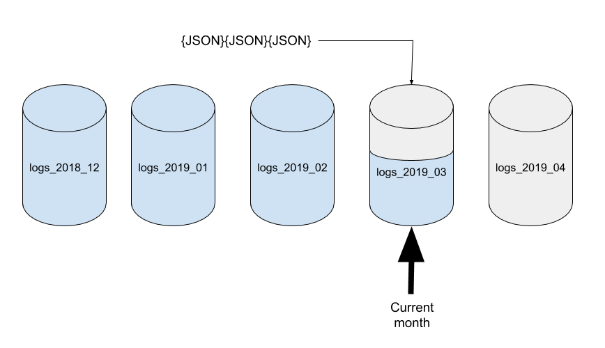
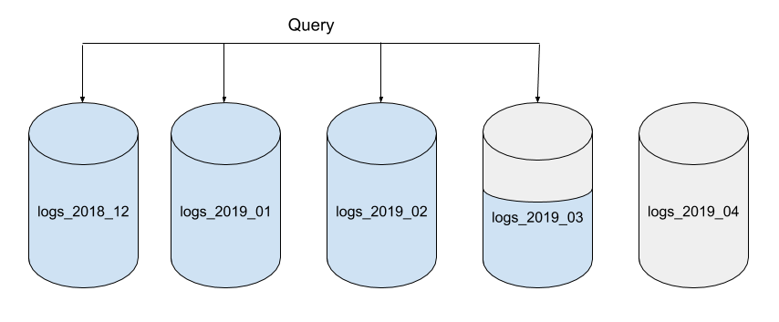
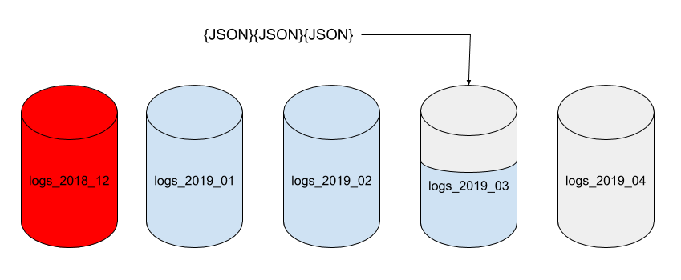
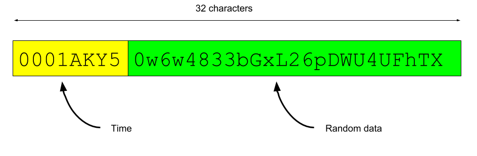

Time-series data is simply the recording of data points in time order such as:

- Internet of Things (IoT) installations where sensors report readings periodically.
- Monitoring user-interface interactions from a website to get a sense of which part of the page your users are interested in.
- Storing the logs from a distributed computer system for diagnostics.
- Recording the sales of products from a store.

In this post we'll examine options for storing time-series data in Cloudant.


## The ever-growing data set

It's tempting to create a single, ever-growing Cloudant database to store your time-series data but it's worth taking time to think about how much data you'll be storing and to estimate the data size growth.

Let's say we're storing IoT data in documents like this:

```js
{
  "_id": "e30bff4b286dd88c1cc178b7dbacaded",
  "_rev": "1-8a10be69dc1e81531fee2c9ca2688508",
  "type": "reading",
  "device": "GE5521965B",
  "reading": 25.3,
  "units": "celcius",
  "timestamp": "2019-03-29T09:28:31.229Z"
}
```

At approximately 200 bytes per reading, each sensor would generate 6GB of raw data per year. Bear in mind that Cloudant stores data in triplicate and additional storage will be required for any secondary indexes you define. With only fifty or so sensors, your application could easily generate a terabyte of data per year.

In a lot of applications the most recent data, say the last year's, is of the most interest and older data can be archived to slower and cheaper storage methods such as [IBM Cloud Object Storage](https://www.ibm.com/uk-en/cloud/object-storage). Keeping your time-series store scalable and cost effective can become striking a balance between fast, primary data in a database and slower, cheaper data access in archive storage.

Putting all of our data in a single, ever-growing Cloudant database is impractical because:

- large monolithic Cloudant databases will become progressively less efficient unless _resharded_ to keep the shard sizes optimal.
- mass deletion of individual Cloudant documents is a non-starter for archival of old data. A [Cloudant deletion](https://cloud.ibm.com/docs/Cloudant?topic=Cloudant-delete-a-doc) leaves a _tombstone_ document behind - a document recording the last `_id`/`_rev` pair to ensure that the document remains deleted after replication.

A common work-around is to adopt the "timeboxed database" pattern, as outlined in the next section.

## The timeboxed database pattern

This pattern is pretty straightforward.

1. Create a database per time-period (e.g month).
2. Always write new data into _this month's_ database.
3. Ahead of time, create a new empty database ready for next month's data. Don't forget to create any [Design Documents](https://cloud.ibm.com/docs/Cloudant?topic=Cloudant-design-documents) needed to service queries in the new database.



This month's data can be queried from the _current_ database. Historical data can be queried by directing requests to the older databases that cover the time-range you are interested in.



To remove unwanted data, simply delete older monthly databases that are no longer needed. Deleting a whole database recovers all the data occupied by the database (JSON documents and associated indexes) cleanly and quickly.



This _write only_ approach combined with the deletion of older data by removing databases plays to Cloudant strengths.

## Storing time/date in a time-series database

The choice of time and date format in your JSON document is important because JSON has no native date/time data type. The gist is:

- use ISO-8601 format ("2019-03-29T10:36:03.510Z") to store time-sortable, human & machine readable time stamps.
- use "milliseconds since 1970" format for easy date/time arithmetic.
- use component day/month/year/hour/minute/second/millisecond/timezone pieces if you need to query by the pieces e.g. find events that occur when "hour == 18".
- you can use more than one of the above.

## Time-sortable ids

If we're using 32 characters to store a "random" `_id` field, then it would be handy if it sorted in chronological order in a time-series database.

In brief, the front of the `_id` is a time-sortable string and rest is random data. The `_id` field then sorts in approximate date/time order (to a precision of one second).



## Using timeboxed databases that are also partitioned

Depending on your use-case, it may also be useful to make your timeboxed databases _partitioned_ too, that is generated with the `?partitioned=true` flag to enable Cloudant's new [Partitioned Databases](/2019/03/05/Partition-Databases-Introduction.html) feature.

The choice of [partition key](https://cloud.ibm.com/docs/Cloudant?topic=Cloudant-database-partitioning#what-makes-a-good-partition-key) is beyond the scope of this post, but in a IoT application a _device id_ may be a good choice, as long as there are many devices generating data at a similar rate.

Here's an example document that uses the full gamut of Cloudant time-series tricks: monthly databases, time-ordered ids and partitioned databases:

```js
{
  "_id": "GE5521965B:001h9p4Z0XeJzT0372TQ0hk2q83CLdqg",
  "type": "reading",
  "device": "GE5521965B",
  "reading": 25.3,
  "units": "celcius",
  "timestamp": "2019-03-29T10:49:30.980Z"
}
```

- the `_id` field has a partition key of the reading's device id and a document key which is time-sortable, so the documents in a partition sort in date/time order.
- the `timestamp` field is stored in ISO-8601 which is time-sortable, readable and parsable by MapReduce functions.
- documents are are only ever written. Cloudant loves write-only design patterns.

Queries for a single timebox *and* a single device (e.g. "get me the latest 50 readings for device X") can be directed at a single partition and will use only a fraction of the resources of a global query.

```sh
// Fetch the 50 latest readings for device GE5521965B
// As the data is partitioned by device id, we can direct the query to a single partition.
// The data within the partition is in date/time order so the last 50 records are the
// ones we are interested in. descending=true reverses the order.
curl "$URL/logs_2019_03/_partition/GE5521965B/_all_docs?limit=50&descending=true&include_docs=true"
```

## Aggregating time-series data with MapReduce

A very common use-case for a time-series database is to produce aggregations of the recorded data grouped by time. [Cloudant's MapReduce](https://cloud.ibm.com/docs/Cloudant?topic=Cloudant-creating-views-mapreduce) allows the generation of materialized views of data by grouped, complex keys.

Cloudant supports the following reducers:

- `_count` - row count, optionally grouped by keys.
- `_sum` - the sum of numeric values, optionally grouped by keys.
- `_stats` - totals and counts required for mean, variance and standard deviation calculation, optionally grouped by keys.
- `_approx_count_distinct` - an approximate count of distinct keys.

Before we can reduce any data we need to generate the keys and values in the MapReduce index using a JavaScript function: 

```js
function(doc) {

  // convert timestamp to JavaScript Date object
  var d = new Date(doc.timestamp)
  
  // calculate time components
  var year = d.getFullYear()
  var month = d.getMonth() + 1
  var day = d.getDate()
  var hour = d.getHours()
  var minute = d.getMinutes()
  
  emit([year,month,day,hour,minute], doc.reading);
}
```

This JavaScript function is encoded into a Design Document and saved in the database:

```js
{
  "_id": "_design/aggregate",
  "views": {
    "byYMDHM": {
      "reduce": "_stats",
      "map": "function(doc) {\n\n  // convert timestamp to JavaScript Date object\n  var d = new Date(doc.timestamp)\n  \n  // calculate time components\n  var year = d.getFullYear()\n  var month = d.getMonth() + 1\n  var day = d.getDate()\n  var hour = d.getHours()\n  var minute = d.getMinutes()\n  \n  emit([year,month,day,hour,minute], doc.reading);\n}"
    }
  },
  "language": "javascript",
  "options": {
    "partitioned": false
  }
}
```

- the `_id` of the Design Document always starts with "_design/" and this identifier is used to query the view later.
- the `views` object contains one entry per MapReduce view. The name ("byYMDHM") is used to query the view later.
- the `map` function is the JavaScript function as a JSON-encoded string.
- the `reduce` string is the name of the built-in reducer.
- the `language` is "javascript" by default.
- the `options.partitioned` flag being `false` ensures that a _global_ view is calculated in this _partitioned_ database. If omitted, the view would only be queryable on a _per partition_ basis.

Once the Design Document is saved in the database, the view builds asynchronously - for a small database it will appear that the view is ready "immediately", but for larger datasets it may take some time before the view is ready to query.

The view is queried using the design document name and view name used earlier:

```sh
curl "$URL/logs_2019_03/_design/aggregate/_view/byYMDHM?group_level=3"
```

- `group_level` - is used to define how many elements of an array-based key are grouped together e.g. when emitting `[year,month,day,hour,minute]` as the key, a `group_level=3` means "group by year, month & day".
- `starkey`/`endkey` - can be used to limited the return data to keys between the supplied keys.
- `reduce` (true/false) - can be used to "switch off" the reducer step at query-time
- See [Using Views](https://cloud.ibm.com/docs/services/Cloudant/api?topic=cloudant-using-views#using-views) in the Cloudant documentation for more details

Note that when using monthly timeboxed databases, you may not need to emit the `year` and `month` values as all documents would emit the same first two keys, although it does help when combining aggregated results from multiple databases.

## Out-of-the box time-series solutions

If you don't want to build your own time-series solution, then the [Watson Internet Of Things](https://www.ibm.com/uk-en/internet-of-things) platform can run the whole thing as-a-service including device registration, data storage, analytics, monitoring and archival.


