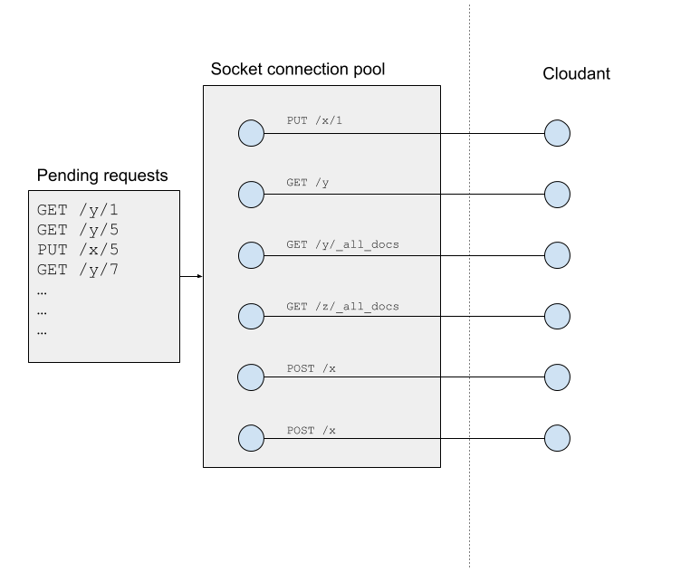

Building a Cloudant-based application with Node.js means that your app will making many HTTP requests to your Cloudant service. It's important to understand how such HTTP traffic is coordinated in Node and to be able to measure the anatomy of each request so that you can measure latencies and eliminate unwanted delays.

In this post we'll be using the [Official Node.js Cloudant library](https://www.npmjs.com/package/@cloudant/cloudant), exploring HTTP connection pooling and finding out how to instrument your Node.js app.

## The anatomy of an HTTP request

When your app decides to make an HTTP request, a number of tasks are performed in sequence:

- DNS lookup - your Cloudant domain name is resolved to an IP address using a DNS resolver.
- Socket connection - a TCP socket is established between your app and the remote Cloudant service on port 443, the default port for HTTPS traffic.
- TLS handshake - the client and server negotiate which version of Transport Layer Security (TLS) is to be used to encrypt the traffic, keys are exchanged and the server's certificate is tested for authenticity.
- Client request - the HTTP request, headers and body are sent to the server over the encrypted connection.
- Client response - the server's response is sent back to the client.

When your app decides to make a second request, it can _reuse_ the existing socket and avoid the DNS lookup, socket connection and TLS handshake steps. 

## HTTP Connection Pooling

An HTTP socket can only host one HTTP request at anyone one time, but a Node.js app can utilise several sockets at once - known as a connection pool. By default, the Cloudant Node.js library is configured to use a pool of six sockets - this means that six HTTP connections can be in flight at any one time. 

When you issue a Cloudant API call in your Node,js app, it queues inside the app until a socket becomes free in the pool. 



If you have more requests in flight than you have sockets in the pool, then some requests will be delayed in your app waiting for a socket to become available. The key to discovering if you are adding latency to your requests by not having enough free sockets is to record detailed metrics.

## Recording HTTP metrics

When we instantiate the `@cloudant/cloudant` Node.js library we can switch on detailed timings by supplying `{time: true}` to the `requestDefaults` object:

```js
const cloudantOpts = {
  url: process.env.COUCH_URL,
  requestDefaults: {
    time: true
  }
}
const Cloudant = require('@cloudant/cloudant')
const cloudant = Cloudant(cloudantOpts)
```

To access this timing information we need to add a custom plugin to the Cloudant library to intercept each request:

```js
const Cloudant = require('@cloudant/cloudant')
const { BasePlugin } = Cloudant 

/**
 * Timer plugin.
 * Has access to fine-grained timings for each HTTP request.
 */
class TimerPlugin extends BasePlugin {
  constructor(client, cfg) {
    super(client, cfg)
    this.id = 'timer'
  }

  onResponse(state, response, callback) {
    response.request.on('end', function () { 
      console.log(response.request.method, response.request.path, response.statusCode)
      console.log(response.timingPhases)
    })
    callback(state)
  }

  onError(state, error, callback) {
    callback(state)
  }
}

module.exports = TimerPlugin
```

> Note: Requires version 4.2.3 or above of the [Node.js Cloudant](https://www.npmjs.com/package/@cloudant/cloudant) library.

We need to tell the Cloudant library about our plugin at startup:

```js
const timerPlugin = require('./timerplugin.js')
const cloudantOpts = {
  url: process.env.COUCH_URL,
  requestDefaults: {
    time: true
  },
  plugins: [timerPlugin]
}
const Cloudant = require('@cloudant/cloudant')
const cloudant = Cloudant(cloudantOpts)
```

Our plugin's `onResponse` function is called when Cloudant responds to an HTTP request. At that point we set up a function to wait for the `end` event (signifying the end of the of HTTP response) which then `console.log`s a `response.timingPhases` object containing timings for each phase of the HTTP request:


```js
{
  wait: 14.766608999999988,
  dns: 66.622751,
  tcp: 127.91263899999998,
  firstByte: 288.22381900000005,
  download: 54.45547700000003,
  total: 551.981295
}
```

If two HTTP requests are dispatched in sequence in our app, the second request should have a quite different `timingPhases` profile:

```js
{
  wait: 0.5625499999999874,
  dns: 0,
  tcp: 0,
  firstByte: 139.43548199999998,
  download: 30.81753900000001,
  total: 170.81557099999998
}
```

It has zero or near zero delays in the wait/dns/tcp phases because it reuses the socket opened during the first request.

> Note: In my example code I am simply outputting timings to the console, but in your case you would want to store the details of the request and the timing data in your chosen monitoring package.

## Analyzing the timings

To minimise latencies, your application needs to be as geographically close to its Cloudant service, preferably in the same data centre. 

It's also important to note that some Cloudant HTTP requests are intentionally long e.g. long-polling the Cloudant changes feed. Be careful not to include such requests in your average calculations!

### wait

If you are seeing values of `wait` greater than a millisecond for anything but the app's first request (per socket) then you may have more HTTP requests in flight than you have available sockets. See the next section on _increasing maxSockets_ to remedy this. 

You may also see longer values of `wait` if you are [Blocking the Event Loop](https://nodejs.org/ru/docs/guides/dont-block-the-event-loop/) by executing long-running synchronous code which doesn't allow Node.js enough processor cycles to service network IO.

### dns

The DNS lookup is a one-time operation per socket and should only take a few tens of milliseconds.

### tcp 

This is another one-off cost per socket whose speed will depend on the proximity of your Cloudant service. A transatlantic TLS negotiation may take 150ms.

### firstByte

This is a measure of how long it took to get your app's request to Cloudant plus how long it took for Cloudant to begin to respond. Note that it includes network latency between you and Cloudant, so a close proximity to Cloudant will help to minimise this number. A large value here may indicate an inefficient query that takes Cloudant a while to answer or a large request size (e.g. uploading a binary attachment).

### download

This is a measure of the time taken to spool Cloudant's response to you. It depends on the network latency and the volume of data being requested from Cloudant. The Node.js Cloudant library asks Cloudant to _zip_ JSON responses, which helps to minimise this measurement.

### total

The entire HTTP timing from start to finish. 

## This works for any HTTP request

This timing trick isn't exclusive to the Node.js Cloudant library - it's actually baked into the Node.js `request` library, so any HTTP request you do can be timed in this way:

```js
const request = require('request').defaults({time: true})
request.get('https://google.com', function(err, res, body) {
  console.log(res.timingPhases)
})
```

## Increasing maxSockets

If you anticipate having more than six HTTP requests in flight in your Node.js app, or you are seeing significant values of `wait` from your HTTP latency monitoring, then you may need to increase the size of `maxSockets` - the maximum number of sockets used in the HTTP connection pool.

It is easily configured within the Node.js Cloudant library:

```js
const timerPlugin = require('./timerplugin.js')
const https = require('https')
const myagent = new https.Agent({
  keepAlive: true,
  keepAliveMsecs: 30000,
  maxSockets: 50
})
const cloudantOpts = {
  url: process.env.COUCH_URL,
  requestDefaults: {
    time: true,
    agent: myagent
  },
  plugins: [timerPlugin]
}
```

We create our own `https.Agent` configured to keep sockets alive for thirty seconds and a custom value of `maxSockets`, in this case `50`.


