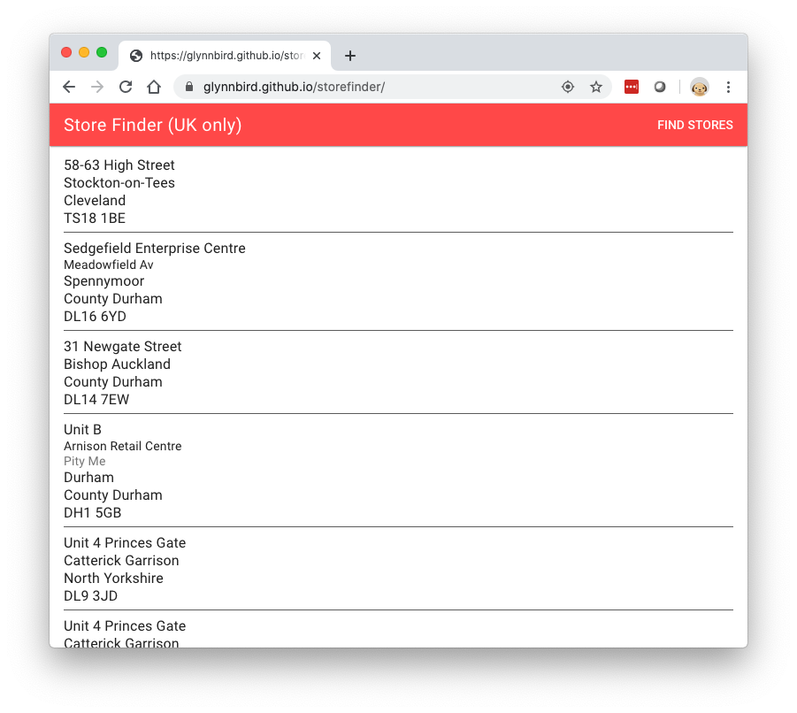

> Note: Given the age of this blog post, several links may be broken.

In this post we'll be creating a web-based _store finder_ using Cloudant. A user visits your website and wants to know which of your branches is closest to their current location.

To build this need a search index that can sort search results by distance but first, we need a database of branches.

## Data preparation

Let's say we have a list of branches that looks like this:

```txt
130 Turves Road, Cheadle Hulme, Cheadle, Cheshire, SK8 6AW
2-8 High Street, Witney, Oxfordshire, OX28 6HA
34 Church Wk, Caterham, Surrey, CR3 6RT
49 Calverley Road, Tunbridge Wells, Kent, TN1 2UU
8 Pitsea Centre, Northlands Pavement, Pitsea, Basildon, Essex, SS13 3DU
36 The Broadway, London, E15 1NG
14-16 Station Road, West Drayton, Middlesex
```

Our first task is to split the addresses into meaningful columns:

| address1                                              | address2                         | address3                 | city                 | county             | postcode |
|-------------------------------------------------------|----------------------------------|--------------------------|----------------------|--------------------|----------|
| 130 Turves Road                                       | Cheadle Hulme                    |                          | Cheadle              | Cheshire           | SK8 6AW  |
| 2-8 High Street                                       |                                  |                          | Witney               | Oxfordshire        | OX28 6HA |
| 34 Church Wk                                          |                                  |                          | Caterham             | Surrey             | CR3 6RT  |
| 49 Calverley Road                                     |                                  |                          | Tunbridge Wells      | Kent               | TN1 2UU  |
| 8 Pitsea Centre                                       | Northlands Pavement              | Pitsea                   | Basildon             | Essex              | SS13 3DU |
| 36 The Broadway                                       |                                  |                          | London               |                    | E15 1NG  |
| 14-16 Station Road                                    |                                  |                          | West Drayton         | Middlesex          | UB7 7BY  |

Next we need to to be able to locate each of our addresses on a map, by calculating a latitude and longitude of each branch. In the UK, the [Office for National Statistics](https://geoportal.statistics.gov.uk/datasets/4f71f3e9806d4ff895996f832eb7aacf) publishes a list of postcodes and their longitude/latitude so with with a suitable [tool](https://github.com/glynnbird/postcodelookup), we can lookup each branch's postcode and add additional columns for the positional data:

| address1                                              | address2                         | address3                 | city                 | county             | postcode | longitude | latitude  |
|-------------------------------------------------------|----------------------------------|--------------------------|----------------------|--------------------|----------|-----------|-----------|
| 130 Turves Road                                       | Cheadle Hulme                    |                          | Cheadle              | Cheshire           | SK8 6AW  | -2.206689 | 53.373407 |
| 2-8 High Street                                       |                                  |                          | Witney               | Oxfordshire        | OX28 6HA | -1.484964 | 51.785435 |
| 34 Church Wk                                          |                                  |                          | Caterham             | Surrey             | CR3 6RT  | -0.077256 | 51.281556 |
| 49 Calverley Road                                     |                                  |                          | Tunbridge Wells      | Kent               | TN1 2UU  | 0.266187  | 51.134097 |
| 8 Pitsea Centre                                       | Northlands Pavement              | Pitsea                   | Basildon             | Essex              | SS13 3DU | 0.504061  | 51.566237 |
| 36 The Broadway                                       |                                  |                          | London               |                    | E15 1NG  | 0.001901  | 51.541677 |
| 14-16 Station Road                                    |                                  |                          | West Drayton         | Middlesex          | UB7 7BY  | -0.474192 | 51.509073 |

## Importing tabular data into Cloudant

It's easy to import data in CSV (comma-separated values) or TSV (tab-separated values) into Cloudant. [couchimport](https://www.npmjs.com/package/couchimport) allows data to be bulk imported into a Cloudant database from a variety of formats. If our data is in a text file called `branches.txt` with TAB characters separating the columns and the first row containing column headings, then `couchimport` can be used like so:

```sh
# import the tabular data from "branches.txt" into Cloudant database "branches"
cat branches.txt | couchimport --db branches
```

The `couchimport` utility expects the Cloudant URL, including credentials, to be stored in an environment variable. See the [README](https://www.npmjs.com/package/couchimport) for details.

One subtlety of importing data from a text file, is that there is no sense of data type. If we want the latitude and longitude to be treated as numbers instead of strings, then we need to _transform_  the data on its way into Cloudant. Create a transform function like this:

```js
module.exports = function (doc) {
  doc.longitude = parseFloat(doc.longitude)
  doc.latitude = parseFloat(doc.latitude)
  return doc
}
```

and tell `couchimport` the path of the transform function:

```sh
# import data while transforming longitude & latitude into numbers
cat branches.txt | couchimport --db branches --transform './transform.js'
```

## Creating a 'find my nearest' index

[Cloudant Search](https://cloud.ibm.com/docs/Cloudant?topic=Cloudant-cloudant-search#geographical-searches) has a mode which allows search results to be ordered by distance from a supplied point. First we need to create the index by uploading a JavaScript function that decides which attributes to index:


```js
// index town, latitude & longitude
function(doc) {
  index('town', doc.town)
  index('latitude', doc.latitude)
  index('longitude', doc.longitude)
}
```

When we come to query the index we need to do two things:

1. Supply a reasonable lat/long range around the centre point of our user's location. If we don't bound the query by a geographical area, Cloudant would have to use all the data in the database to get the result. The size of the region will depend on the density of your data - if you have branches on every street corner, a small area will suffice but a bigger geography will be needed for sparser data sets.
2. Instruct Cloudant to sort the data by proximity to our centre point. Cloudant Search has a specific [sort parameter](https://cloud.ibm.com/docs/Cloudant?topic=Cloudant-cloudant-search#geographical-searches) which orders by distance from a point

If the centre point of our search is lat=51.508056 & long=-0.128056 (Trafalgar Square, London), then we could pick a region +-0.5° of latitude & longitude, so our query in Lucene query language becomes:

```
// find documents +-0.5° around our centre point
latitude:[51.0080 TO 52.0080] AND longitude:[-0.628056 TO 0.371944]
```

and our [sort parameter](https://cloud.ibm.com/docs/services/Cloudant?topic=Cloudant-cloudant-search#geographical-searches) is:

```
// sort by distance from the supplied point with distance units of kilometres
"<distance,longitude,latitude,-0.128056,51.508056,km>"
```

The full URL, with special characters escaped correctly, becomes:

```
https://mycloudant.service.com/branches/_design/find/_search/nearest?q=latitude%3A[51.0080%20TO%2052.0080]%20AND%20longitude%3A[-0.628056%20TO%200.371944]&sort=%22%3Cdistance,longitude,latitude,-0.128056,51.508056,km%3E%22&include_docs=true&limit=10
```

which with additional parameters `include_docs=true&limit=10` returns the ten nearest branches to our chosen location.

## Putting it all together

It's relatively simple to get a user's location (with their permission) in a web application. [This tutorial](https://web.dev/user-location/) explains it in easy steps. For dedicated apps for [Apple](https://developer.apple.com/documentation/corelocation/getting_the_user_s_location) and [Android](https://developer.android.com/training/location) devices, the platform SDKs have their own location APIs.

Here's a [single-page web app](https://github.com/glynnbird/storefinder/blob/master/index.html) that:

- Asks permission of the user to get their location.
- Gets the browser's location.
- Creates a query from the browser to a Cloudant service, asking for stores around the browser's location.
- Presents the results as a list of stores.

If you're in the UK, you can [try it here](https://glynnbird.github.io/storefinder/).



## Extra ideas

To further improve the store finder it could also:

- Fall back to asking for the user's "city" and perform a fielded search for documents matching the supplied city, if the user declines to give us their latitude & longitude.
- Present the results on a map.
- Allow multi-page result sets to be accessed with an "infinite scroll" mechanism (see the [bookmark](https://cloud.ibm.com/docs/Cloudant?topic=Cloudant-cloudant-search) parameter).
- Provide links for directions, [detecting which mapping app](https://medium.com/@colinlord/opening-native-map-apps-from-the-mobile-browser-afd66fbbb8a4) the user is likely to use.
- Add extra meta data: phone numbers, URLs, opening times, store features etc.
- Allow filtering of results by features e.g only show stores that are currently open 

