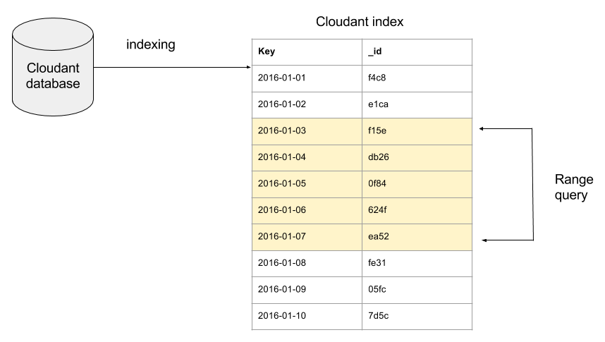
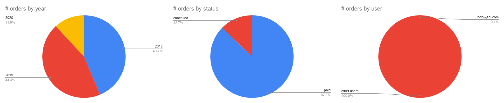

[Cloudant Query](https://cloud.ibm.com/docs/services/Cloudant?topic=cloudant-query) is a JSON-based query language inspired by MongoDB. It allows the developer to express the slice of data they need from a database using a mixture of logical and comparison operators.

For example, if the following JSON is sent to the database's `_find` endpoint:

```js
POST /orders/_find

{
  "selector": {
    "$and": [
      { "date": { "$gte": "2018-01-01" } },
      { "date": { "$lt": "2019-01-01" } },
      { "status": "cancelled" },
      { "user": "bob@aol.com" }
    ],
  },
  "limit": 5
}
```

then the first five documents that match all of the following clauses will be returned:

- The order must have been created in 2018.
- Have a status of 'cancelled'.
- Belong to a known user `bob@aol.com`.

By default, when given this query Cloudant will have to scan each of the database's documents in turn to see if they match the _selector_ until it has the five results that it needs. If there are fewer than five such documents in the database, then Cloudant will have performed a _full database scan_ to get the answer. 

This may be fine during development of your application, but if you want great performance as your data size and traffic increases, then we need to define a suitable _secondary index_ to help Cloudant get the answer without reading every document in the database.

## Explain - which index is being used?

How can we tell if a query is using a secondary index or "flying blind" and scanning each document in turn? We can send our query to the database's `_explain` endpoint (instead of `_find`):

```js
POST /orders/_explain

{
  "selector": {
    "$and": [
      { "date": { "$gte": "2018-01-01" } },
      { "date": { "$lt": "2019-01-01" } },
      { "status": "cancelled" },
      { "user": "bob@aol.com" }
    ],
  },
  "limit": 5
}
```

The returned data contains an explanation of which index, if any,  _would_ be selected:

```js
{
  ...
  "index": {
    "ddoc": null,
    "name": "_all_docs",
    "type": "special",
    "def": {
      "fields": [
        {
          "_id": "asc"
        }
      ]
    }
   }
   ...
}
```

In the above example, no secondary index is capable of helping the query - Cloudant is falling back on `_all_docs`, that is scanning each document in turn.

## Secondary indexing

A secondary index is an extra data structure that sits alongside the core database documents and is ordered by one or more attributes in the document. If we were extracting data by `date` then we may elect to create an index on the `date` field, by posting some JSON to the database's `_index` endpoint:

```js
POST /orders/_index

{
  "index": {
    "fields": ["date"]
  },
  "name": "ordersByDate",
  "type": "json"
}
```

This is an instruction for Cloudant to begin creating a secondary index on the `date` field. It does so by doing a on-off, full-database scan to create a data structure that links `date` to the document's `_id`. 



Once built, this date-ordered index can help reduce query times when asking for:

- Orders on a supplied date.
- Orders before a supplied date.
- Orders after a supplied date.
- Orders created between two dates.

But is "date" the right field to index in this case?

## Which attribute should I index?

The choice of attribute or attributes to index depends on the distribution of values within your database and the query you're making. 

For a database containing 100,000 orders, let's look at the distribution of orders by year in this dataset: 

| year | # orders |
|------|----------|
| 2018 | 43718    |
| 2019 | 44428    |
| 2020 | 11853    |

And by order status:

| status    | # orders |
|-----------|----------|
| paid      | 87275    |
| cancelled | 12724    |

And by user:

| status      | # orders |
|-------------|----------|
| bob@aol.com | 50       |
| other users | 99950    |

So what if we want to find cancelled orders from 2018 for our _bob@aol.com_ user, which _one_ field would be best to index?

- date? - Such a large date range (a whole year) leaves us with tens of thousands of documents still to scan to get the answer. ❌
- status? - Knowing that we're interested in only "cancelled" orders allows us to ignore the vast majority of data, but this still leaves 10% of the data left to scan ❌
- user? - In most commerce systems, there are many users and it turns out that singling out only Bob's orders gets us to only 50 documents - a tiny fraction of the total ✅



It's pretty clear that if we were to index only one field for this use-case, it should be `user` which would reduce our 100k documents to a few tens of documents if we know a user id. 

If we create that index and run a query where `user` is used in one of the clauses, Cloudant will use it to power the query:

```js
{
   "selector": {
      "$and": [
         { "user": "bob@aol.com" },
         { "status": "cancelled" },
         { "date": { "$gte": "2018-01-01" } },
         { "date": { "$lt": "2019-01-01" } }
      ]
   }
}
```

We can check that it is being used by sending the above query to the `_explain` endpoint, which shows which index is selected to assist the query:

```js
{
  ...
  "index": {
    "ddoc": "_design/0342694a2497a41a6f580d88277b306d0f4898db",
    "name": "byUser",
    "type": "json",
    "partitioned": false,
    "def": {
      "fields": [
        {
          "user": "asc"
        }
      ]
    }
  },
  ...
}
```

Notice that the `index` response to the `_explain` call indicates that Cloudant is no longer selecting the `_all_docs` route - the full-database scan - it is using our `byUser` index.

## Measuring the efficiency of a query

If we want to measure the efficiency of a Cloudant Query, we can add `execution_stats: true` to the object we pass to `_find` e.g.

```js
{
   "selector": {
      "$and": [
         { "user": "bob@aol.com" },
         { "status": "cancelled" },
         { "date": { "$gte": "2018-01-01" } },
         { "date": { "$lt": "2019-01-01" } }
      ]
   },
   "execution_stats": true
}
```

As well as our search results, the foot of the returned object will also contain some execution statistics: 

```js
  ...
  "execution_stats": {
    "total_keys_examined": 0,
    "total_docs_examined": 50,
    "total_quorum_docs_examined": 0,
    "results_returned": 2,
    "execution_time_ms": 10.75
  },
  "warning": "The number of documents examined is high in proportion to the number of results returned. Consider adding a more specific index to improve this."
}
```

In this case, Cloudant is explaining that in order to find the two matching documents, it had to examine fifty (`total_docs_examined`) documents. This isn't _too bad_, considering without an index, Cloudant would have had to scan _100,000_ documents. But we can do better.

## Should I index additional attributes?

How are the fifty orders belonging to Bob distributed by date & status?

| date | status    | # orders |
|------|-----------|----------|
| 2018 | cancelled | 2        |
| 2018 | paid      | 21       |
| 2019 | cancelled | 3        |
| 2019 | paid      | 17       |
| 2020 | cancelled | 0        |
| 2020 | paid      | 7        |

So if we want to get the index to take us to the 2 orders that are Bob's AND are in 2018 AND are cancelled, we'd need to index all three items: user, status and date by posting the following JSON to the `_index` endpoint:

```js
{
  "index": {
    "fields": [
      "user",
      "status",
      "date"
    ]
  },
  "name": "userStatusDate",
  "type": "json"
}
```

The order of the fields is important. We want the attribute that we are performing the _range query_ on at the end of the list - in this case we are querying between two dates, so `date` needs to be at the end of the list of indexed fields.

If we check the _execution stats_ of the query:

```js
  ...
  "execution_stats": {
    "total_keys_examined": 0,
    "total_docs_examined": 2,
    "total_quorum_docs_examined": 0,
    "results_returned": 2,
    "execution_time_ms": 5.158
  }
}
```

We are now scanning only two (`total_docs_examined`) documents to find the documents we need. 

## Conclusion

- Without an index, Cloudant Query will scan all documents in a database until it finds enough matches to satisfy the supplied query. This can be a very expensive query if the slice of data you are looking for is rare in the data set.
- A secondary index will be chosen to help the query if a query and an index have the same matching attributes. A well-designed index can greatly reduce the amount of work a query does by allowing Cloudant to jump straight to the matching data.
- The choice of attribute or attributes to index is important. If the chosen index still leaves Cloudant many documents to scan to get the final result, then this may result in poor query performance. e.g. in our example, if we'd chosen `date` as the only thing to index, the query would still have had to scan 40% of the database to get its answer.
- If the query includes multiple attributes one of which is a range, or is using less-than/greater-than operators, then that field should appear last in the list of indexed attributes. See [creating an index documentation](https://cloud.ibm.com/docs/services/Cloudant?topic=cloudant-query#creating-a-type-json-index).
- Use the `_explain` endpoint to check that your queries are using the index you expect. See [_explain documentation](https://cloud.ibm.com/docs/services/Cloudant?topic=cloudant-query#explain-plans)
- Specify the `use_index` parameter to tell Cloudant which index to use. See [use_index documentation](https://cloud.ibm.com/docs/services/Cloudant?topic=cloudant-query#working-with-indexes).
- Use the `execution_stats` flag at query-time to see how much work each query is doing. A query that scans many more documents than the number it returns is inefficient - the more documents scanned, the more inefficient it is. Inefficient queries will result in high latencies and performance problems as the data size and query traffic increases. See [execution_stats documentation](https://cloud.ibm.com/docs/services/Cloudant?topic=cloudant-query#working-with-indexes).

