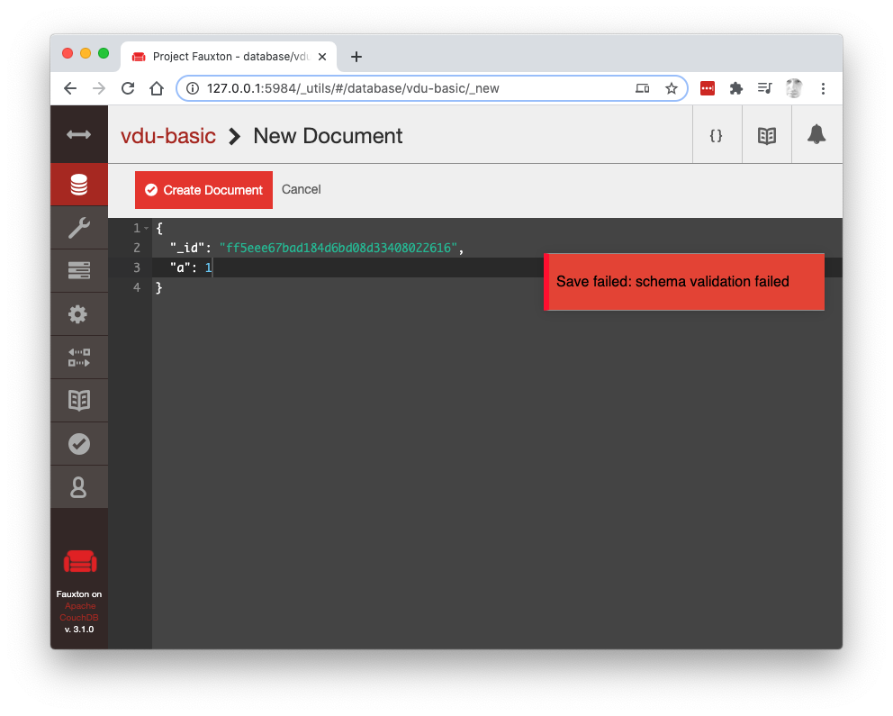

[JSON Schema](https://json-schema.org/) is a standard that allows you to specify the form of your JSON and allow programmatic validation of JSON against the specification.

In your application there would be a formal definition of the types of JSON being stored (e.g. users, orders, products etc) which could be used to verify objects prior to being allowed into the database. 

Having a formal schema definition has several advantages:

- It can be used to validate documents prior to being stored in the databases. If it doesn't match the specification, it's not allowed in.
- The schema can be used to automatically generate documentation and coded to access the defined objects.
- API frameworks like [Fastify](https://www.fastify.io/docs/latest/Getting-Started/#serialize-your-data) can use JSON Schema definitions to speed up the parsing of JSON payloads.

JSON Schemas are clear, unambiguous, machine & human readable definitions of the objects that your application needs. 

## What does a JSON Schema look like?

As we're looking at Cloudant databases which store JSON objects, let's focus on a schema describing a JavaScript _Object_, in this case an object representing a person:

```js
{
  "_id": "abc123",
  "type": "user",
  "name": "Bob Smith",
  "email": "bob.smith@aol.com",
  "password": "1f6b5d0e151388786d3820cded9408e2",
  "salt": "43614d9b1dec23da34a5b6f4eb71fb59",
  "active": true,
  "email_verified": true,
  "address": "19 Front Street, Darlington, DL5 1TY",
  "joined": "2020-07-23T11:50:17.809Z"
}
```

A JSON Schema representation of this object could be:

```js
{
  "$schema": "https://json-schema.org/draft/2019-09/schema",
  "$id": "http://glynnbird.com/person",
  "type": "object",
  "properties": {
    "_id": { "type": "string" },
    "_rev": { "type": "string" },
    "type": { "type": "string", "enum": ["user"] },
    "name": { "type": "string" },
    "email": { "type": "string", "format": "email" },
    "password": { "type": "string" },
    "salt": { "type": "string" },
    "active": { "type": "boolean" },
    "email_verified": { "type": "boolean" },
    "address":  { "type": "string" },
    "joined": { "type": "string", "format": "date-time"}
  },
  "additionalProperties": false,
  "required": ["type", "name", "email", "password", "salt", "active", "joined"]
}
```

Note that each property's _data type_ is specified with an optional `format` or `enum` for further validation. JSON Schema has a number of built in types (email/URL/date/time etc) and can also handle regular expression validation of other patterns.

As `additionalProperties` is set to `false`, no extra properties other than those defined in the schema are allowed. The `required` array lists the properties that must be present - all others are optional.

Try schema validation yourself using [this online tool](https://www.jsonschemavalidator.net/). Paste the schema in the left pane and the JSON in the right. Note how validation fails if there is a type/format mismatch, a missing mandatory property or the presence of any additional property.

## Implementing JSON Schema

There are [numerous implementations](https://json-schema.org/implementations.html) of JSON Schema validators in a range of programming languages. I was drawn to the [cfworker/json-schema](https://github.com/cfworker/cfworker/blob/master/packages/json-schema/README.md) JavaScript implementation which is designed to run on Cloudflare serverless workers with no dependencies. 

It would make sense to add JSON Schema validation in your application layer to prevent invalid JSON documents making it to Cloudant:

```js
import { Validator } from '@cfworker/json-schema'
const validator = new Validator(myPersonSchema)
const result = validator.validate(myObject)
// { valid: true }
if (result.valid) {
  await db.insert(myObject)
}
```

Frameworks such as [Fastify](https://www.fastify.io/) have JSON Schema support baked in and use them to get the best performance, as well as for schema validation.

Next we'll look at how schema validation could work _inside_ the Cloudant/CouchDB database.

## Validate Document Update functions

Cloudant and its open-source cousin Apache CouchDB have the ability to run user-defined JavaScript [Validate Document Update (VDU)](https://docs.couchdb.org/en/stable/ddocs/ddocs.html?highlight=validate_doc_update#validate-document-update-functions) functions which decide whether an incoming document makes it to the database or not.

Create a Cloudant database with a Design Document with the following content:

```js
{
  "_id": "_design/vdu",
  "validate_doc_update": "function (newdoc) { throw({ forbidden: 'schema validation failed' })  }"
}
```
 
This VDU function is executed before every regular document insert/update/delete operation and if it throws an error, then the document change is **not** stored. As this particular VDU function _always_ throws an error, we are unable to write any further documents to the database:



We can write our own custom logic into that VDU function to, say, reject documents that contain a property "b":

```js
{
  "_id": "_design/vdu",
  "validate_doc_update": "function (newdoc) { if (typeof newdoc.b !== 'undefined') throw({ forbidden: 'schema validation failed })  }"
}
```

Now any document is valid unless it contains `b` property. 

We can keep extending this VDU logic to ensure that only documents that match our schema are allowed, but _that's what JSON Schema is for_. If only there was a way to run a JSON Schema validator in a VDU function...

## Adding JSON Schema validation into a VDU function

CouchDB allows JavaScript functions to be "required" in from elsewhere in the Design Document, so if we store a JSON Schema validator in there, we are able to access it from our VDU function.

> Note: writing JavaScript in Design Documents is difficult, prone to error and almost impossible to debug. Things get gnarly from here.

First we need to add the [cfworker/json-schema](https://github.com/cfworker/cfworker/blob/master/packages/json-schema/README.md) validator into our design document together with the schema(s) to validate against and our VDU function.

The Design Document has the following shape:

```js
{
  "_id": "_design/validate",
  "views": {
    "lib": {
      "validator": "<JSON Schema validator code goes here>",
      "person": "<JSON Schema for a 'person' object goes here>"
    }
  },
  "validate_doc_update": "<VDU code goes here>",
}
```

The finished code is difficult to read as the JavaScript is represented as [JSON strings in the Design Document](https://gist.github.com/glynnbird/87e5e8ec01a04b4982c25c2bbda8d3ab):

<script src="https://gist.github.com/glynnbird/87e5e8ec01a04b4982c25c2bbda8d3ab.js"></script>

Let's look at the VDU function in more detail:

```js
function (newdoc) { 
  var Validator = require('views/lib/validator').Validator; 
  var schema = require('views/lib/person'); 
  var validator = new Validator(schema); 
  var r = validator.validate(newdoc); 
  if (!r.valid) { 
    throw({'forbidden':'schema does not match'})
  }  
}
```

- it uses `require` to pull in the validator function from the design document.
- it uses `require` to pull in the JSON schema we wish to test. If your database is storing documents of different types, it could pull in the correct schema dynamically here.
- if the incoming `newdoc` fails to pass schema validation an error is thrown and the document is not allowed in.

With this Design Document in place, the database only accepts objects that match the definition of our _person_ object by testing the incoming object against the schema. 

----

If you find JSON Schema useful, they have an [Open Collective page](https://opencollective.com/json-schema).
