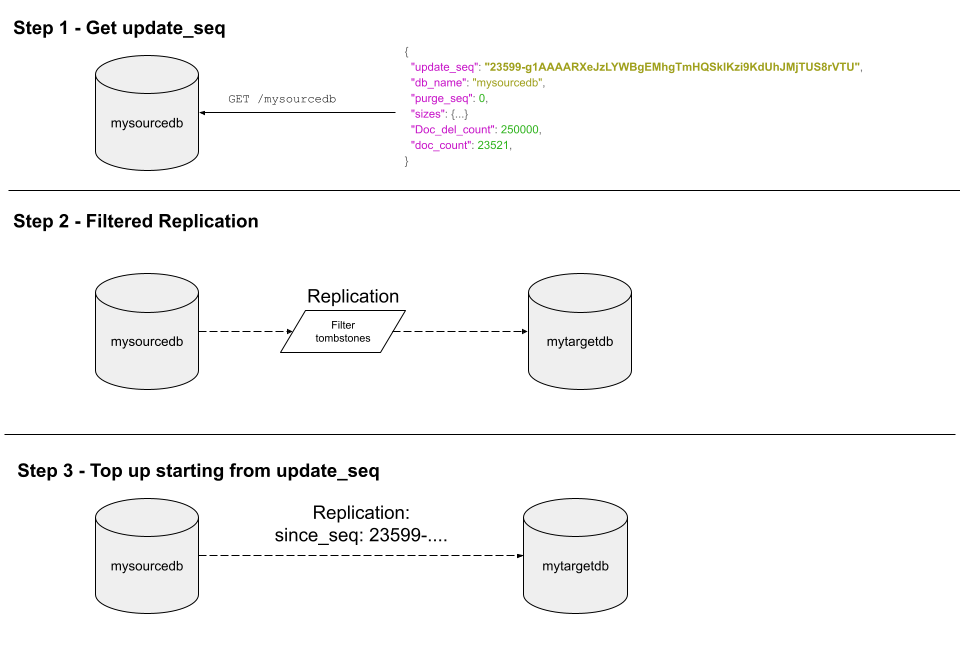

Cloudant and its sister database Apache CouchDB store document data in revision trees. When a document is deleted, a special deletion (`"deleted": true`) revision is added to the head of the tree. This allows the intention that the document is to be deleted to be replicated around, whether that be to other nodes in the cluster or to other Cloudant or CouchDB services in other geographies. Without this mechanism, it would be possible for a deleted document to be unintentionally resurrected via replication from an external replica.

The downside of this approach is that deleted documents occupy space in the database which adds additional cost for storage and  backup, and slows down replication and index building. 

If the number of deletions becomes onerous, it is best practice to periodically rid the database of the burden of these so-called "tombstone" documents: stub documents that mark the place of a formerly existing document. This blog post shows how to do just that.

## Filtered replication to delete tombstones

We can create a new empty database and set up a replication from the old database to the new but with a filter that leaves the tombstones behind.

Replications are started by creating a document in the `_replicator` database like so:

```js
{
  "_id": "myfirstreplication",
  "source" : "http://<username1>:<password1>@<account1>.cloudant.com/<sourcedb>",
  "target" : "http://<username2>:<password2>@<account2>.cloudant.com/<targetdb>",
  "selector": {
    "_deleted": {
      "$exists": false
    }
  }
}
```

where the `source` is the original database and the `target` is the new empty database. The `selector` is the filter that checks each document before replicating - in this case we only want documents _without_ a `deleted` attribute (an document that hasn't been deleted).

This solution works and will create you a pristine database that contains no deletions. But databases rarely stay static: what happens to documents that are deleted while the replication is in progress? Those deletions wouldn't make it to the target database, so documents that were intended to be deleted would be present in the target! This is avoidable by following the more complex procedure in the next section.

## Two-phase filtered replication

To delete the unwanted deletions but to keep deletions that are occuring _during the replication_, follow these steps:



1. Call the `GET /<sourcedb>` endpoint. This returns meta data about the source database and will tell us the current value of `update_seq`. This very long, opaque string is a representation of a point in time in the database's changes feed. Make a note of this value - we'll need it later.
2. Set up a one-off replication beteen the source database and the target database using a `selector` to filter out deletions, just as we did in the previous section. Let this run to completion. The target now contains no deletions.
3. Set up a second replication between the source and the target database _without a filter_, but with an additional parameter `"since_seq": "X"` where X is the value we saved from step 1. This "tops up" the target database with changes that have happened _since_ the point in time when we started the first replication, including any deletions that occurred. When this replication is complete, the target database can be used to handle live traffic instead of the source database.

The third step's `_replicator` document would look something like:

```js
{
  "_id": "mytopupreplication",
  "source" : "http://<username1>:<password1>@<account1>.cloudant.com/<sourcedb>",
  "target" : "http://<username2>:<password2>@<account2>.cloudant.com/<targetdb>",
  "since_seq": "23599-g1AAAARXeJzLYWBgEMhgTmHQSklKzi9KdUhJMjTU"
}
```

This third replication could additionally have `"continuous": true` added so that changes are continuously replicated from source to target. This is useful to keep the original and new databases in lock-step while the application code is updated to point to the new target database. The continuous replication can be stopped and the source database deleted after switchover.


