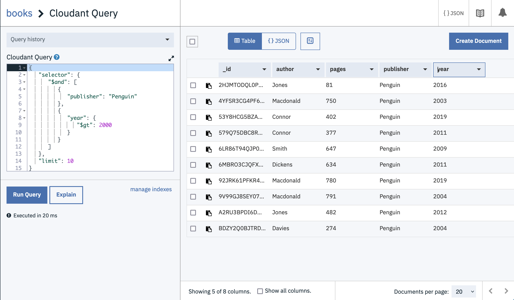
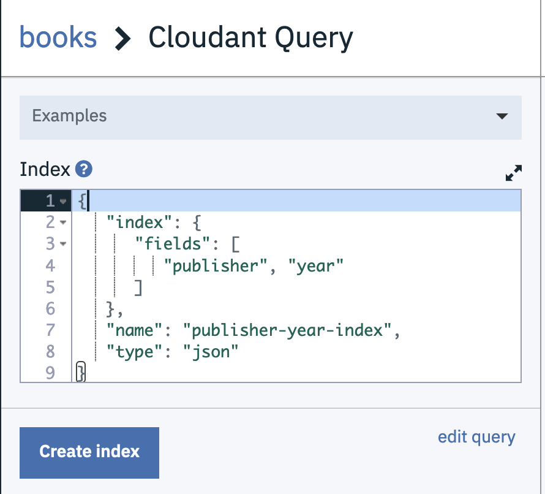
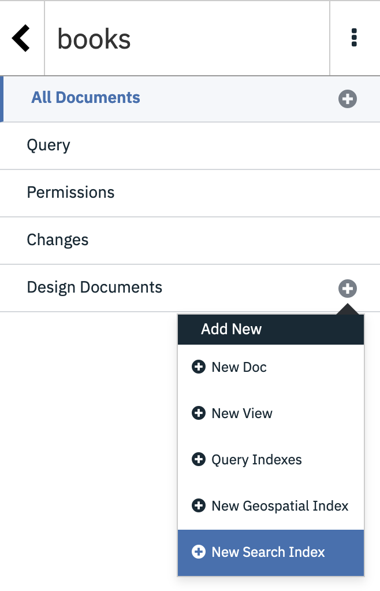
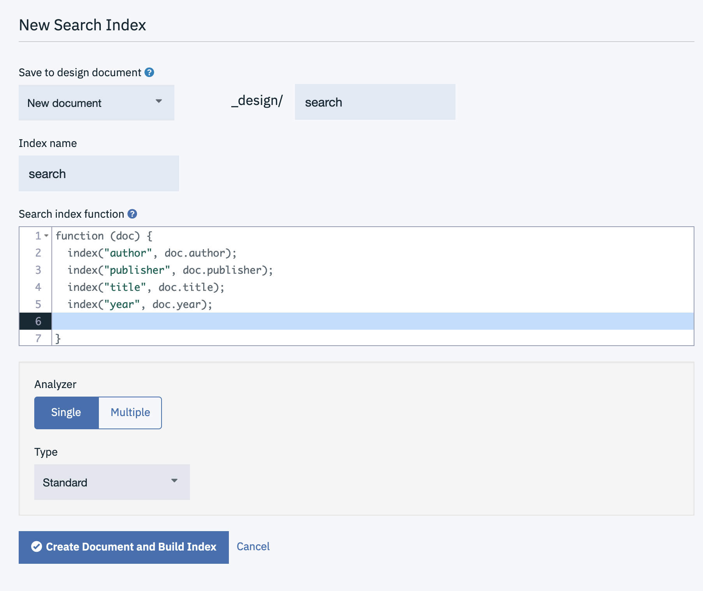
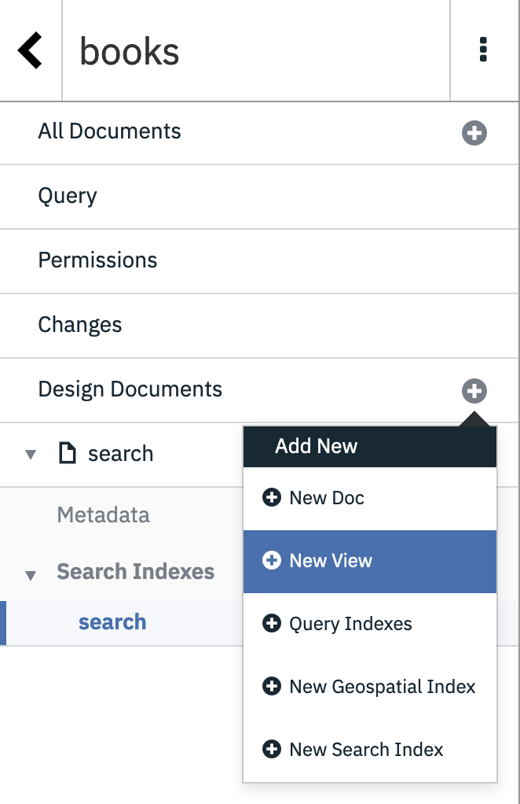
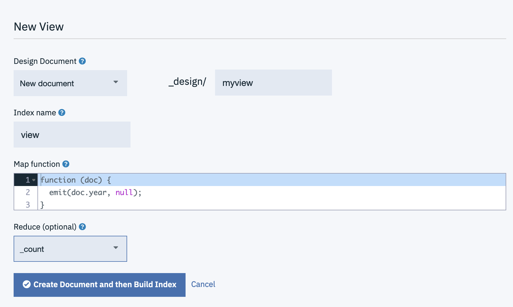
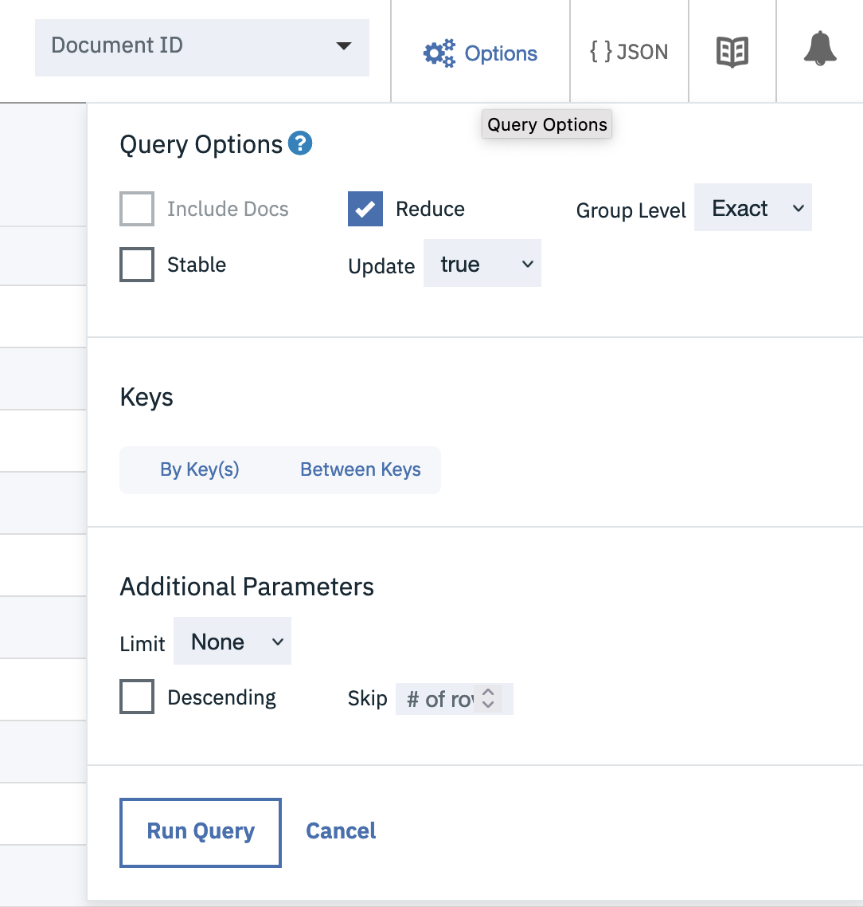
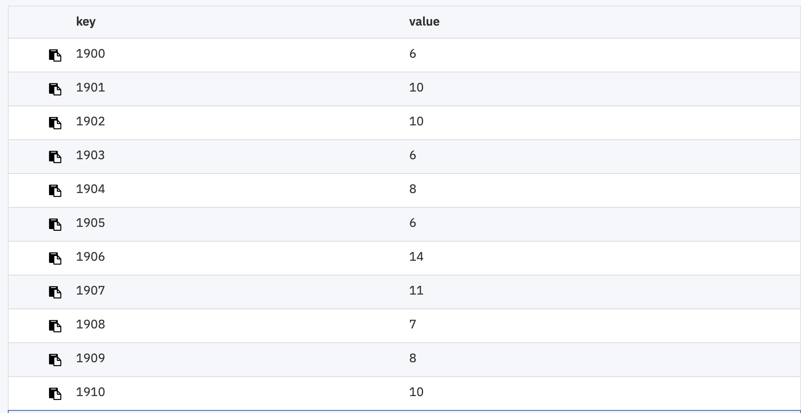

The Cloudant dashboard gives new and experienced Cloudant users the opportunity to add, edit and delete documents while refining the indexing and querying options that best suit their application's use-cases.

In this blog post we'll set up some simple indexes using the dashboard and see how each of Cloudant's querying mechanisms work.

## The data set

Let's first create some sample data representing books in a library:

```js
{
  "_id": "BXP9G5ZQY9Q4EA13",
  "author": "Dickens",
  "title": "David Copperfield",
  "year": 1840,
  "pages": 723,
  "publisher": "Penguin",
  "url": "http://www.somurl.com/dc"
}
```

> Create a databases called `books` and add some documents matching this pattern using the Cloudant dashboard.

The documents store simple key/value pairs holding meta data about the book, its author and its publisher. In this example we're going to deal with three use-cases:

- A query facility alllowing a user to find a book by a known publisher and year.
- A general-purpose search engine allowing a user to find books by a combination of one or more of the author, title, year and publisher.
- A report detailing the number of books published by year.

## Querying books by publisher and year - Cloudant Query

Cloudant Query is a query language that allows small slices of a total database to be located:

```js
{
  "selector": {
    "$and": [
      { "publisher": "Penguin" },
      { "year": { "$gt": 2000 } }
    ]
  },
  "limit": 10
}
```

The above query contains a `selector` object which defines the slice of data you need:

- `$and` means _both_ of the query clauses must be satisfied for a document to make it to the result set.
- `{ "publisher": "Penguin" }`- the publisher must be "Penguin".
- `{ "year": { "$gt": 2000 } }` - the year must be greater than 2000. `$gt` means "greater than". 

We can try the query by choosing "Query" when viewing our `books` database in the Cloudant Dashboard and pasting in the query JSON and hitting "Run Query":



Cloudant matches the documents that meet your criteria and it _seems_ to do it quickly, but there's a catch: Cloudant isn't using an index to service this query, meaning that the database is having to scan every document in the database to get your answer. This is fine for very small data sets, but if you're running a production application where the data set is expanding all the time, you definitely _don't_ want to rely on unindexed queries. 

To create an index we can tell Cloudant to create an index on the `publisher` and `year` fields we are using in our query. Choose Design Documents --> Query Indexes from the `books` database's page in the Cloudant dashboard



and enter the following index definition:

```js
{
   "index": {
      "fields": [
         "publisher", "year"
      ]
   },
   "name": "publisher-year-index",
   "type": "json"
}
```

The `fields` array contains a list of fields we wish to Cloudant to index.

If we repeat our query, it will be faster and will remain quick even as the database size reaches millions of documents. 

> Indexing instructs Cloudant to create a secondary data structure that allows it to find the slice of data you need much faster than pouring over every document in turn. Cloudant Query is best for fixed queries based on the same fields in the same order.

This index is useful for queries involving both the `publisher` and the `year` but if we introduce another field or make the query more complex (e.g. using the `$or` operator) then the index won't get used and we'll be back to a full database scan. 

For a general-purpose search facility we need Cloudant Search.

## Creating a search engine - Cloudant Search

Cloudant Search is based on Apache Lucene and has its own query language that allows rich queries to be constructed. Here's an example:

```
publisher:Penguin AND (year:1972 OR year:1973) AND title:Crash
```

Unlike Cloudant Query, you _must_ specify the fields to index _before_ performing a query. Cloudant Search indexes are defined by supplying Cloudant with a JavaScript function which is called once for every document in the database - if the function calls `index` then data is added to the index.

Choose Design Documents -> New Search Index from the `books` database's page in the Cloudant Dashboard:



- Enter a design document name.
- Enter an index name.
- Paste the following code into the search index function.
- Choose the "Standard Analyzer".

```js
function (doc) {
  index("author", doc.author);
  index("publisher", doc.publisher);
  index("title", doc.title);
  index("year", doc.year);
}
```



You may then build complex queries involving one, some or all of the indexed fields combined with AND and OR operators.

> Cloudant Search is best if you have many search use-cases involving different combinations of fields. 

## Aggregating data - MapReduce

Neither Cloudant Query nor Cloudant Search can _aggregate_ search results, i.e. you can't ask "how many books were published in 1973?". Cloudant's MapReduce feature allows secondary indexes to be created that can be used for selection or aggregation. MapReduce indexes are, like Cloudant Search, created by supplying a JavaScript function - any call to an `emit` function adds a row to the index. Visit Design Documents --> New View to get started:



- Choose a design document name.
- Choose a view name.
- Choose the `_count` reducer, as we want our results _counted_.

Paste the following index defintion:

```js
function (doc) {
  emit(doc.year, null);
}
```



The subsequent MapReduce view will allow documents to be found by year (as that is the key of the index), but if we switch on the _reducer_ from the "Options" pull-down menu the index will aggregate the results, grouping by key (year):





> MapReduce views are perfect for generating ordered views of your data, containing key/value pairs you define. They can be used for selecting individual keys, range queries or aggregation grouping by the key.
