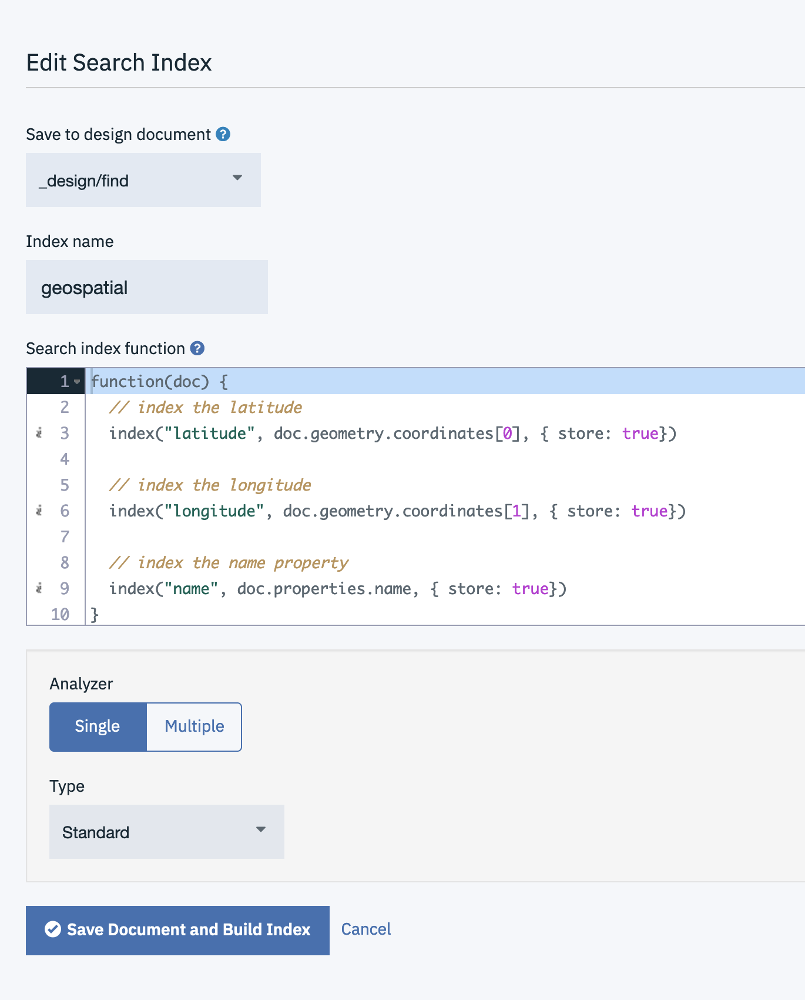

In this blog post I'll show how to perform basic Geospatial queries using standard Cloudant secondary indexes:

- Find documents within a "rectangle".
- Find the nearest.

## The data

To demonstrate, I'll use a dataset containing [GeoJSON](https://en.m.wikipedia.org/wiki/GeoJSON) - an industry-standard JSON representation of geographical content. My database contains a number of "features" represented by a decimal latitude,longitude point representing the [WGS84](https://en.wikipedia.org/wiki/World_Geodetic_System#1984_version) coordinate of the feature. Other attributes of the feature are stored in the `properties` object.

```js
{
  "type": "Feature",
  "geometry": {
    "type": "Point",
    "coordinates": [7.7046, -143.3901]
  },
  "properties": {
    "name": "Shenika Bond"
  }
}
```

## Indexing

In order to efficiently query our data, we'll need a secondary index. I can define a [Cloudant Search](https://cloud.ibm.com/docs/Cloudant?topic=Cloudant-cloudant-search) index by providing a JavaScript function that decides which portion of a document is to be indexed:

```js
function(doc) {
  // index the latitude
  index("latitude", doc.geometry.coordinates[0], { store: true})

  // index the longitude
  index("longitude", doc.geometry.coordinates[1], { store: true})

  // index the name property
  index("name", doc.properties.name, { store: true})
}
```

In the Cloudant Dashboard, adding a Cloudant Search index looks like this:



Note:

- An index definition resides in a _Design Document_, in this case `_design/find`.
- Each index has a name e.g `geospatial`
- Cloudant Search has a nominated "Analyzer" which pre-processes string fields. 

## Find documents within a rectangle

We can query the view using Lucene's query language. A typical query might be:

```
latitude:[49.7 61.1] AND longitude: [-8 0.5]
```

This says "find my documents whose latitude is between 49.7 and 61.1 degrees, and whose longitude is between -8 and 0.5 degrees". This corresponds roughly to the boundary of the UK. It's not _really_ a rectangle, but represents the South West and North East boundaries of a shape on the globe.

The API call we are making looks something like this:

```
GET poi/_design/find/_search/geospatial?q=latitude%3A[50 55] AND longitude%3A [-3 1]
```

where

- `poi` is the database name
- `_design/find` is the design document containing the Cloudant Search index
- `geospatial` is the name of the Cloudant Search index

In response we get the matching documents:

```js
{
	"total_rows": 19,
	"bookmark": "g1AAAAN3eJzLYW",
	"rows": [{
		"id": "8fb924d8fb1636c19893ba94e7fb68fb",
		"order": [1.4142135381698608, 431],
		"fields": {
			"latitude": 53.5436,
			"longitude": -0.6182,
			"name": "Carli Reiter-Schofield"
		}
	}, {
		"id": "05fdf4171319b64ed997e0be3faf391e",
		"order": [1.4142135381698608, 613],
		"fields": {
			"latitude": 54.8739,
			"longitude": 0.5319,
			"name": "Quinn Shuler"
		}
	}
  ...
  ```

  The `fields` object contains the content we indexed and opted to store in the index (`{store: true}`).

## Find nearest

Finding the nearest items is a small iteration of the _Find documents within a rectangle_ use-case. We still retain our "rectangle" so that the database doesn't have to sort every document in the database into nearest-first order.

We simply add a `sort` parameter, specifying the point from which distances are to be measured:

```
  sort="<distance,longitude,latitude,-3.25,55.4,km>"
```

where:

- `longitude` is the indexed field storing the longitude value.
- `latitude` is the indexed field storing the latitude value.
- `-3.25,55.4` is the longitude/latitude pair (not lat/long!) from where the distance will be calculated.
- `km` is the units of distance to use. `mi` is also available.

e.g.

```
GET poi/_design/find/_search/geospatial?q=latitude%3A[50 55] AND longitude%3A [-3 1]&sort="<distance,longitude,latitude,-3.25,55.4,km>"
```

The returned data is much the same:

```js
{
	"total_rows": 677,
	"bookmark": "g1AAAAP0e",
	"rows": [{
		"id": "56174eed0f78f2173813f7530469499e",
		"order": [27.42736711207944, 2406],
		"fields": {
			"latitude": 55.7525,
			"longitude": -3.5712,
			"name": "Mitsuko Glaser"
		}
	}, {
		"id": "96ea862cd73f20d8b4998206f7279453",
		"order": [38.5319843263235, 1732],
		"fields": {
			"latitude": 55.9093,
			"longitude": -2.85,
			"name": "Tricia Creel"
		}
	},
  ...
  ```

But the first element of the order array indicates the distance from the provided point in `km`. 

## Conclusion

Cloudant Search indexes allow fields to be indexed and queried using the standard "Lucene" query language. By indexing an object's latitude and longitude we can perform simple geospatial queries, such as find within a rectangle or find nearest. We can also combine the geospatial query with a normal lucene query e.g. find people called "Tricia" sorted by distance.
