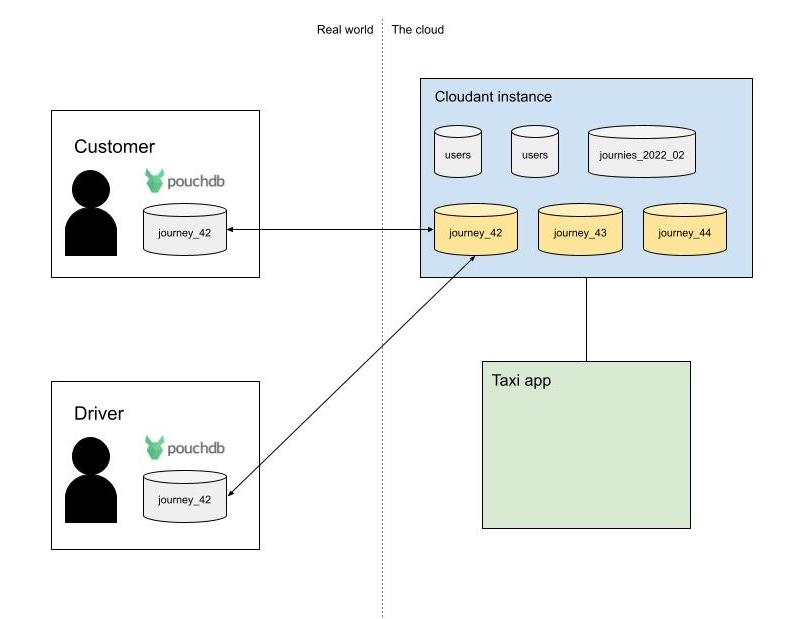

We've all used taxi or ride-sharing services where the customer uses a mobile app to define the start and end point of their journey, then a driver chooses the job and makes their way to the start point. Such applications are complex distributed, real-time systems with data originating from:

- The customer (start & end points, current location, ride preferences).
- The driver (current position, photographs).
- The taxi company (billing etc).
- Elsewhere (traffic conditions, mapping, route planning)

These actors are expecting that data can be shared between them from disconnected databases over potentially flaky mobile connections.

Cloudant seems like a good fit for this application because:

- It is a managed service with very high availability.
- It can be deployed in one or more regions - keeping data closer to the customer.
- It allows data to be synced between the cloud and mobile devices running [PouchDB](https://pouchdb.com/) giving a pseudo "real time" response to changing data.

In this blog post we'll see how such a system could be designed with Cloudant and PouchDB to give the best scalability and to avoid some replication pitfalls.

## Cloudant replication

Cloudant replication is mostly used to copy data from one Cloudant database to another, typically another Cloudant service in a different IBM Cloud region. As Cloudant replication uses the same protocol as its open-source sibling [Apache CouchDB](https://couchdb.apache.org/), it can also be used to transfer data between [PouchDB](https://pouchdb.com/) or [CouchDB](https://couchdb.apache.org/) and Cloudant. PouchDB can be be embedded into mobile apps to:

- Store data locally and forward the data to the cloud when there is network connectivity - an "offline first" approach.
- Sync data between mobile and cloud continuously to allow data to be modified on the cloud copy or on the mobile device.

It seems like replication is going to be a powerful tool in transferring data between mobile and cloud replicas, in both directions. But before we get carried away we have some design decisions to make.

## Data design

We will likely have a database containing the taxi drivers that are on the company's books and the customers that have signed up to use the app. One document per driver/user would make sense here as this data need not be updated frequently. This data can stay on the cloud-side Cloudant databases and needn't be replicated to the driver or customer's devices.

As for the journey data, it's tempting to go for a "one document per journey" schema. The document could start small with just the customer's location and destination. At a later date the nominated driver details could be added. The document would be modified over its life as the journey proceeds, adding driver location over time, billing information and journey status.

There are some drawbacks to consider with this approach:

- If we put all of our journeys into one Cloudant database, then the database will keep growing forever. This isn't good practice with Cloudant and it's better to store ever-growing data sets in groups of "time boxed" databases. 
- If all of our journeys are in one database, or a collection of time-boxed databases (i.e.a month's journeys per database), then how can we sync/replicate a single journey's data to the driver and customer without transferring _everyone else's journey data_ at the same time? Cloudant can do [filtered replication](https://cloud.ibm.com/docs/Cloudant?topic=Cloudant-replication-guide#filtered-replications-repl-guide) to copy a subset of data, but this wouldn't scale for thousands of drivers/customers.
- If more than one actor modifies the document at the same time, then Cloudant and PouchDB will store the clashing revisions as one or more document conflicts. Although Cloudant will retain both conflicting revisions, the application will have to add considerable extra complexity when deciding how to resolve the conflict.

Perhaps there's a data design other than "one document per journey" that overcomes these pitfalls?

## A possible solution

There is a solution which allows for:

- Clean, scalable replication for a single journey between driver, customer and company.
- Avoids scaling problems that occur when using filtered replication from a shared, ever-growing database.
- Avoids the possibility of document conflicts.

The solution is to create _one database per live journey_, where the database contains _write only_ documents, each representing an event throughout the lifecycle of the trip e.g.

- The profile of the customer requesting the taxi.
- Meta data about the trip: how many seats, any special requirements.
- An estimated price from the taxi company. *
- The location of the pick up point supplied by the customer. *
- The current location of the customer. *
- The profile of the driver who is assigned to the job. *
- The current location of the driver. *
- A request to cancel the job, from either the customer or driver.
- The customer has been collected.
- The customer has been dropped off.
- The customer has paid.
- The customer has left a tip.
- Customer feedback.

> Note: documents types marked `*` could appear multiple times in the database.

A per-journey database can be created as soon as the customer has supplied their location, destination and trip parameters e.g. "wheelchair access required". The database starts off small and slowly gains documents over the lifetime of the trip. Importantly, no document is ever edited or deleted so there is no possibility of document conflicts. This avoids having to deal with building a complex "conflict resolution" algorithm.

API keys granting both customer and driver access to the server-side data can be generated when the database is created. When the trip is complete, the API keys can be revoked. 

Each party would have a copy of the data (the driver and customer in PouchDB, and Cloudant with a copy in the cloud). The client-side applications would have to fetch all of the documents in their local database to find out the current status of the trip and its entire history. Continuous replications between mobile and cloud replicas would keep each database in sync and the mobile device would be notified as new documents arrive from elsewhere.

Once the trip is complete, the individual event documents could be combined into a single summary document which can be stored in a separate reporting database (or collection of timeboxed reporting databases) on the server-side. The original per-trip database can then be deleted, as we don't want thousands of Cloudant databases lying around forever.

## Conclusion

It is tempting to use Cloudant's replication in conjuction with PouchDB for mobile applications but careful planning must be undertaken to avoid creating an unscalable or unmanagable solution. The key design aims are:

- Avoid ever-growing Cloudant databases. Keep individual database sizes reasonable so that data can be backed up and to make index building times practical.
- Avoid filtered replication to distribute subsets of data to many users. This approach quickly becomes a performance drag as user numbers increase.
- Avoid schemas that are likely to generate document conflicts. A write-only approach has the advantage of guaranteeing that individual documents can never become conflicted.
- Keep the volume of data that needs to be replicated between mobile devices and the cloud to a minumum to keep performance slick when mobile reception is flaky.
- For the most part, mobile applications (both driver's and customer's) will read data from their local replica and write documents locally when they need to record an event. Replication handles the transfer of documents between the mobile devices and the cloud replica.
