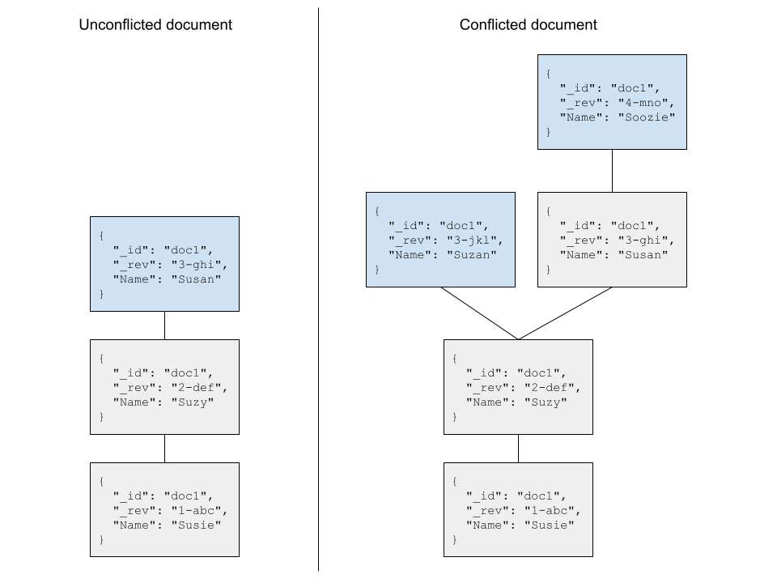

Cloudant's HTTP API will return a variety of HTTP response codes in reply to API requests. One that causes a good deal of confusion is `409 - Document update conflict`.

> tl;dr - a `409 - Document update conflict` response doesn't mean that Cloudant created a conflict, in fact it avoided creating a conflict.

In this blog post we'll explore what a 409 response means and how to prevent 409s happening in your application.

## What dodes the HTTP 409 response mean?

The [HTTP RFC](https://www.rfc-editor.org/rfc/rfc9110.html#name-409-conflict) states:

> The 409 (Conflict) status code indicates that the request could not be completed due to a conflict with the current state of the target resource.

This can come about in Cloudant because:

1. A document with a supplied `_id` is being created and a document with that `_id` already exists.
2. or, a document is being modified or deleted and the supplied revision has already been superseded.

Let's explore those scenarios by example:

### The document \_id field must be unique

Cloudant documents can be created without a document `_id` and Cloudant will generate a unique `_id` for you:

```sh
# create a document with Cloudant-generated _id field
curl -X POST \
     -H 'content-type: application/json' \
     -d '{"name":"Sue"}' \
     "$URL/mydb"
# {"ok":true,"id":"524d6ff148950d4d1554946e7e91036e","rev":"1-877206fdfc192b2a566b6eac4eaa4205"}
```

As the `_id` field is auto-generated, I can repeat this operation over and over again without any errors.

If I supply my own document `_id` then I am responsible for it being unique. The following operation will work the first time:

```sh
# create a document with client-generated _id field
curl -X POST \
     -H 'content-type: application/json' \
     -d '{"_id":"myid","name":"Sue"}' \
     "$URL/mydb"
# {"ok":true,"id":"myid","rev":"1-877206fdfc192b2a566b6eac4eaa4205"}
```

but if the request is repeated, it will garner an HTTP 409 response:

```sh
HTTP/2 409 

{"error":"conflict","reason":"Document update conflict."}
```

> The fix? If you want to supply your own `_id` field when creating documents, then you are responsible for their uniqueness. See this blog post on creating time-sortable ids.

### A document revision can't be superseded more than once

If we create a document it will take a `1-xxx` revision (stored as the `_rev` attribute in the document). When the document is later updated, the `1-xxx` revision will become `2-yyy` where the alpha-numeric sequence after the `-` represents a hash of the document's content.

```sh
# create a the first revision of a document
curl -X POST \
     -H 'content-type: application/json' \
     -d '{"_id":"mynewdoc","name":"Sue"}' \
     "$URL/mydb"
# {"ok":true,"id":"mynewdoc","rev":"1-877206fdfc192b2a566b6eac4eaa4205"}

# modify the first revision to become rev 2-yyy
curl -X POST \
     -H 'content-type: application/json' \
     -d '{"_id":"mynewdoc","_rev":"1-877206fdfc192b2a566b6eac4eaa4205","name":"Susan"}' \
     "$URL/mydb"
# {"ok":true,"id":"mynewdoc","rev":"2-9d949e7391749205c5acfba683eab819"}
```

Notice:

- When creating the first revision of a document, a `_rev` token is not supplied.
- If a create/update/delete operation is successful, the resultant value of `_rev` is returned in the response as "rev".
- When modifying a document, the `_rev` token *must* be supplied, in this case the rev of the first document revision.

If we try to modify revision `1` again, we will hit a HTTP 409:

```sh
# attempt to modify rev 1 again
curl -X POST \
     -H 'content-type: application/json' \
     -d '{"_id":"mynewdoc","_rev":"1-877206fdfc192b2a566b6eac4eaa4205","name":"Susan"}' \
     "$URL/mydb"
# {"error":"conflict","reason":"Document update conflict."}
```

This is Cloudant preventing the same revision being modified more than once. Cloudant knows that "revision 1" has already been superseded by "revision 2", so no further attempts to modify revision 1 will succeed.

> The fix? Supply the "rev" of the document revision that is to be changed. If that "rev" has already been superseded, then Cloudant will not accept the change and will return an HTTP 409. A work around is to fetch the document again, to see the current state of the database and then resubmit your request with a different "rev".

Note that design patterns which require a document to be modified quickly (multiple times a second) are not a good fit for Cloudant as they can result in conflicts - see next section on document conflicts.

## Conflicts

A conflict is a branch in the revision tree. In other words, instead of a document's revision proceeding linearly with revision 1, 2, 3, 4, there are circumstances where there are multiple revisions of same document revision number.

In the diagram below, on the left we can see an unconflicted revision tree where each new revision supersedes the last. On the right, there is a branch in the revision tree after the second document revision.



In the previous section we said that Cloudant will not accept a change to a document where the document revision has already been superseded, so how do conficts occur? There are two possible ways:

1. Replication: Cloudant allows data to be replicated to other Cloudant databases, or to Apache CouchDB databases or to mobile applications running PouchDB. When there are multiple copies of data that are connected asynchronously (or perhaps only connected occasionally), it is possible that a document can be modified in two different ways and when the two conficted changes are replicated, both revisions are retained. This is intentional and allows application developers to be assured that conflicting data is not discarded - it can subsequently be repaired by deleting an unwanted revision, merging the conflicted revisions or implementing the _conflict revision_ strategy that best suits the application.
2. Fast writes: Cloudant is a distributed database with three copies of each document on separate database nodes. It is possible when updating a document over and over in a short time window that a conflicting write can be accepted by the database (as opposed to being denied with a 409). These spurious conflicts can be eliminated by avoiding design patterns that a require a single document to be modifed very quickly.

## Conclusion

If an application gets an HTTP 409 response saying "409 - Document update conflict", it doesn't mean that Cloudant has _created_ a document conflict. On the contrary, it means that Cloudant refused to accept the request to _avoid creating a conflict_.
