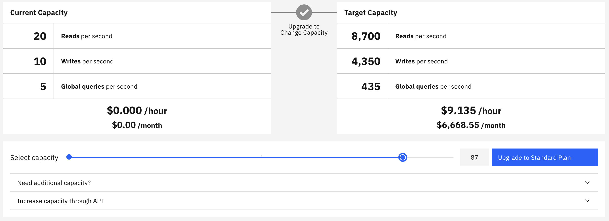

Cloudant is a Database-as-a-Service that allows customers to provision the database capacity they need in terms of the number of read, write and query operations per second.

If the consumed capacity is exceeds the provisioned capacity in a given one second window, Cloudant will respond with an _HTTP 429 Too Many Requests_ response to further requests.

In this blog post we'll explore which Cloudant APIs fall into the three categories and how your application can avoid HTTP 429 responses.

## Reads, Writes and Queries

Cloudant API operations are classified as one of three types:

### Reads

- Single document fetches, by a known id: `GET /<db>/<doc_id>`.
- All multi-document operations on a [partitioned database](https://cloud.ibm.com/docs/Cloudant?topic=Cloudant-database-partitioning), charged as one read per document e.g. `GET /<db>/_partition/<partition_id>/_all_docs`.

### Writes

- Single document writes: `PUT /<db>/<doc_id>` or `POST /<db>`.
- Bulk document writes: `POST /<db>/_bulk_docs`.

### Queries

- All documents: `GET/POST /<db>/_all_docs`.
- Bulk documents: `POST /<db>/_bulk_get`.
- Cloudant Queries: `POST /<db>/_find`.
- Cloudant MapReduce: `GET/POST /<db>/_design/<design_doc>/_view/<view_name>`
- Cloudant Search: `GET/POST /<db>/_design/<design_doc>/_search/<view_name>`

## Provisioned Capacity

Each Cloudant instance has its own Provisioned Capacity expressed as number, with each increment representing 100 reads, 50 writes and 5 queries per second. So an instance with a Provisioned Capacity of 100 has 10,000 reads, 5,000 writes and 500 queries per second. The more you pay, the greater the number of reads, writes and queries your Cloudant instance will be able to service.

The capacity of your instance can be changed at any time using the IBM Cloud web UI or via the [API](https://cloud.ibm.com/apidocs/cloudant#putcapacitythroughputconfiguration). When your target capacity is changed, the capacity of the instance will be changed asynchronously to meet the new target.

Importantly, the provisioned capacity is a hard limit. If a Cloudant instance receives more reads, writes or queries in a given second than its capacity, then the excess requests will recieve a _HTTP 429 Too Many Requests_ response. Further requests will be allowed again at the start of next second boundary.

## How do I avoid HTTP 429 responses?

### Set your provisioned capacity correctly

The provisioned capacity of your Cloudant instance should be set such that your application never exhausts the reads, writes and queries per second limit. There is an [API call](https://cloud.ibm.com/apidocs/cloudant#getcurrentthroughputinformation) which can tell you whether your applicaiton is hitting the limit and the the HTTP 429 responses can be found in your Cloudant logs. 

Set the capacity of your Cloudant service higher than the peak traffic required at your application's busiest time.

### Retry rate-limited requests

If your application receives a HTTP 429 response, you may elect to retry the request a number of times - backing off exponentially with each attempt e.g after 1s, 2s and 4s. This technique is suitable for small blips in traffic that push your application above its normal usage. Retry logic is not suitable for sustained API traffic that exceeds the capacity of your Cloudant instance.

The official IBM Cloudant SDKs can be configured to [attempt retries after a 429 response](https://github.com/IBM/ibm-cloud-sdk-common/#automatic-retries) so that your higher-level application code need not know that a retry occurred.

### Spread out load from background tasks

If your application performs background tasks periodically, make sure that they are set up such that the load they bear on your Cloudant service doesn't use up capacity needed for operational API calls.

- Keep bulk inserts to reasonable batch size e.g. 100 small docs per request.
- Remember that replication tasks contribute to your Cloudant usage - with reads consumed at the _source_ and writes at the _target.
- If replication is proceeding too fast (and exhausting your Cloudant instance's capacity), then the speed can be tuned with additional [replication parameters](https://cloud.ibm.com/docs/Cloudant?topic=Cloudant-replication-guide#tuning-replication-speed)
- Run background workloads at a low concurrency and a moderate rate to avoid starving operational API calls.
