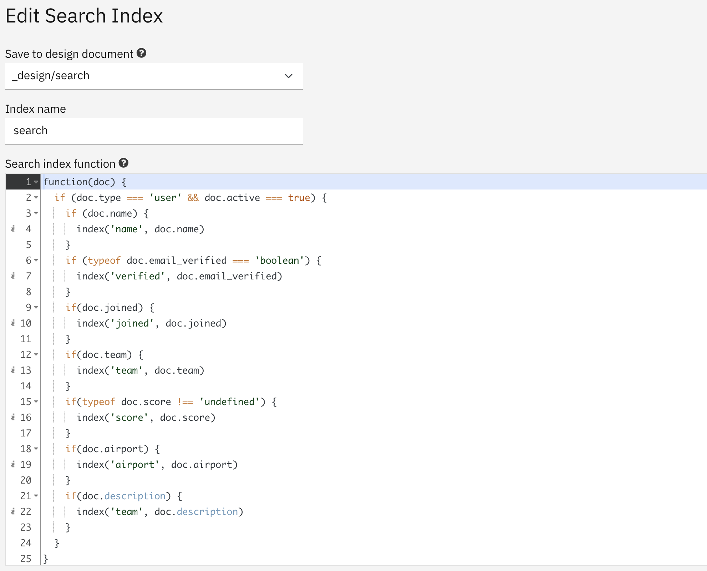
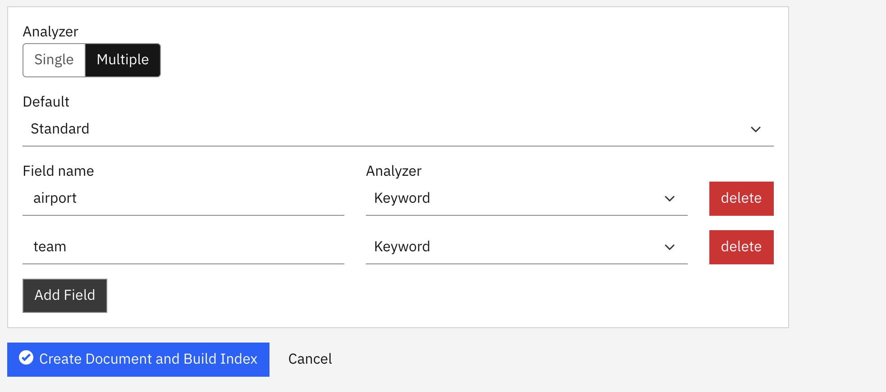

Cloudant Search allows full-text queries to be performed on strings from Cloudant document bodies and multi-field queries on mixed-type document attributes.

In this blog post we'll explore the query syntax that the Cloudant Search endpoints expect to see.

## The data

We're going to write queries against a database of users following this schema:

```js
{
  "_id": "7DN9B4252T2Y8YYU",
  "type": "user",
  "name": "Lester Bourque",
  "email": "lester825@objectives.com",
  "password": "b480c074d6b75947c02681f31c90c668c46bf6b8",
  "salt": "368f35616ac2cdea162985750cece7c7",
  "active": true,
  "email_verified": true,
  "address": "4017 Dew Lane , Cricklade, Armagh, KT39 1WP",
  "joined": "2021-02-07",
  "team": "violet",
  "score": 62,
  "airport": "RDZ",
  "description": "forum joe negotiations resolutions arrival switched june england shareware essentially eval economies ellen interval ph sur stuck disclose academy logos"
}
```

Notice that all of the attributes are at the top level and there are a range of data types: strings, numbers, booleans.

## The index

To index some of this data we need to place an indexing function in a Cloudant Design Document:

```js
function(doc) {
  if (doc.type === 'user' && doc.active === true) {
    if (doc.name) {
      index('name', doc.name)
    }
    if (typeof doc.email_verified === 'boolean') {
      index('verified', doc.email_verified)
    }
    if(doc.joined) {
      index('joined', doc.joined)
    }
    if(doc.team) {
      index('team', doc.team)
    }
    if(typeof doc.score !== 'undefined') {
      index('score', doc.score)
    }
    if(doc.airport) {
      index('airport', doc.airport)
    }
    if(doc.description) {
      index('description', doc.description)
    }
  }
}
```

Notice

- The first `if` statement only allows _active users_ to be indexed. If there are other document types or inactive users in the database, their data will not make it to the searchable index.
- Each field is surrounded by its own `if` statement. This makes sure that we don't try to index `undefined` or `null` items.
- Sometimes we use a different field name (e.g `verified`) than the attribute name in the document (e.g. `email_verified`).
- We only index the fields we need to query - not every attribute of the document.

Here's how the search function is supplied in the Cloudant Dashboard:



We are also going to override the choice of analyzers for some fields. Analyzers pre-process string data prior to indexing, and query parameters prior to querying. The Standard analyzer is suitable for blocks of English text, but the Keyword analyzer is preferred for ids or strings that need to be kept unmolested.



See the [Cloudant documentation on index functions](https://cloud.ibm.com/docs/Cloudant?topic=Cloudant-cloudant-search#index-functions).

We now have the following fields we can query on:

| field       | type    | analyzer |
|-------------|---------|----------|
| name        | string  | standard |
| verified    | boolean | n/a      |
| joined      | string  | standard |
| team        | string  | keyword  |
| score       | number  | n/a      |
| airport     | string  | keyword  |
| description | string  | standard |

## Single field queries

The queries against our index can be entered into a form in the Cloudant Dashboard:


We can query our index on any of the fields:

```
// find any documents whose name matches "Bob"
q=name:Bob

// find any documents where the airport = NOA
q=airport:NOA

// find a document whose name matches "Bob Mcmahan"
// Notice multi-word strings are in double quotes.
q=name:"Bob Mcmahan"
```

> Note that because we chose the Keyword Analyzer for the `airport` field, the query value must exactly match the indexed item. e.g. `NOA` not `noa`.

The same syntax works for numbers and booleans:

```
// find documents whose score is 48
q=score:48

// find documents whose verified field is false
q=verified:false
```

## Combining search clauses

We can also search on multiple fields

```
// find documents whose name matches Bob Mcmahan and whose airport is NOA
name:"Bob Mcmahan" AND airport:NOA

// find documents whose name matches Bob Mcmahan and whose airport is NOA or LON
name:"Bob Mcmahan" AND (airport:NOA OR airport:LON)
```

## Ranges

We can query on ranges of values

```
// find documents whose score is between 0 and 50, inclusive
q=score:[0 TO 50]

// find documents whose score is between 0 and 50, exclusive
q=score:{0 TO 50}
```

## Boosting

We can boost search clauses to push them up the search order

```
// search for bob in the name and description fields but
// give a boost to matches on the name field
q=name:bob^100 OR description:bob^10 
```

## Wildcard searches

We can search for values that start with a known string:

```
// find any document whose name starts with "bo"
q=name:bo*
```

> Note wildcard searches may be more expensive than queries that match exact values.

## Escaping values

Some characters need to be _escaped_ before including in a Cloudant Search query. Any of the following characters in query values will need to be escaped with a `\` character:

```
+ - && || ! ( ) { } [ ] ^ " ~ * ? : \
```

e.g.

```
// find any documents whose name matches (Taylor's Version)
name:"\(Taylor's Version\)"
```

## When to use Search vs MapReduce

MapReduce is good for:

- Queries that match the indexed keys exactly e.g case-sensitve search. 
- Queries that match some of the elements at the front of an key which is array.
- Queries that need aggregation: counting, totalising, averaging etc.
- Queries that need more than 200 rows.
- Queries where the results need to be in key order, or reverse key order only.


Search is good for:

- Free-text searching i.e. case-insensitve search after tokenization and stemming.
- General purpose multi-field queries on a one, some or all of a handful of indexed fields.
- Queries that contain logic: AND or OR clauses.
- Queries that need boosting.
- Queries that need wildcards.
- Queries that need to be sorted by "best match" or by another nominated field, or fields.
- Queries that need a maximum of 200 results per call.
- Queries that need flexible sort ordering.
- Queries that need to be sorted by nearness to a point.
