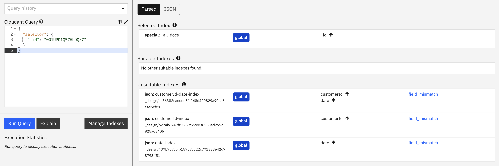
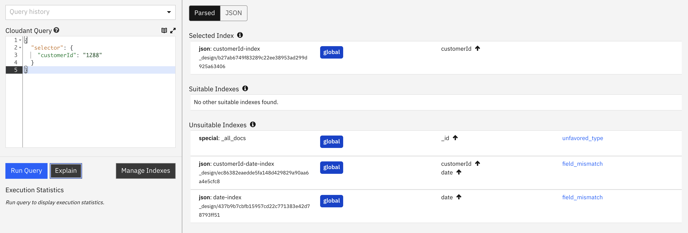
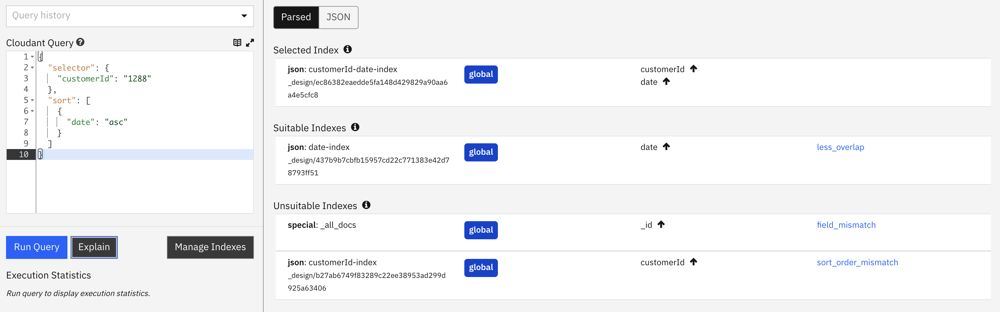
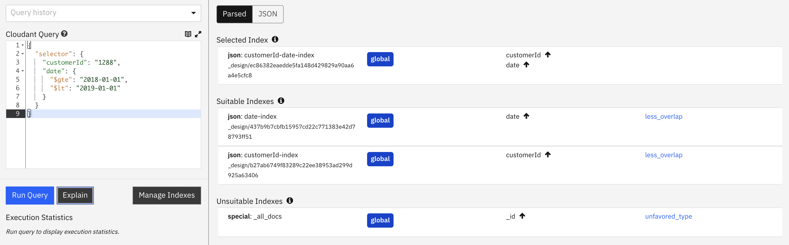
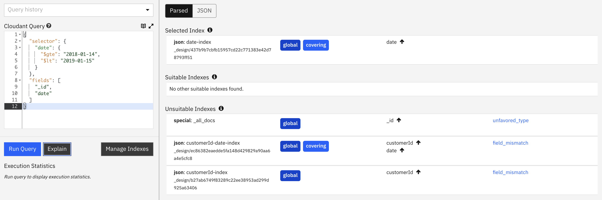
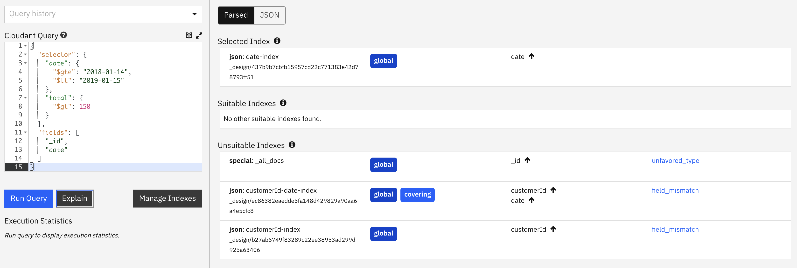
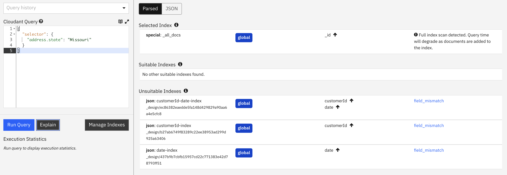
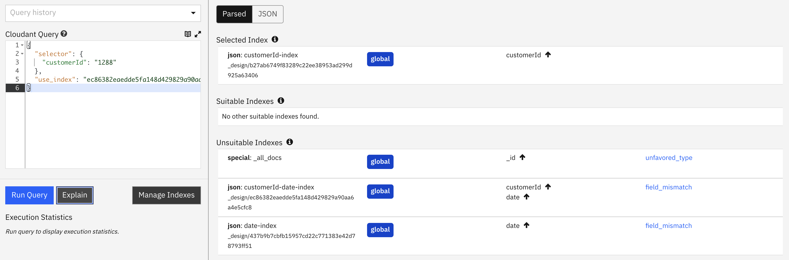

Cloudant Query provides an API to extract slices of data from a database. A `selector` object is supplied to Cloudant (think of it as the "where" clause of an SQL query) which provides the query definition and Cloudant trawls the database for matching documents.

Efficient queries are key to responsive applications. To make queries execute as quickly as possible, Cloudant looks to use a pre-defined secondary index to help in answering the query. Without an index, query performance will degrade quickly as the number of documents in the database increases.

In this blog post we'll examine how Cloudant selects the best index for job, how the [POST /{db}/_explain](https://cloud.ibm.com/apidocs/cloudant#postpartitionexplain-queries) endpoint works and how its output is represented in the Cloudant Dashboard.
 
Before exploring index selection, let's work through an example of Cloudant Query in action.

## Cloudant Query in nutshell

Let's say we have documents that represent e-commerce orders - one document per order:

```js
{
  "_id": "001UPD1Q57HL9QS7",
  "_rev": "1-0e03f900e9d433c7502a948e5c7ab7d5",
  "type": "order",
  "customerId": "1141",
  "customerName": "Leonarda Perdue",
  "email": "leonarda-perdue@atmospheric.com",
  "orderId": "001UPD1Q57HL9QS7",
  "date": "2018-05-20T05:51:48.433Z",
  "total": 249.09,
  "tax": 20.26,
  "address": {
    "street": "2090 Tynedale Circle",
    "state": "Idaho",
    "zip": "94237"
  },
  "basket": [
    "DANDEE",
    "TIENXI",
    "HARISSA"
  ]
}
```

Note that the `orderId` field is actually the same value as the document's `_id` field. This is handy because every database has a _primary index_ on the `_id` field, which we can now use a Cloudant Query to find documents by `orderId`:

```js
{
  "selector": {
    "_id": "001UPD1Q57HL9QS7"
  }
}
```

> Note: a cheaper and faster way to do this is to use the `GET /orders/001UPD1Q57HL9QS7` endpoint instead.

A simple Cloudant Query against this database might be:

```js
{
  "selector": {
    "customerId": "1288"
  }
}
```

which translates as "find documents whose `customerId` field equals `1288`".

Without a secondary index to help, Cloudant will have to read every document in the database to find those with the matching `customerId`.

So let's use the `_index` endpoint to define some secondary indexes to handle common access patterns:

```js
// index the customerId field
{
  "index": {
    "fields": [
      "customerId"
    ]
  },
  "name": "customerId-index",
  "type": "json"
}

// index customerId and date
{
  "index": {
    "fields": [
      "customerId",
      "date"
    ]
  },
  "name": "customerId-date-index",
  "type": "json"
}

// index date
{
  "index": {
    "fields": [
      "date"
    ]
  },
  "name": "date-index",
  "type": "json"
}
```

We can now perform some queries against these indicies:

```js
// fetch a single order (remember that GET /orders/001UPD1Q57HL9QS7 is preferred)
{
  "selector": {
    "_id": "001UPD1Q57HL9QS7"
  }
}

// find documents for a known customerId
{
  "selector": {
    "customerId": "1288"
  }
}

// find a single customer's orders in date order
{
  "selector": {
    "customerId": "1288"
  },
  "sort": [
    {
      "date": "asc"
    }
  ]
}

// find a single customers orders in time/date range
{
  "selector": {
    "customerId": "1288",
    "date": {
      "$gte": "2018-01-01",
      "$lt": "2019-01-01"
    }
  }
}

// find orders on a single date, returning _id and date
{
  "selector": {
    "date": {
      "$gte": "2018-01-14",
      "$lt": "2019-01-15"
    }
  },
  "fields": [
    "_id",
    "date"
  ]
}

// find orders on a single date, returning _id and date
// but only those whose total > 150
{
  "selector": {
    "date": {
      "$gte": "2018-01-14",
      "$lt": "2019-01-15"
    },
    "total": {
      "$gt": 150
    }
  },
  "fields": [
    "_id",
    "date"
  ]
}

// Find documents whose state is Missouri
{
  "selector": {
    "address.state": "Missouri"
  }
}
```

Some of these indexes match the underlying indexes perfectly, some can be _helped_ by the indexes and some miss the indexes completely. 

Let's examine how Cloudant Query's index selection process works.

## Cloudant Query index selection

When faced with an incoming query, Cloudant will look at the database's indexes to see if they are suitable to assist in the execution of the query. There are several factors to consider:

- Is this a global or partitioned query?
- Which field or fields are being used in the `selector` of the query?
- Has a index been suggested at query-time with the `use_index` parameter?
- Which field or fields are being used int he `sort` of the query?
- Does the index have a [partial_filter_selector](https://cloud.ibm.com/docs/Cloudant?topic=Cloudant-working-with-indexes#creating-a-partial-index) making it a view of only part of the database?
- Is the index `type=json` (MapReduce based) or `type=text` (Apache Lucene based)?
- Do the Cloudant Query operators used preclude the use of an index? e.g `$or`, `$in` or `$exists` cannot be used with `type=json` index. `$text` can only be used with `type=text` indexes.

The [process](https://docs.couchdb.org/en/latest/api/database/find.html#index-selection) is too complicated to provide examples of every permutation but Cloudant does provide a window into the index selection process through its `_explain` API. Let's dig in.

## What is the `_explain` endpoint?

The `_explain` endpoint performs a query "dry run". It accepts the same parameters as the normal query endpoint (`_find`) but doesn't actually execute the query. Crucially, `_explain` still goes to the trouble of identifying which index (if any) it would use to support the query. It returns a detailed list of which indexes it considered, which it rejected (and why) and which index would be used to support the index.

The dilligent Cloudant user can use `_explain` while developing their application to ensure that queries are hitting the indexes that the developer expects.

> Queries that scan many documents to return only a few documents will get progressively slower as data volume increases. Avoiding this scenario is fundamental to helping an application to scale with data size and request volume.

Before we perform some test queries we have one more piece of Cloudant Query terminology to learn.

## Covering index

A Cloudant Query index is considered a _covering_ index if a query can be satisfied by only using data taken from the secondary index itself, without loading the whole document body of each matching index row.

For example, if I have an index on `customerId` and ask for the document ids that belong to a known `customerId` value, then the index will be considered as _covering_ that use case - because the `customerId` and document `_id` are stored in the index, so there's no need to fetch each document body.

Conversely, if I ask for the _dates_ of documents that belong to a known `customerId`, then the index can be used to speed up the query but the documents will have to be loaded to extract the `date` field (which isn't in the index).

Queries that can be satisfied with a _covering_ index will execute faster because they can be satisfied by looking at the secondary index alone and without using additional computing resources to load each row's document body.

> It is best practice to only ask for the fields you need (using the `fields` array in a `_find` API call), and if this set of fields is in the index and as long as the `selector` doesn't need to examine additional fields from the document body, then you will be using a _covering_ index.

## Test queries

In this section, we'll show what the API response from the `_explain` endpoint returns and show the equivalent visualisation on the Cloudant Dashboard, with explanations of what it all means.

### Finding a document by its id

Let's run our test queries through the `_explain` endpoint to see the response. See the HTTP request and response below:

<details>
  <summary>Request</summary>

```js
POST /orders/_explain
{
  "selector": {
    "_id": "001UPD1Q57HL9QS7"
  }
}
```
</details>

<details>
  <summary>Response</summary>

```js
{
  "dbname": "my-cloudant-instance/orders",
  "index": {
    "ddoc": null,
    "name": "_all_docs",
    "type": "special",
    "def": {
      "fields": [
        {
          "_id": "asc"
        }
      ]
    }
  },
  "partitioned": false,
  "selector": {
    "_id": {
      "$eq": "001UPD1Q57HL9QS7"
    }
  },
  "opts": {
    "use_index": [],
    "bookmark": "nil",
    "limit": 10000000000,
    "skip": 0,
    "sort": {},
    "fields": [],
    "partition": "",
    "r": 1,
    "conflicts": false,
    "stale": false,
    "update": true,
    "stable": false,
    "execution_stats": false
  },
  "limit": 10000000000,
  "skip": 0,
  "fields": [],
  "index_candidates": [],
  "selector_hints": [
    {
      "type": "json",
      "indexable_fields": [
        "_id"
      ],
      "unindexable_fields": []
    },
    {
      "type": "text",
      "indexable_fields": [
        "_id"
      ],
      "unindexable_fields": []
    }
  ],
  "mrargs": {
    "include_docs": true,
    "view_type": "map",
    "reduce": false,
    "partition": null,
    "start_key": "001UPD1Q57HL9QS7",
    "end_key": "001UPD1Q57HL9QS7",
    "direction": "fwd",
    "stable": false,
    "update": true,
    "conflicts": "undefined"
  },
  "covering": false
}
```
</details>




- `index.name` indicates that the `_all_docs` index is used. This means the query will act upon the database's primary index.
- `mrargs.start_key` & `mrargs.start_key` show the slice of the primary index that would be extracted.
- As previously mentioned `GET /orders/001UPD1Q57HL9QS7` is a better way of achieving this result, because it is cheaper to use 1 "read" unit than 1 "query" unit.
- The dashboard shows that all indexes are unsuitable and that the built-in primary index will be used.

### Find documents belonging to a known customer

<details>
  <summary>Request</summary>

```js
POST /orders/_find
{
  "selector": {
    "customerId": "1288"
  }
}
```
</details>
<details>
  <summary>Response</summary>

```js
{
  "dbname": "my-cloudant-instance/orders",
  "index": {
    "ddoc": "_design/b27ab6749f83289c22ee38953ad299d925a63406",
    "name": "customerId-index",
    "type": "json",
    "partitioned": false,
    "def": {
      "fields": [
        {
          "customerId": "asc"
        }
      ]
    }
  },
  "partitioned": false,
  "selector": {
    "customerId": {
      "$eq": "1288"
    }
  },
  "opts": {
    "use_index": [],
    "bookmark": "nil",
    "limit": 10000000000,
    "skip": 0,
    "sort": {},
    "fields": [],
    "partition": "",
    "r": 1,
    "conflicts": false,
    "stale": false,
    "update": true,
    "stable": false,
    "execution_stats": false
  },
  "limit": 10000000000,
  "skip": 0,
  "fields": [],
  "index_candidates": [
    {
      "index": {
        "ddoc": "_design/ec86382eaedde5fa148d429829a90aa6a4e5cfc8",
        "name": "customerId-date-index",
        "type": "json",
        "partitioned": false,
        "def": {
          "fields": [
            {
              "customerId": "asc"
            },
            {
              "date": "asc"
            }
          ]
        }
      },
      "analysis": {
        "usable": false,
        "reasons": [
          {
            "name": "field_mismatch"
          }
        ],
        "ranking": 2,
        "covering": false
      }
    },
    {
      "index": {
        "ddoc": "_design/437b9b7cbfb15957cd22c771383e42d78793ff51",
        "name": "date-index",
        "type": "json",
        "partitioned": false,
        "def": {
          "fields": [
            {
              "date": "asc"
            }
          ]
        }
      },
      "analysis": {
        "usable": false,
        "reasons": [
          {
            "name": "field_mismatch"
          }
        ],
        "ranking": 2,
        "covering": false
      }
    },
    {
      "index": {
        "ddoc": null,
        "name": "_all_docs",
        "type": "special",
        "def": {
          "fields": [
            {
              "_id": "asc"
            }
          ]
        }
      },
      "analysis": {
        "usable": true,
        "reasons": [
          {
            "name": "unfavored_type"
          }
        ],
        "ranking": 1,
        "covering": null
      }
    }
  ],
  "selector_hints": [
    {
      "type": "json",
      "indexable_fields": [
        "customerId"
      ],
      "unindexable_fields": []
    },
    {
      "type": "text",
      "indexable_fields": [
        "customerId"
      ],
      "unindexable_fields": []
    }
  ],
  "mrargs": {
    "include_docs": true,
    "view_type": "map",
    "reduce": false,
    "partition": null,
    "start_key": [
      "1288"
    ],
    "end_key": [
      "1288",
      "<MAX>"
    ],
    "direction": "fwd",
    "stable": false,
    "update": true,
    "conflicts": "undefined"
  },
  "covering": false
}
```
</details>



- `index` indicates that a secondary index is being used to assist the query. As we are asking for data by `customerId`, then it has chosen the index on `customerId`-only as the best fit.
- `index_candidates` lists the index candidates that were considered and rejected. `index_candidates[].analysis` shows how each index was graded and ranked for suitability.
- `covering` is false, so each document must be loaded in turn to perform the query, making it slower. The query, by omitting a `fields` attribute, is asking Cloudant to return the whole document body in the response.

### Find a customer's orders, sorted by date

<details>
  <summary>Request</summary>

```js
POST /orders/_find
{
  "selector": {
    "customerId": "1288"
  },
  "sort": [
    {
      "date": "asc"
    }
  ]
}
```
</details>
<details>
  <summary>Response</summary>

```js
{
  "dbname": "my-cloudant-instance/orders",
  "index": {
    "ddoc": "_design/ec86382eaedde5fa148d429829a90aa6a4e5cfc8",
    "name": "customerId-date-index",
    "type": "json",
    "partitioned": false,
    "def": {
      "fields": [
        {
          "customerId": "asc"
        },
        {
          "date": "asc"
        }
      ]
    }
  },
  "partitioned": false,
  "selector": {
    "customerId": {
      "$eq": "1288"
    }
  },
  "opts": {
    "use_index": [],
    "bookmark": "nil",
    "limit": 10000000000,
    "skip": 0,
    "sort": {
      "date": "asc"
    },
    "fields": [],
    "partition": "",
    "r": 1,
    "conflicts": false,
    "stale": false,
    "update": true,
    "stable": false,
    "execution_stats": false
  },
  "limit": 10000000000,
  "skip": 0,
  "fields": [],
  "index_candidates": [
    {
      "index": {
        "ddoc": "_design/b27ab6749f83289c22ee38953ad299d925a63406",
        "name": "customerId-index",
        "type": "json",
        "partitioned": false,
        "def": {
          "fields": [
            {
              "customerId": "asc"
            }
          ]
        }
      },
      "analysis": {
        "usable": false,
        "reasons": [
          {
            "name": "sort_order_mismatch"
          }
        ],
        "ranking": 2,
        "covering": false
      }
    },
    {
      "index": {
        "ddoc": "_design/437b9b7cbfb15957cd22c771383e42d78793ff51",
        "name": "date-index",
        "type": "json",
        "partitioned": false,
        "def": {
          "fields": [
            {
              "date": "asc"
            }
          ]
        }
      },
      "analysis": {
        "usable": true,
        "reasons": [
          {
            "name": "less_overlap"
          }
        ],
        "ranking": 1,
        "covering": false
      }
    },
    {
      "index": {
        "ddoc": null,
        "name": "_all_docs",
        "type": "special",
        "def": {
          "fields": [
            {
              "_id": "asc"
            }
          ]
        }
      },
      "analysis": {
        "usable": false,
        "reasons": [
          {
            "name": "field_mismatch"
          }
        ],
        "ranking": 2,
        "covering": null
      }
    }
  ],
  "selector_hints": [
    {
      "type": "json",
      "indexable_fields": [
        "customerId"
      ],
      "unindexable_fields": []
    },
    {
      "type": "text",
      "indexable_fields": [
        "customerId"
      ],
      "unindexable_fields": []
    }
  ],
  "mrargs": {
    "include_docs": true,
    "view_type": "map",
    "reduce": false,
    "partition": null,
    "start_key": [
      "1288"
    ],
    "end_key": [
      "1288",
      "<MAX>"
    ],
    "direction": "fwd",
    "stable": false,
    "update": true,
    "conflicts": "undefined"
  },
  "covering": false
}
```
</details>



- `index` indicates that a secondary index is being used to assist the query. As we are asking for data by `customerId` but _sorted_ by `date`, then it has chosen the index on `customerId` & `date` as the best fit.
- `index_candidates` lists the index candidates that were considered and rejected. `index_candidates[].analysis` shows how each index was graded and ranked for suitability.
- `mrargs` shows the `start_key` and `end_key` values used to extract data from the index.
- `covering` is false, so each document must be loaded in turn to perform the query, making it slower. The query, by omitting a `fields` attribute is asking Cloudant to return the whole document body in the response.
- Notice that the dashboard shows that two indexes were deemed suitable, but the index on `customerId` & `date` was preferred.

### Find a single customer's orders in a time/date range

<details>
  <summary>Request</summary>

```js
POST /orders/_find
{
  "selector": {
    "customerId": "1288",
    "date": {
      "$gte": "2018-01-01",
      "$lt": "2019-01-01"
    }
  }
}
```
</details>
<details>
  <summary>Response</summary>

```js
{
  "dbname": "my-cloudant-instance/orders",
  "index": {
    "ddoc": "_design/ec86382eaedde5fa148d429829a90aa6a4e5cfc8",
    "name": "customerId-date-index",
    "type": "json",
    "partitioned": false,
    "def": {
      "fields": [
        {
          "customerId": "asc"
        },
        {
          "date": "asc"
        }
      ]
    }
  },
  "partitioned": false,
  "selector": {
    "$and": [
      {
        "customerId": {
          "$eq": "1288"
        }
      },
      {
        "$and": [
          {
            "date": {
              "$gte": "2018-01-01"
            }
          },
          {
            "date": {
              "$lt": "2019-01-01"
            }
          }
        ]
      }
    ]
  },
  "opts": {
    "use_index": [],
    "bookmark": "nil",
    "limit": 10000000000,
    "skip": 0,
    "sort": {},
    "fields": [],
    "partition": "",
    "r": 1,
    "conflicts": false,
    "stale": false,
    "update": true,
    "stable": false,
    "execution_stats": false
  },
  "limit": 10000000000,
  "skip": 0,
  "fields": [],
  "index_candidates": [
    {
      "index": {
        "ddoc": "_design/b27ab6749f83289c22ee38953ad299d925a63406",
        "name": "customerId-index",
        "type": "json",
        "partitioned": false,
        "def": {
          "fields": [
            {
              "customerId": "asc"
            }
          ]
        }
      },
      "analysis": {
        "usable": true,
        "reasons": [
          {
            "name": "less_overlap"
          }
        ],
        "ranking": 2,
        "covering": false
      }
    },
    {
      "index": {
        "ddoc": "_design/437b9b7cbfb15957cd22c771383e42d78793ff51",
        "name": "date-index",
        "type": "json",
        "partitioned": false,
        "def": {
          "fields": [
            {
              "date": "asc"
            }
          ]
        }
      },
      "analysis": {
        "usable": true,
        "reasons": [
          {
            "name": "less_overlap"
          }
        ],
        "ranking": 1,
        "covering": false
      }
    },
    {
      "index": {
        "ddoc": null,
        "name": "_all_docs",
        "type": "special",
        "def": {
          "fields": [
            {
              "_id": "asc"
            }
          ]
        }
      },
      "analysis": {
        "usable": true,
        "reasons": [
          {
            "name": "unfavored_type"
          }
        ],
        "ranking": 3,
        "covering": null
      }
    }
  ],
  "selector_hints": [
    {
      "type": "json",
      "indexable_fields": [
        "date",
        "customerId"
      ],
      "unindexable_fields": []
    },
    {
      "type": "text",
      "indexable_fields": [
        "date",
        "customerId"
      ],
      "unindexable_fields": []
    }
  ],
  "mrargs": {
    "include_docs": true,
    "view_type": "map",
    "reduce": false,
    "partition": null,
    "start_key": [
      "1288",
      "2018-01-01"
    ],
    "end_key": [
      "1288",
      "2019-01-01",
      "<MAX>"
    ],
    "direction": "fwd",
    "stable": false,
    "update": true,
    "conflicts": "undefined"
  },
  "covering": false
}
```
</details>



- `index` indicates that a secondary index is being used to assist the query. As we are asking for data by `customerId` and within a range of `date` values, then it has chosen the index on `customerId` & `date` only as the best fit. 
- `index_candidates` lists the index candidates that were considered and rejected. `index_candidates[].analysis` shows how each index was graded and ranked for suitability.
- `mrargs` shows the `start_key` and `end_key` values used to extract data from the index.
- `covering` is false, so each document must be loaded in turn to perform the query, making it slower. The query, by omitting a `fields` attribute is asking Cloudant to return the whole document body in the response.
- The dashboard shows that two indexes were deemed suitable, but not as good a choice as the selected index.

### Find orders on a single date, returning `_id` and `date`

<details>
  <summary>Request</summary>

```js
POST /orders/_find
{
  "selector": {
    "date": {
      "$gte": "2018-01-14",
      "$lt": "2019-01-15"
    }
  },
  "fields": [
    "_id",
    "date"
  ]
}
```
</details>
<details>
  <summary>Response</summary>

```js
{
  "dbname": "my-cloudant-instance/orders",
  "index": {
    "ddoc": "_design/437b9b7cbfb15957cd22c771383e42d78793ff51",
    "name": "date-index",
    "type": "json",
    "partitioned": false,
    "def": {
      "fields": [
        {
          "date": "asc"
        }
      ]
    }
  },
  "partitioned": false,
  "selector": {
    "$and": [
      {
        "date": {
          "$gte": "2018-01-14"
        }
      },
      {
        "date": {
          "$lt": "2019-01-15"
        }
      }
    ]
  },
  "opts": {
    "use_index": [],
    "bookmark": "nil",
    "limit": 10000000000,
    "skip": 0,
    "sort": {},
    "fields": [
      "_id",
      "date"
    ],
    "partition": "",
    "r": 1,
    "conflicts": false,
    "stale": false,
    "update": true,
    "stable": false,
    "execution_stats": false
  },
  "limit": 10000000000,
  "skip": 0,
  "fields": [
    "_id",
    "date"
  ],
  "index_candidates": [
    {
      "index": {
        "ddoc": "_design/ec86382eaedde5fa148d429829a90aa6a4e5cfc8",
        "name": "customerId-date-index",
        "type": "json",
        "partitioned": false,
        "def": {
          "fields": [
            {
              "customerId": "asc"
            },
            {
              "date": "asc"
            }
          ]
        }
      },
      "analysis": {
        "usable": false,
        "reasons": [
          {
            "name": "field_mismatch"
          }
        ],
        "ranking": 2,
        "covering": true
      }
    },
    {
      "index": {
        "ddoc": "_design/b27ab6749f83289c22ee38953ad299d925a63406",
        "name": "customerId-index",
        "type": "json",
        "partitioned": false,
        "def": {
          "fields": [
            {
              "customerId": "asc"
            }
          ]
        }
      },
      "analysis": {
        "usable": false,
        "reasons": [
          {
            "name": "field_mismatch"
          }
        ],
        "ranking": 2,
        "covering": false
      }
    },
    {
      "index": {
        "ddoc": null,
        "name": "_all_docs",
        "type": "special",
        "def": {
          "fields": [
            {
              "_id": "asc"
            }
          ]
        }
      },
      "analysis": {
        "usable": true,
        "reasons": [
          {
            "name": "unfavored_type"
          }
        ],
        "ranking": 1,
        "covering": null
      }
    }
  ],
  "selector_hints": [
    {
      "type": "json",
      "indexable_fields": [
        "date"
      ],
      "unindexable_fields": []
    },
    {
      "type": "text",
      "indexable_fields": [
        "date"
      ],
      "unindexable_fields": []
    }
  ],
  "mrargs": {
    "include_docs": false,
    "view_type": "map",
    "reduce": false,
    "partition": null,
    "start_key": [
      "2018-01-14"
    ],
    "end_key": [
      "2019-01-15",
      "<MAX>"
    ],
    "direction": "fwd",
    "stable": false,
    "update": true,
    "conflicts": "undefined"
  },
  "covering": true
}
```
</details>



- `index` indicates that a secondary index is being used to assist the query. As we are asking for data by `date`, then it has chosen the index on `date` only as the best fit. 
- `index_candidates` lists the index candidates that were considered and rejected. `index_candidates[].analysis` shows how each index was graded and ranked for suitability.
- `mrargs` shows the `start_key` and `end_key` values used to extract data from the index.
- `covering` is true, so this query can be executed without loading the document's bodies and will therefore execute more quickly.
- The dashboard view shows the indexes that are _covering_.

### Find orders by date but only those whose total > 150

<details>
  <summary>Request</summary>

```js
POST /orders/_find
{
  "selector": {
    "date": {
      "$gte": "2018-01-14",
      "$lt": "2019-01-15"
    },
    "total": {
      "$gt": 150
    }
  },
  "fields": [
    "_id",
    "date"
  ]
}
```
</details>
<details>
  <summary>Response</summary>

```js
{
  "dbname": "my-cloudant-instance/orders",
  "index": {
    "ddoc": "_design/437b9b7cbfb15957cd22c771383e42d78793ff51",
    "name": "date-index",
    "type": "json",
    "partitioned": false,
    "def": {
      "fields": [
        {
          "date": "asc"
        }
      ]
    }
  },
  "partitioned": false,
  "selector": {
    "$and": [
      {
        "$and": [
          {
            "date": {
              "$gte": "2018-01-14"
            }
          },
          {
            "date": {
              "$lt": "2019-01-15"
            }
          }
        ]
      },
      {
        "total": {
          "$gt": 150
        }
      }
    ]
  },
  "opts": {
    "use_index": [],
    "bookmark": "nil",
    "limit": 10000000000,
    "skip": 0,
    "sort": {},
    "fields": [
      "_id",
      "date"
    ],
    "partition": "",
    "r": 1,
    "conflicts": false,
    "stale": false,
    "update": true,
    "stable": false,
    "execution_stats": false
  },
  "limit": 10000000000,
  "skip": 0,
  "fields": [
    "_id",
    "date"
  ],
  "index_candidates": [
    {
      "index": {
        "ddoc": "_design/ec86382eaedde5fa148d429829a90aa6a4e5cfc8",
        "name": "customerId-date-index",
        "type": "json",
        "partitioned": false,
        "def": {
          "fields": [
            {
              "customerId": "asc"
            },
            {
              "date": "asc"
            }
          ]
        }
      },
      "analysis": {
        "usable": false,
        "reasons": [
          {
            "name": "field_mismatch"
          }
        ],
        "ranking": 2,
        "covering": true
      }
    },
    {
      "index": {
        "ddoc": "_design/b27ab6749f83289c22ee38953ad299d925a63406",
        "name": "customerId-index",
        "type": "json",
        "partitioned": false,
        "def": {
          "fields": [
            {
              "customerId": "asc"
            }
          ]
        }
      },
      "analysis": {
        "usable": false,
        "reasons": [
          {
            "name": "field_mismatch"
          }
        ],
        "ranking": 2,
        "covering": false
      }
    },
    {
      "index": {
        "ddoc": null,
        "name": "_all_docs",
        "type": "special",
        "def": {
          "fields": [
            {
              "_id": "asc"
            }
          ]
        }
      },
      "analysis": {
        "usable": true,
        "reasons": [
          {
            "name": "unfavored_type"
          }
        ],
        "ranking": 1,
        "covering": null
      }
    }
  ],
  "selector_hints": [
    {
      "type": "json",
      "indexable_fields": [
        "total",
        "date"
      ],
      "unindexable_fields": []
    },
    {
      "type": "text",
      "indexable_fields": [
        "total",
        "date"
      ],
      "unindexable_fields": []
    }
  ],
  "mrargs": {
    "include_docs": true,
    "view_type": "map",
    "reduce": false,
    "partition": null,
    "start_key": [
      "2018-01-14"
    ],
    "end_key": [
      "2019-01-15",
      "<MAX>"
    ],
    "direction": "fwd",
    "stable": false,
    "update": true,
    "conflicts": "undefined"
  },
  "covering": false
}
```
</details>



- `index` indicates that a secondary index is being used to assist the query, but as there isn't an index on `date` & `total` it has chosen the index on `date` only as the best fit. If there are only a few documents with orders whose value is greater than `150`, then this could be a slow query because it will have to scan many index rows and load many document bodies to find the results.
- `index_candidates` lists the index candidates that were considered and rejected. `index_candidates[].analysis` shows how each index was graded and ranked for suitability.
- `mrargs` shows the `start_key` and `end_key` values used to extract data from the index.
- `covering` is false, because of the query's reliance on the unindexed `total` attribute, so the document body must be loaded for each row that matches by `date`.

### Find documents whose state is Missouri

<details>
  <summary>Request</summary>

```js
POST /orders/_find
{
  "selector": {
    "address.state": "Missouri"
  }
}
```
</details>
<details>
  <summary>Response</summary>

```js
{
  "dbname": "my-cloudant-instance/orders",
  "index": {
    "ddoc": null,
    "name": "_all_docs",
    "type": "special",
    "def": {
      "fields": [
        {
          "_id": "asc"
        }
      ]
    }
  },
  "partitioned": false,
  "selector": {
    "address.state": {
      "$eq": "Missouri"
    }
  },
  "opts": {
    "use_index": [],
    "bookmark": "nil",
    "limit": 10000000000,
    "skip": 0,
    "sort": {},
    "fields": [],
    "partition": "",
    "r": 1,
    "conflicts": false,
    "stale": false,
    "update": true,
    "stable": false,
    "execution_stats": false
  },
  "limit": 10000000000,
  "skip": 0,
  "fields": [],
  "index_candidates": [
    {
      "index": {
        "ddoc": "_design/ec86382eaedde5fa148d429829a90aa6a4e5cfc8",
        "name": "customerId-date-index",
        "type": "json",
        "partitioned": false,
        "def": {
          "fields": [
            {
              "customerId": "asc"
            },
            {
              "date": "asc"
            }
          ]
        }
      },
      "analysis": {
        "usable": false,
        "reasons": [
          {
            "name": "field_mismatch"
          }
        ],
        "ranking": 1,
        "covering": false
      }
    },
    {
      "index": {
        "ddoc": "_design/b27ab6749f83289c22ee38953ad299d925a63406",
        "name": "customerId-index",
        "type": "json",
        "partitioned": false,
        "def": {
          "fields": [
            {
              "customerId": "asc"
            }
          ]
        }
      },
      "analysis": {
        "usable": false,
        "reasons": [
          {
            "name": "field_mismatch"
          }
        ],
        "ranking": 1,
        "covering": false
      }
    },
    {
      "index": {
        "ddoc": "_design/437b9b7cbfb15957cd22c771383e42d78793ff51",
        "name": "date-index",
        "type": "json",
        "partitioned": false,
        "def": {
          "fields": [
            {
              "date": "asc"
            }
          ]
        }
      },
      "analysis": {
        "usable": false,
        "reasons": [
          {
            "name": "field_mismatch"
          }
        ],
        "ranking": 1,
        "covering": false
      }
    }
  ],
  "selector_hints": [
    {
      "type": "json",
      "indexable_fields": [
        "address.state"
      ],
      "unindexable_fields": []
    },
    {
      "type": "text",
      "indexable_fields": [
        "address.state"
      ],
      "unindexable_fields": []
    }
  ],
  "mrargs": {
    "include_docs": true,
    "view_type": "map",
    "reduce": false,
    "partition": null,
    "start_key": null,
    "end_key": "<MAX>",
    "direction": "fwd",
    "stable": false,
    "update": true,
    "conflicts": "undefined"
  },
  "covering": false
}
```
</details>



- `index` indicates that the primary index will be scanned, as no suitable indexes were found to assist the query. As the query is on the `address.state` field, the whole document must be loaded for each row too. If Missouri-based orders are scarce in the dataset, then this could be a very slow and inefficient query.
- `index_candidates` lists the index candidates that were considered and rejected. `index_candidates[].analysis` shows how each index was graded and ranked for suitability.
- `covering` is false, because the documents have to be loaded to examine the unindexed `address.state` field.
- The dashboard warns about the performance problems of falling back on the primary index to run this query.

## use_index

Cloudant Query allows the developer to _suggest_ which index should be used to answer a query by supplying `use_index` in the request body. Cloudant Query will use the suggested index if it is suitable; if it isn't, the normal index ranking and selection will take place to choose the best candidate, if any.

We can use the `_explain` API to check whether our suggestion is having any effect or not:

<details>
  <summary>Request</summary>

```js
POST /orders/_explain
{
  "selector": {
    "customerId": "1288"
  },
  "use_index": "ec86382eaedde5fa148d429829a90aa6a4e5cfc8/customerId-date-index"
}
```
</details>
<details>
  <summary>Response</summary>

```js
{
  "dbname": "my-cloudant-instance/orders",
  "index": {
    "ddoc": "_design/b27ab6749f83289c22ee38953ad299d925a63406",
    "name": "customerId-index",
    "type": "json",
    "partitioned": false,
    "def": {
      "fields": [
        {
          "customerId": "asc"
        }
      ]
    }
  },
  "partitioned": false,
  "selector": {
    "customerId": {
      "$eq": "1288"
    }
  },
  "opts": {
    "use_index": [
      "ec86382eaedde5fa148d429829a90aa6a4e5cfc8",
      "customerId-date-index"
    ],
    "bookmark": "nil",
    "limit": 10000000000,
    "skip": 0,
    "sort": {},
    "fields": [],
    "partition": "",
    "r": 1,
    "conflicts": false,
    "stale": false,
    "update": true,
    "stable": false,
    "execution_stats": false
  },
  "limit": 10000000000,
  "skip": 0,
  "fields": [],
  "index_candidates": [
    {
      "index": {
        "ddoc": "_design/ec86382eaedde5fa148d429829a90aa6a4e5cfc8",
        "name": "customerId-date-index",
        "type": "json",
        "partitioned": false,
        "def": {
          "fields": [
            {
              "customerId": "asc"
            },
            {
              "date": "asc"
            }
          ]
        }
      },
      "analysis": {
        "usable": false,
        "reasons": [
          {
            "name": "field_mismatch"
          }
        ],
        "ranking": 2,
        "covering": false
      }
    },
    {
      "index": {
        "ddoc": "_design/437b9b7cbfb15957cd22c771383e42d78793ff51",
        "name": "date-index",
        "type": "json",
        "partitioned": false,
        "def": {
          "fields": [
            {
              "date": "asc"
            }
          ]
        }
      },
      "analysis": {
        "usable": false,
        "reasons": [
          {
            "name": "field_mismatch"
          }
        ],
        "ranking": 2,
        "covering": false
      }
    },
    {
      "index": {
        "ddoc": null,
        "name": "_all_docs",
        "type": "special",
        "def": {
          "fields": [
            {
              "_id": "asc"
            }
          ]
        }
      },
      "analysis": {
        "usable": true,
        "reasons": [
          {
            "name": "unfavored_type"
          }
        ],
        "ranking": 1,
        "covering": null
      }
    }
  ],
  "selector_hints": [
    {
      "type": "json",
      "indexable_fields": [
        "customerId"
      ],
      "unindexable_fields": []
    },
    {
      "type": "text",
      "indexable_fields": [
        "customerId"
      ],
      "unindexable_fields": []
    }
  ],
  "mrargs": {
    "include_docs": true,
    "view_type": "map",
    "reduce": false,
    "partition": null,
    "start_key": [
      "1288"
    ],
    "end_key": [
      "1288",
      "<MAX>"
    ],
    "direction": "fwd",
    "stable": false,
    "update": true,
    "conflicts": "undefined"
  },
  "covering": false
}
```
</details>



In this case our suggestion of using the index on `customerId` & `date` has been rejected and the index on `customerId` alone is used instead.

> Note: using `use_index` in your queries is useful of showing in your code which index is supporting each query. It provides a clear link between your application's access patterns and the indexes they rely on. The `_explain` API is there to make sure that the index being suggested is actually being used!

## Partitioned databases

The `_explain` API is also available for partitioned databases too. Simply call the [POST /{db}/_partition/{partition_key}/_explain](https://cloud.ibm.com/apidocs/cloudant?code=node#postpartitionexplain-partitioned-databases) endpoint passing it an object containing a `selector`.

## execution_stats

Adding `execution_stats: true` to a Cloudant Query `_find` API call will unlock the executions statistics of the running query and reveal how many index rows were scanned, how many documents were fetched and how many results were returned. A query that scans lots of rows and reads many document bodies to yield a handful of matches is likely to perform poorly and may get worse over time as data volumes increase. The perfect query will scan as many index rows as it returns.

> Note: the `execution_stats` parameter only applies to the `_find` API and will not work with `_explain` because the latter does not actually execute the query.

------

## Further reading

- How the index selection algoithm works - https://docs.couchdb.org/en/latest/api/database/find.html#index-selection
- Explain API Reference - https://cloud.ibm.com/apidocs/cloudant?code=node#postpartitionexplain-queries
- Partitioned Explain API Reference - https://cloud.ibm.com/apidocs/cloudant?code=node#postpartitionexplain-partitioned-databases
