[IBM Cloud Logs](https://www.ibm.com/products/cloud-logs) (ICL) is the centrepiece of IBM's observability offering. It allows logs from your application stack and from IBM's platform services to be retained, queried and turned into dashboards or alerts.

In this blog post we'll see how a Cloudant service's logs are stored and queried within ICL. We'll walk through the creation of some visualisations and use the querying mechanisms to extract slices of data.

## Provisioning IBM Cloud logs

Visit the [IBM Cloud Logs page in the IBM Cloud catalog](https://cloud.ibm.com/catalog/services/cloud-logs?callback=%2Fobservability%2Fapi%2Flogging%2Fcreate). 

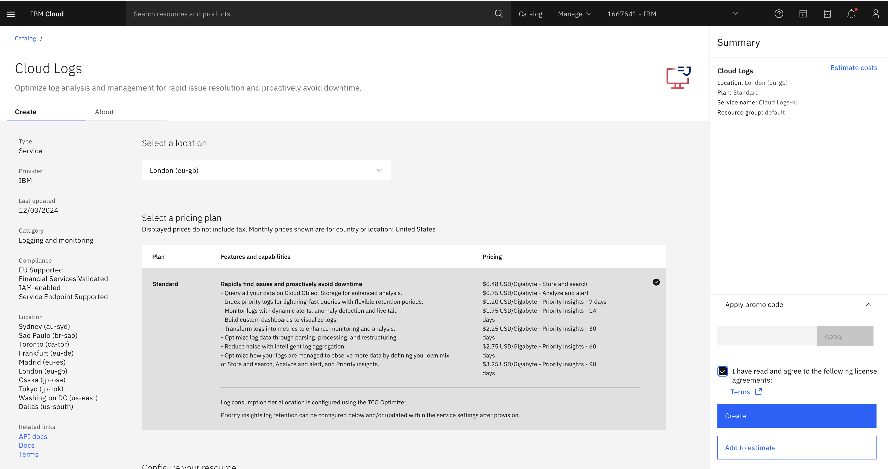

- Choose the region where your ICL instance is to be provisioned.
- Choose how many day's data is to be retained (default 7 days)

Provisioning will take a few minutes to complete.

> IBM Cloud Logs is paid service. Please bear in mind that provisioning an instance requires an IBM Cloud account with a payment method attached and will incur charges.

## Opt into platform logs

Once provisioned, ICL is ready to receive your application's logs - see the [documentation on how to send your own logging data](https://cloud.ibm.com/docs/cloud-logs?topic=cloud-logs-cl-operational-logs) to IBM Cloud Logs.

To send your Cloudant services' logs to ICL we need to direct your "platform logs" to your newly provisioned ICL instance. Your service's "Getting Started" tab has a "Platform Logs" page:

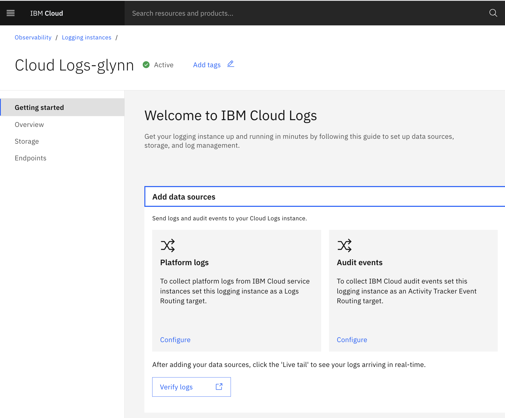

On a region-by-region basis, choose the target ICL instance that is to handle that region's logs

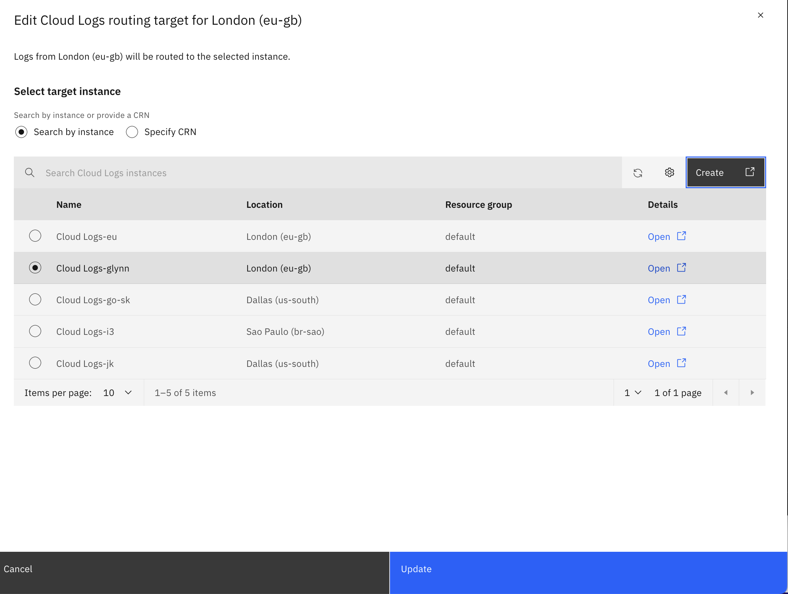

That's it! Logs from platform services in that region should start flowing to ICL.

## Raw logs

The ICL dashboard has a triangular "play" button which will allow the live logs to be "tailed" in the web interface:

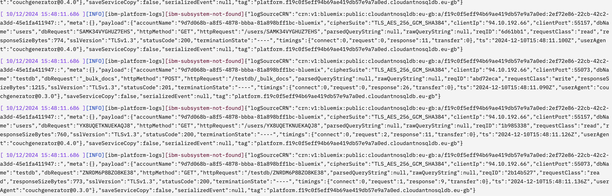

This is good way to verify that logs are flowing correctly. Cloudant's log entries look like this:

```
[ 11/12/2024 09:52:49.377 ][INFO][ibm-platform-logs][ibm-subsystem-not-found]{"logSourceCRN":"crn:v1:bluemix:public:cloudantnosqldb:eu-gb:a/f19c0f5eff94b69ae419db57e9a7a0ed:2ef72e86-22cb-42c2-a3dd-45e1fa411947::","meta":{},"payload":{"accountName":"a1b2c3d4e5f6g7h8i9ja","cipherSuite":"TLS_CHACHA20_POLY1305_SHA256","clientIp":"94.10.192.66","clientPort":61224,"dbName":"testdb","dbRequest":"JU80O0EC01QBGTNK","httpMethod":"GET","httpRequest":"/testdb/JU80O0EC01QBGTNK?meta=true","parsedQueryString":{"meta":"true"},"rawQueryString":"meta=true","reqID":"f2f1d9e0","requestClass":"read","responseSizeBytes":818,"sslVersion":"TLSv1.3","statusCode":200,"terminationState":"----","timings":{"connect":29,"request":0,"response":12,"transfer":0},"ts":"2024-12-11T09:52:48.899Z","userAgent":"ccurl/1.0.0(nodev22.12.0)"},"saveServiceCopy":false,"serializedEvent":null,"tag":"platform.f19c0f5eff94b69ae419db57e9a7a0ed.cloudantnosqldb.eu-gb"}
```

Breaking out the JSON:

```js
{
  "logSourceCRN": "crn:v1:bluemix:public:cloudantnosqldb:eu-gb:a/abc123:xyz789::",
  "meta": {},
  "payload": {
    "accountName": "a1b2c3d4e5f6g7h8i9ja",
    "cipherSuite": "TLS_CHACHA20_POLY1305_SHA256",
    "clientIp": "94.10.192.66",
    "clientPort": 61224,
    "dbName": "testdb",
    "dbRequest": "JU80O0EC01QBGTNK",
    "httpMethod": "GET",
    "httpRequest": "/testdb/JU80O0EC01QBGTNK?meta=true",
    "parsedQueryString": {
      "meta": "true"
    },
    "rawQueryString": "meta=true",
    "reqID": "f2f1d9e0",
    "requestClass": "read",
    "responseSizeBytes": 818,
    "sslVersion": "TLSv1.3",
    "statusCode": 200,
    "terminationState": "----",
    "timings": {
      "connect": 29,
      "request": 0,
      "response": 12,
      "transfer": 0
    },
    "ts": "2024-12-11T09:52:48.899Z",
    "userAgent": "ccurl/1.0.0(nodev22.12.0)"
  },
  "saveServiceCopy": false,
  "serializedEvent": null,
  "tag": "platform.f19c0f5eff94b69ae419db57e9a7a0ed.cloudantnosqldb.eu-gb"
}
```

- `payload.accountName` defines which Cloudant instance is being accessed.
- `payload.ts` shows when the request arrived (UTC timezone).
- `payload.clientIp`/`payload.clientPort` shows where the request came from and `payload.userAgent` shows how the client advertised their "user agent".
- `payload.dbName` shows which database was accessed and `payload.dbRequest` shows which resource within the database that was requested.
- `payload.httpMethod`, `payload.httpRequest` and `payload.parsedQueryString` break down the HTTP request and `payload.statusCode` shows the HTTP status code sent in reply with `payload.responseSizeBytes` showing how many bytes were sent back to the client.
- `payload.requestClass` indicates how the request was treated for billing purposes. A "read" is a single-document fetch, a "write" is an insert/update/delete operation and a "query" is multi-document fetch, such as a MapReduce, Cloudant Query, Cloudant Search or "all_docs" request.
- `payload.timings` breaks down how long the request took to be received and how long the database took to respond:
  - `payload.timings.connect` - the number of milliseconds it took the client to connect a socket to Cloudant. A small delay is expected when the client connects to Cloudant and a TLS negotiation occurs. The Cloudant SDKs will keep this socket alive for a time so subsequent connections may see a zero `connect` value.
  - `payload.timings.request` - the number of milliseconds it took to send the request to Cloudant.
  - `payload.timings.response` - the number of milliseconds it took Cloudant to respond to the request after it arrived.
  - `payload.timings.transfer` - the number of milliseconds it took to send the response back to the client. The total round trip of the request is the sum of the connect/request/response/transfer values.
- `payload.reqID` - a unique string that can be used to identify an individual Cloudant request. This value is handy to quote when creating support tickets.

## Querying logs

The ICL dashboard provides two querying mechanisms for selecting subsets of logs from within your log retention window (default: 7 days).

### Querying with Lucene

Lucene query language allows slices of data to be fetched including exact matching log item keys to supplied values (with AND / OR logic), wildcard search, numeric ranges and full-text matching.

The [documentation](https://cloud.ibm.com/docs/cloud-logs?topic=cloud-logs-query-data-lucene) has some generic examples, but some Cloudant-specific queries are listed below:

```
# find requests that received an HTTP 429 response when talking to the users database
payload.statusCode:429 AND payload.dbName:users

# find requests where the response code is > 400 for the users/products databases
payload.statusCode:[400 TO 600] AND (payload.dbName:users OR payload.dbName:products)
```

The results page shows simple aggregations on a time line and the time window can be set to any range within your logs' retention window e.g "last hour":

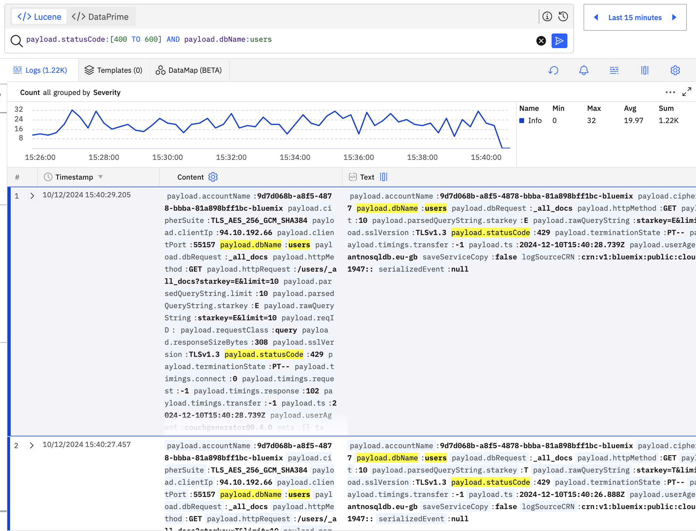

## Querying with DataPrime

Logs may also be queried and aggregated using the DataPrime query language, as explained in the [documentation](https://cloud.ibm.com/docs/cloud-logs?topic=cloud-logs-query-data-dataprime).

DataPrime works by narrowing the search by piping selection and aggregation operations together e.g.:

```
# take all the logs, keep only INFO logs, count requests by request class
# and order by the count, descending
source logs | filter $m.severity == INFO | groupby payload.requestClass aggregate count() as request_count | orderby -$d.request_count
```

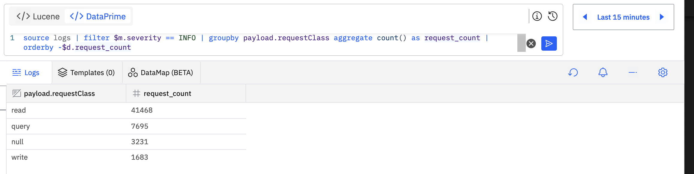

See the [documentation](https://cloud.ibm.com/docs/cloud-logs?topic=cloud-logs-dataprime-ref) on how to build DataPrime queries.

## Dashboards

Dashboards are user-configurable web pages containing graphs, charts, tables and gauges to present an at-a-glance view of your application. Some examples of how Cloudant's logs can be presented in dashboards are shown below.

### Latency by request class

Add a line chart to a custom dashboard that plots `payload.timings.response` grouped by `payload.requestClass`:

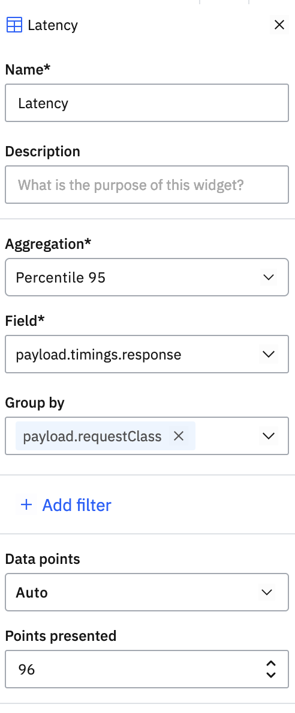

The result shows three lines, one each for read/write/query operations:

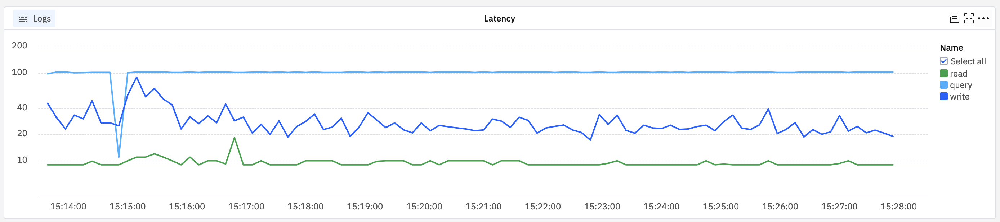

### Rate-limited operations by request class

Create a bar chart to a custom dashboard with a filter where `payload.statusCode` equals `429` to only show rate-limited requests. Plot the count of such requests grouped by `payload.requestClass`.


The result is bars representing the number of rate-limited requests for read/write/query classes.

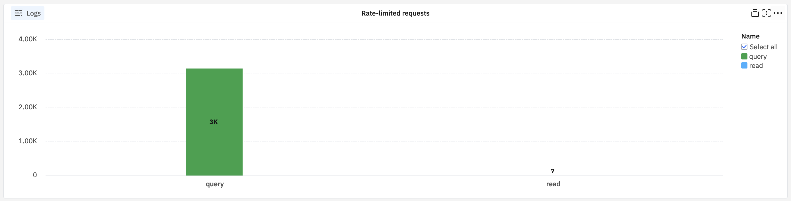

### Request count chart by database

Create a pie chart on a custom dashboard to count log items by `payload.dbName`:

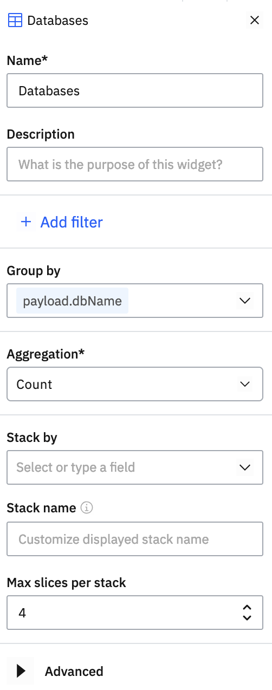

The result shows the most used databases represented as a pie chart:

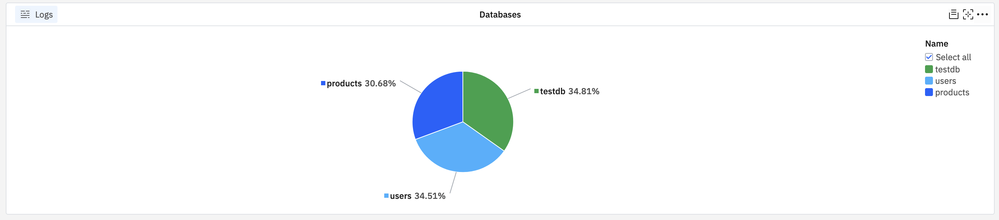

### Request count table by status code

Create a new table in a custom dashboard, configuring the counts of requests grouped by `payload.statusCode`:

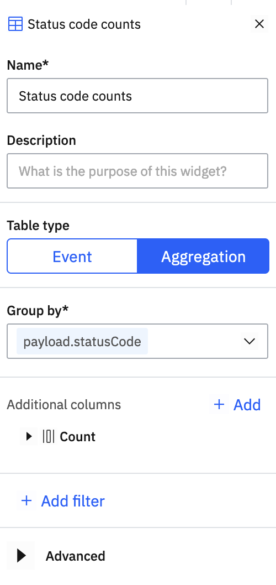

The result is a simple table listing database names and the number of requests recorded against each:

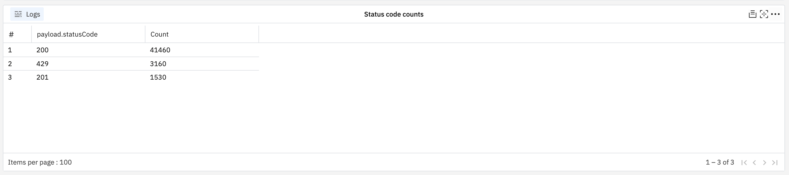
