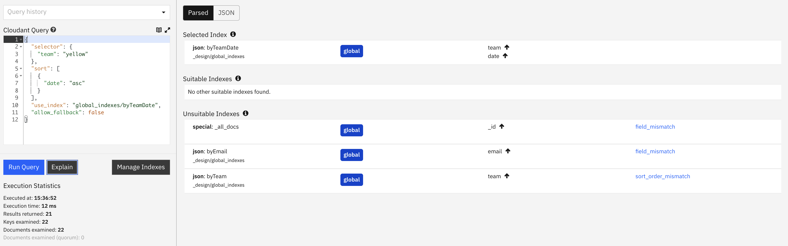
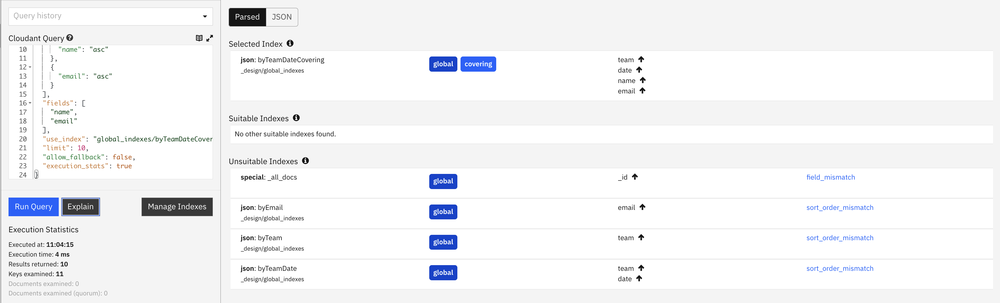

Cloudant's [POST /{db}/_find](https://cloud.ibm.com/apidocs/cloudant#postfind) endpoint allows queries to be sent to Cloudant that pick subsets of data from a collection of JSON documents. The database will first look for a secondary index that can assist in answering a query - if suitable indexes are found that can benefit the query, the best index is selected to be used to execute the query.

If no suitable index is found, then in most cases Cloudant Query falls back to scanning each document in the database in turn to find documents matching the query. If the documents being sought are not common in the data set, then Cloudant may have to scan hundreds or even thousands of documents per document returned. Discerning customers will not want this inefficient behaviour in production, and there's a new flag in Cloudant Query which can prevent it happening.

In this blog post we'll discuss what the new `allow_fallback` flag does and how it should be used.

## Sample data 

To give a concrete example, we have a database called `fallback` which contains fifty thousand documents of this form:

```js
{
  "_id": "0004e53a0a2b4a83818c8d0fa4cf6157",
  "name": "Ashleigh Granger",
  "email": "ashleighgranger5451@hotmail.com",
  "president": "William Henry Harrison",
  "date": "2025-01-11T18:59:06.324Z",
  "team": "red"
}
```

A database without any secondary indexes can be used to retrieve data by the documents' `_id` field or by ranges of ids, but to find documents using attributes within the document body itself, we need to perform a query - preferably a query backed by a secondary index.

## Querying without an index

If we try to perform a query on this database without any indexes present, then it will work albeit very slowly, because the index will fall back to scanning the `_all_docs` primary index - that is reading all of the database's documents in turn until it has enough matching documents to satisfy the request.

If we try a query:

```js
{
  "selector": {
    "team": "yellow"
  },
  "fields": [
    "name",
    "email"
  ],
  "limit": 100,
  "execution_stats": true
}
```

The execution statistics show that we scanned six times as many documents as we returned. i.e the database did much more work than necessary to achieve the result.

```js
{
  "docs": [
    ...
  ],
  "bookmark": "xyz",
  "execution_stats": {
    "total_keys_examined": 604,
    "total_docs_examined": 604,
    "total_quorum_docs_examined": 0,
    "results_returned": 100,
    "execution_time_ms": 13.337
  },
  "warning": "No matching index found, create an index to optimize query time."
}
```

> `total_keys_examined` shows that 604 index rows were scanned. `total_docs_examined` shows that 604 full document bodies were also loaded to satisfy the request. `results_returned` shows that 100 documents were returned matching the query selector. Notice that `warning` field that indicating that no useful index was found to assist with the query.

If we search for rarer data, the situation is even worse:

```js
POST /fallback/_find
{
  "selector": {
    "email": "ashleighgranger5451@hotmail.com"
  },
  "fields": [
    "name"
  ],
  "limit": 100,
  "execution_stats": true
}
```

There is only one matching document in the database that matches the query, but without an index Cloudant doesn't know that and has to scan _all_ of the documents to get the answer - so 50,000 documents are scanned to find the matching one! The execution statistics bear this out:

```js
{
  "docs": [ { "name": "Ashleigh Granger" } ],
  "bookmark": "g1AAAABwe",
  "execution_stats": {
    "total_keys_examined": 50000,
    "total_docs_examined": 50000,
    "total_quorum_docs_examined": 0,
    "results_returned": 1,
    "execution_time_ms": 633.329
  },
  "warning": "No matching index found, create an index to optimize query time.\nThe number of documents examined is high in proportion to the number of results returned. Consider adding a more specific index to improve this."
}
```

Production systems that rely on such inefficient queries will be prone to long latencies, variable performance and in extreme cases, timeouts. The more documents in the database, the slower this query will perform, eating up precious database resources and making other queries run more slowly.

## Avoid falling back to full database scans

Adding the `allow_fallback: false` flag to a query instructs Cloudant to never perform a full database scan if there is no matching index. A query that doesn't have a supporting index will refuse to execute:

```js
POST /fallback/_find
{
  "selector": {
    "email": "ashleighgranger5451@hotmail.com"
  },
  "fields": [
    "name"
  ],
  "allow_fallback": false
}
```

The above query gets an HTTP 400 response, in other words Cloudant as refused to execute the query because in doing so it would have had to scan the "all_docs" primary index.

To get this query to work, we need a suitable secondary index, so let's create some indexes!

## Creating some indexes

Indexes are created by calling the [POST /{db}/_index](https://cloud.ibm.com/apidocs/cloudant#postindex) endpoint, passing a list of fields to index along with some index meta data.

First an index on `team` and `date`:

```js
POST /fallback/_index
{
  "index": {
    "fields": [
      "team",
      "date"
    ]
  },
  "name": "byTeamDate",
  "ddoc": "global_indexes",
  "type": "json"
}
```

Second, an index on `team`:

```js
POST /fallback/_index
{
  "index": {
    "fields": [
      "team"
    ]
  },
  "name": "byTeam",
  "ddoc": "global_indexes",
  "type": "json"
}
```

Finally, an index on `email`:

```js
{
  "index": {
    "fields": [
      "email"
    ]
  },
  "name": "byEmail",
  "ddoc": "global_indexes",
  "type": "json"
}
```

Notice how we specify the `ddoc` (the design document) in which these index definitions will live. We will use this `ddoc` value and the `name` of the index at query-time to specify the index we wish to use for each query (with the `use_index` parameter).

## Querying without falling back

Now we can query, safe in the knowledge that our queries will use an index and never fall back on a full database scan. A query for a single team can use the `byTeam` index:

```js
POST /fallback/_find
{
  "selector": {
    "team": "yellow"
  },
  "limit": 100,
  "allow_fallback": false,
  "execution_stats": true
}
```

If we know which index we want Cloudant to use we can add `use_index` supplying the design document / index name that we think would be useful. This will be evaluated by Cloudant for its suitability - if it's the best matching index, it will be used:

```js
POST /fallback/_find
{
  "selector": {
    "team": "yellow"
  },
  "use_index": "global_indexes/byTeam",
  "limit": 100,
  "allow_fallback": false,
  "execution_stats": true
}
```

If we attempt to perform a query which has no suitable index, like adding a sort parameter, the query will refuse to execute:

```js
POST /fallback/_find
{
  "selector": {
    "team": "yellow"
  },
  "sort": [
    {
      "president": "asc"
    }
  ],
  "use_index": "global_indexes/byTeamDate",
  "limit": 100,
  "allow_fallback": false,
  "execution_stats": true
}

HTTP 400 Bad Request
```

> When `allow_fallback: false` is supplied, a query will either execute with an index or not at all. This makes Cloudant Query much more deterministic and avoids "runaway" queries that eat up too many system resources.

Cloudant's [POST /{db}/_explain](https://cloud.ibm.com/apidocs/cloudant#postexplain) endpoint is used to reveal the index selection process for a given query. In the Cloudant dashboard, the output of this endpoint is visualised:



Our worst-performing query can now use an index and never fall back to a full scan:

```js
POST /fallback/_find
{
  "selector": {
    "email": "ashleighgranger5451@hotmail.com"
  },
  "fields": [
    "name"
  ],
  "use_index": "global_indexes/byEmail",
  "allow_fallback": false,
  "execution_stats": true
}
```

The executions stats show that the above query is now only scanning a single document to get the results, instead of scanning all fifty thousand documents.

```js
{
  "docs": [ { "name": "Ashleigh Granger" } ],
  "bookmark": "g1AAAAB1eJw1y0E",
  "execution_stats": {
    "total_keys_examined": 1,
    "total_docs_examined": 1,
    "total_quorum_docs_examined": 0,
    "results_returned": 1,
    "execution_time_ms": 3.557
  }
}
```

Using `allow_fallback: false` allows application developers to have certainty that their application will either use a helpful index or refuse to execute at all. It can be combined with `use_index` to hint to Cloudant which index to use - this can be a useful in-code aide memoir as to which index assists which query. The execution statistics numerate the efficiency of a query, with a perfectly optimised query loading only the documents it needs to satisfy the query.

## Covering indexes

We saw in the [Explaining Explain blog post]() that a "covering index" is one where the index contains enough information to satisfy the fields required by the query. A query using a covering index is faster than one powered by a non-covering index because Cloudant doesn't have to load the resultant documents from the database - all of the data is in the index itself.

Let's say we want the names and emails of people who belong to a known team. We would add a `fields` parameter to our query that uses the `byTeam` index:

```js
POST /fallback/_find
{
  "selector": {
    "team": "yellow"
  },
  "fields": ["name", "email"],
  "use_index": "global_indexes/byTeam",
  "limit": 10,
  "allow_fallback": false,
  "execution_stats": true
}
```

This is an efficient query, but it isn't supported by a _covering index_ - Cloudant still has to load the matching documents to find the `name` and `email` fields, because that data isn't in the `byTeam` index.

If instead we put the `name` and `email` into the index itself, as well as the `team` and `date` fields:

```js
POST /fallback/_index
{
  "index": {
    "fields": [
      "team",
      "date",
      "name",
      "email"
    ]
  },
  "name": "byTeamDateCovering",
  "ddoc": "global_indexes",
  "type": "json"
}
```

we now have an index on `team`/`date`/`name`/`email`. It can be used if we use the query from before, but with an additional `sort` parameter so that our query & sort matches the order of data in the index:

```js
POST /fallback/_find
{
  "selector": {
    "team": "yellow"
  },
  "sort": [
    {
      "date": "asc"
    },
    {
      "name": "asc"
    },
    {
      "email": "asc"
    }
  ],
  "fields": [
    "name",
    "email"
  ],
  "use_index": "global_indexes/byTeamDateCovering",
  "limit": 10,
  "allow_fallback": false,
  "execution_stats": true
}
```

We now have a query backed by a covering index, and the explain button in the Cloudant Dashboard proves it:



> Notice how "documents examined" is now zero - because a covering index was used, no additional document bodies were loaded to service the query, making execution faster.

## Summary

In conclusion, let us briefly summarize the main points of consideration when working with indexes:

- Create indexes to back your applications queries.
- A single index can be used for several use-cases, so that as few secondary indexes as possible are created.
- Make sure to use `execution_stats: true` when querying to reveal the efficiency of each query.
- Use the [POST /{db}/_explain](https://cloud.ibm.com/apidocs/cloudant#postexplain) endpoint to ensure that queries are using suitable indexes.
- Specify `allow_fallback: false` at query-time to configure Cloudant Query to only ever perform indexed queries and to never fall back to scanning the primary index for matches.
- Specify `use_index` to hint to Cloudant which index should be used. 
