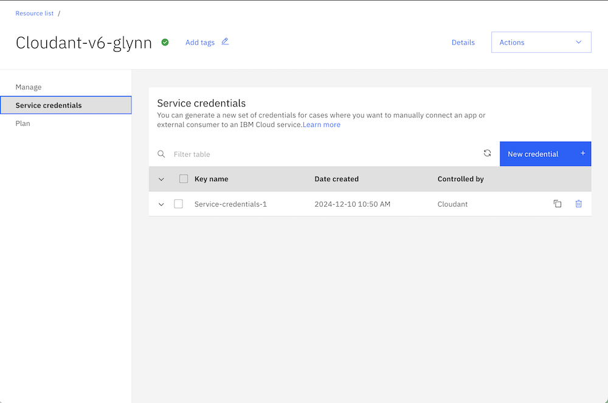
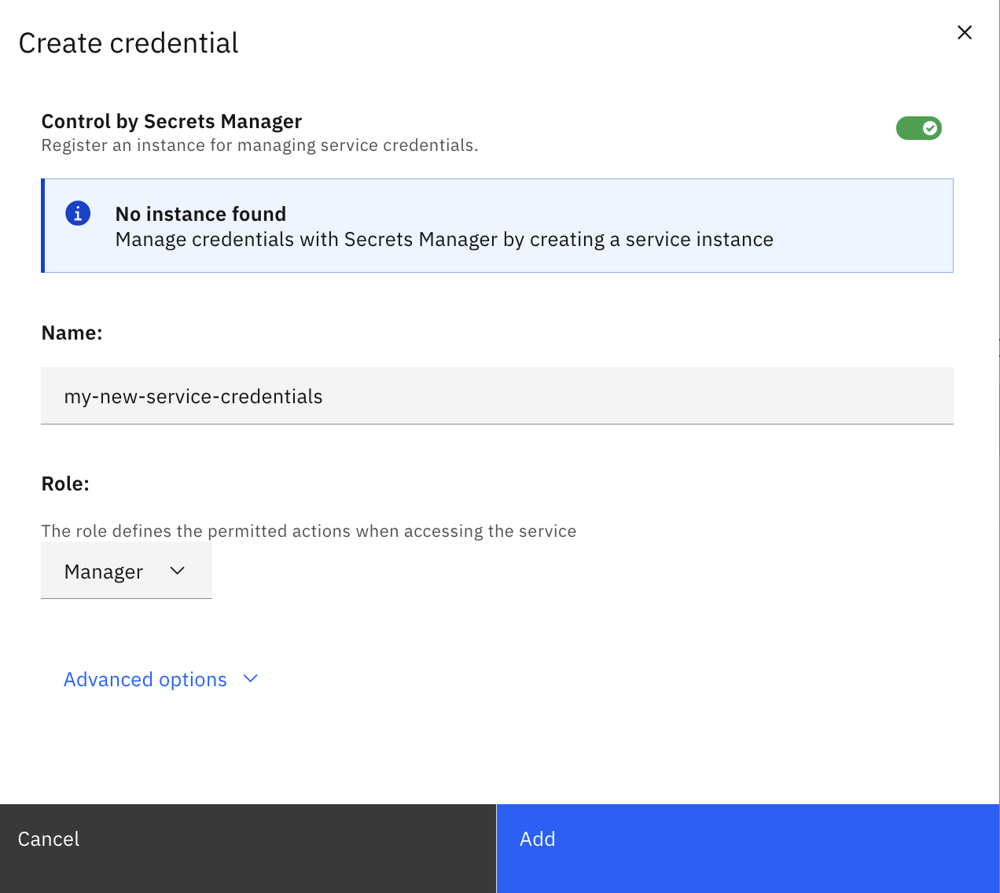

Cloudant's SDKs for [Java](https://github.com/IBM/cloudant-java-sdk), [Node.js](https://github.com/IBM/cloudant-node-sdk), [Python](https://github.com/IBM/cloudant-python-sdk) and [Go](https://github.com/IBM/cloudant-go-sdk) are official, supported libraries for building applications that store their data in IBM Cloudant databases. 

Cloudant has several of ways of handling authentication, all of which are supported in the SDKS. In this blog post, we'll explore the differences between the various methods and how the SDKs model each.

Additionally, we'll look at how an application could switch between authentication methods at run-time (with an application restart).

We'll begin by going through each authentication method in turn.

## Identity & Access Management (IAM)

### Containers

For applications running in containers in the IBM Cloud, [IBM IAM Trusted Profiles](https://cloud.ibm.com/docs/account?topic=account-create-trusted-profile&interface=ui) can be used to grant compute resources (CR) access to database resources based on IAM rules.

The CR token is exchanged for a time-limited "access token" which is sent to Cloudant with each request, and updated as it approaches expiry e.g.

```sh
CLOUDANT_AUTH_TYPE=CONTAINER
CLOUDANT_URL=<url>
CLOUDANT_IAM_PROFILE_ID=<id>
# or CLOUDANT_IAM_PROFILE_NAME=<name>
```

### VPC

Similarly, for VPC-based applications, the VPC's identity token is exchanged for an access token. 

See [IBM IAM Trusted Profiles documentation](https://cloud.ibm.com/docs/account?topic=account-create-trusted-profile&interface=ui) e.g.

```sh
CLOUDANT_AUTH_TYPE=VPC
CLOUDANT_URL=<url>
CLOUDANT_IAM_PROFILE_ID=<id>
# or CLOUDANT_IAM_PROFILE_NAME=<name>
```

### IAM API keys

IAM API keys can come from a Cloudant instance's service credentials, or can be an API key that is attached to any [IAM identity](https://cloud.ibm.com/docs/account?topic=account-identity-overview). Through IAM's rich range of controls, an API can be used to access a single Cloudant instance, multiple Cloudant instances, a whole range of IBM Cloud services or just an individual Cloudant database within an instance.

The Cloudant SDKs exchange the supplied IAM API key for a time-limited token which is transmitted to Cloudant as a header. The token is refreshed automatically as it nears its expiry time. e.g.

```sh
CLOUDANT_AUTH_TYPE=IAM
CLOUDANT_URL=<url>
CLOUDANT_APIKEY=<apikey>
```

## Legacy Authentication with Username & Password

Cloudant has another authentication mechanism where users with a suitable username and password pair can be granted access to Cloudant. The username/password pair can either by:

- the username/password generated in the Cloudant service's credentials.
- or a database-level apikey/password pair, created in the Cloudant dashboard or [programmatically](https://cloud.ibm.com/apidocs/cloudant?code=node#postapikeys). Note that these "api keys" are, confusingly, not IAM API keys but originate from Apache CouchDB's authentication mechanism.

The authentication process works in one of two ways:

1. Session cookies - the client calls the Cloudant instance's `_session` endpoint to get a time-limited cookie which is stored by the cleint and sent on subsequent API calls. The session is renewed automatically on expiry.
2. or Basic auth - the username/password pair is base64 encoded and passed to the server as a header with each request.

> Session cookies is the preferred way to do non-IAM authentication because the secret credentials are sent from client to server less frequently.

```sh
CLOUDANT_AUTH_TYPE=COUCHDB_SESSION
CLOUDANT_URL=<url>
CLOUDANT_USERNAME=<username>
CLOUDANT_PASSWORD=<password>
```

## Generating service credentials

In the IBM Cloud dashboard, select a Cloudant service, select the "Service Credentials" menu and click "New". 



Choose the type of access required and click "Add" to generate a set of service credentials.



The service credentials contain a number of attributes including:

- `apikey` - the IAM API key required for IAM authentication.
- `host` - the url where the Cloudant service is served out from. Add `https://` to the start of this string to form the URL required by the SDKs.
- `username` - the username required for Basic/Session authentication.
- `password` - the password required for Basic/Session authentication.

> Note: if the `password` attribute is not present in the service credentials, then it means the Cloudant instance was created as an "IAM-only" instance. If you would like to convert this to an "IAM + Legacy instance", to unlock the option of non-IAM authentication, then please raise a support ticket.

> Also note: Regardless of the "Role" chosen when creating a set of credentials, the username/password credentials (if created) will be admin-level credentials. That is the "Role" pull-down refers to the role that the IAM API key will assume, not the basic/session credentials.

Service credentials can also be created using the [IBM Cloud CLI](https://cloud.ibm.com/docs/Cloudant?topic=Cloudant-creating-an-ibm-cloudant-instance-on-ibm-cloud-by-using-the-ibm-cloud-cli#creating-credentials-service-create-cli) or through Terraform.

These service credentials only scratch the surface of what IBM IAM can do, so [take note](https://cloud.ibm.com/docs/account?topic=account-cloudaccess) of the many ways that IAM can be used to simplify credential management across the whole application for a range of IBM Cloud services. 

## Using Cloudant credentials with the Cloudant SDKs

All of the Cloudant SDKs have three methods of specifying credentials in an application:

1. As environment variables.
2. Using a credentials file.
3. Programmatically.

### Environment variables

For IAM API key authentication we need the environment variables:

```sh
CLOUDANT_URL=<url>
CLOUDANT_APIKEY=<apikey>
CLOUDANT_AUTH_TYPE=IAM
```

> Note the default value of `CLOUDANT_AUTH_TYPE` is `IAM` when an api key is specified, so the `CLOUDANT_AUTH_TYPE` environment variables isn't needed but is useful as an 
aide-mémoire as to which method is in use.

For session authentication we need:

```sh
CLOUDANT_URL=<url>
CLOUDANT_USERNAME=<username>
CLOUDANT_PASSWORD=<password>
CLOUDANT_AUTH_TYPE=COUCHDB_SESSION
```

> Note: it is perfectly fine to supply the `CLOUDANT_APIKEY`, `CLOUDANT_USERNAME` and `CLOUDANT_PASSWORD` and use `CLOUDANT_AUTH_TYPE` to switch between `IAM` (the default) and `COUCHDB_SESSION` the next best option. This could be useful if your application loses connectivity to the IBM IAM service - simply flip `CLOUDANT_AUTH_TYPE` to `COUCHDB_SESSION` and restart the application, to bypass the dependency on the IAM service.

An application that incorporates any of the Cloudant SDKs will detect these environment variables and seamlessly handle any API calls required to exchange credentials for time-limited tokens - including updating tokens as they approach expiry.

### Credentials file

Create a file called `ibm-credentials.env` (or set the environment variable `IBM_CREDENTIALS_FILE` with the path to the file). The credentials file contains the same data as we set for the environment variables method:

For IAM:

```sh
CLOUDANT_URL=<url>
CLOUDANT_APIKEY=<apikey>
CLOUDANT_AUTH_TYPE=IAM
```

For session auth:

```sh
CLOUDANT_URL=<url>
CLOUDANT_USERNAME=<username>
CLOUDANT_PASSWORD=<password>
CLOUDANT_AUTH_TYPE=COUCHDB_SESSION
```

Or we can put both sets of credentials in the file and use `CLOUDANT_AUTH_TYPE` to choose which to use at runtime (application restart required):

```sh
CLOUDANT_URL=<url>
CLOUDANT_APIKEY=<apikey>
CLOUDANT_USERNAME=<username>
CLOUDANT_PASSWORD=<password>
# CLOUDANT_AUTH_TYPE=IAM
CLOUDANT_AUTH_TYPE=COUCHDB_SESSION
```

### Programmatic configuration

Each SDK language, [Java](https://cloud.ibm.com/apidocs/cloudant?code=java#programmatic-authentication), [Node](https://cloud.ibm.com/apidocs/cloudant?code=node#programmatic-authentication), [Python](https://cloud.ibm.com/apidocs/cloudant?code=python#programmatic-authentication) and [Go](https://cloud.ibm.com/apidocs/cloudant?code=go#programmatic-authentication) have their own ways of specifying the authentication type and credentials.

If using this option with the SDKs, then the code would have to initialise different authenticator classes depending on some application configuration. A an application restart would be required e.g.

```js
let authenticator
const AUTH_TYPE = process.env.AUTH_TYPE || 'IAM'

if (AUTH_TYPE === 'IAM') {
  authenticator = new IamAuthenticator({
      apikey: '{apikey}'
  })
} else {
  authenticator = new CouchdbSessionAuthenticator({
    username: '{username}',
    password: '{password}'
  })
}
const service = new CloudantV1({
   authenticator
})

service.setServiceUrl('{url}')
```
