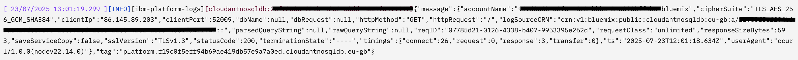

Cloudant generates a unique identifier for every incoming HTTP API request. This is a "uuid" that is returned to the user as a header and is recorded in Cloudant's service logs.

Cloudant now supports user-supplied request ids, allowing an application to better tie up its application's activity with Cloudant requests. 

This blog post demonstrates how to supply your own request ids using `curl` and the Cloudant SDKs.

## Cloudant request ids

When any HTTP request is made on Cloudant's API a unique request id is assigned and returned to the user as an HTTP header:

```sh
# supplying nothing yields a Cloudant-supplied x-couch-request-id
curl -v "$URL"
...
< x-couch-request-id: 07785d21-0126-4338-b407-9953395e262d
...
{
  "couchdb": "Welcome"
  ...
}
```

This unique identifer is also sent to the platform logs. If we tail the service logs, we can see the same request id go by:



> Note: Supplying a request id in a Cloudant support ticket helps the Cloudant support staff and operators to locate an individual API call more easily.

## Supplying your own request id

Sometimes it can be beneficial to supply your own request id instead of relying on the id generated by Cloudant e.g to allow an incoming API request into a customer application to be traced through the application stack.

To supply a custom request id, simply add a `x-request-id` header to the request e.g.

```sh
# supply your own id as a x-request-id header
curl -v -H "x-request-id: da07ec03-7d7f-45aa-b387-5d79c22c3ab8" "$URL"
# which is echoed in the reply header as x-request-id
...
< x-request-id: da07ec03-7d7f-45aa-b387-5d79c22c3ab8
...
{
  "couchdb": "Welcome"
  ...
}
```

> User-supplied ids using the `x-request-id` header should be a [v4 UUID](https://en.wikipedia.org/wiki/Universally_unique_identifier) - this is the recommended best practice. Alternatively, a string of 36 characters or less and consisting of only letters, numbers, dashes and underscores may be supplied as a `x-couch-request-id` header. 

## Supplying your own request id with the Cloudant SDKs

The SDKs can be used to set a custom request id too:

```js
import { randomUUID } from 'node:crypto'
import { CloudantV1 } from '@ibm-cloud/cloudant'

async function main() {

  // create Cloudant client, using environment variables
  // to store configuration
  const client = CloudantV1.newInstance({})

  // make an API call, supplying a custom header
  const myRequestID = randomUUID()
  console.log('Calling Cloudant with my request id', myRequestID)
  const info = await client.getServerInformation({ 
    headers: {
      'x-request-id': myRequestID
    }
  }).catch(e => {
    // The SDK includes the request ID in the `trace` debug info for errors
    console.log(`Error on request with ID ${e?.result?.trace}`)
  })
  console.log('Response', info)  
}
main()
```

Similar mechanisms to supply custom headers are also available in the [Go, Python and Java SDKs](https://github.com/IBM/ibm-cloud-sdk-common/?tab=readme-ov-file#sending-request-http-headers).

