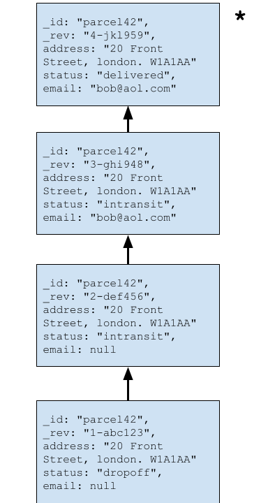
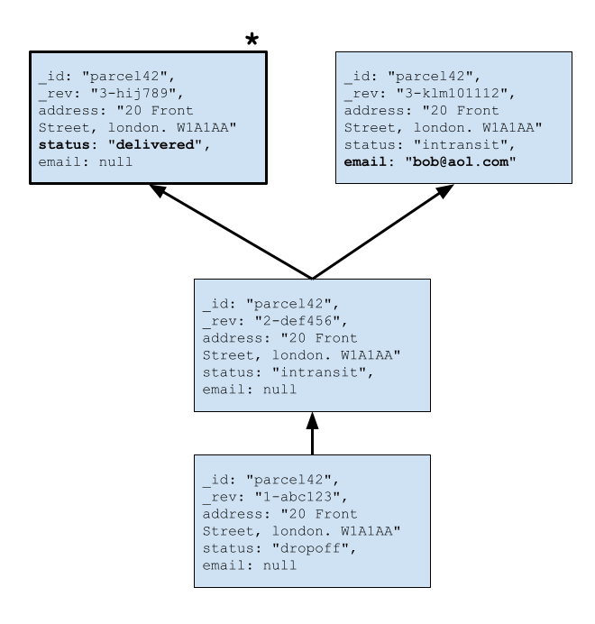

Cloudant used to occasionally create _conflicted_ documents when a document revision was modified in different ways at the same time, but now these _spurious conflicts_ are dramatically reduced with the latest Cloudant release.

In this blog post we'll discuss what spurious conflicts are and how the latest Cloudant release prevents such conflicts occurring in almost all cases.

## What is a spurious conflict?

For most Cloudant customers, conflicts are not a problem. Most customers have documents which are updated in a linear fashion, with each document revision cleanly superceding the last - so that the document's revision tree resembles a telegraph pole rather than a tree!

Branches in the revision tree, which are sometimes referred to as _conflicts_ occur in two ways:

1. In applications where multiple Cloudant services receive document writes for the same document revision, and replication reconciles the changes as a _conflict_ - a branch in the revision tree. These are _legitimate_ conflicts - Cloudant has retained the state from multiple separate write operations and stored all of the data in the database for the application to deal with.
2. With a single Cloudant instance, where multiple actors attempt to modify the same document revision in different ways at approximately the same time and where Cloudant accepts two or more of those writes. These are _spurious_ conflicts - the application didn't want to generate a conflict, it just happened that more than one of the application's writes clashed.

For some applications, conflicts can be extremely useful e.g. if a document represents a parcel and the delivery driver updates its state to "delivered" while at the same time the customer changes the notification email address. Both pieces of data are useful to keep, but they happened to be written at the same moment to different branches of the revision tree.

In such cases, applications will typically detect the conflict and merge the data according to the application-specific _conflict resolution strategy_ - in this case, keeping both JSON attributes in a new revision and deleting one of the branches.

For other users, conflicts are just a pain - customers want Cloudant to behave like a regular database and have only one source of truth. They would rather the database, in the case of simultaneous writes, accept one of the writes and reject the rest.

## A short detour into the HTTP 409 response

Cloudant's way of telling an API client that it is attempting to modify a document that has already been superceded is the **HTTP 409 response code**. Discussed in more detail in [this blog post](), the HTTP 409 response to a document write (insert, update or delete) means:

> Sorry we did not accept your write operation because the resource you are attempting to modify has already been changed.

Receiving an HTTP 409 for a document write does not mean that you _created a conflict_, it means that Cloudant _avoided_ creating a conflict by rejecting the write.

This is the long-accepted behaviour of a Cloudant database, and clients will typically fetch the document again to see what has changed before optionally attempting another write.

> The latest iteration of Cloudant builds on this behaviour, preventing almost all spurious conflicts being stored in the database, and instead will inevitably reject more writes, by correctly determining that the document revision being modified has already been changed.

## How does Cloudant avoid spurious conflicts now?

The exact mechanism is beyond the scope of this blog, but let's start by remembering that Cloudant stores data in triplicate. In previous versions of Cloudant, all three copies were updated in parallel, leaving updates potentially appearing in a different order in each copy of the data.

The new version of Cloudant picks a "leader" whose job it is to apply each document change in the order they arrive - these ordered changes are then fed to the other two copies, so that all three copies of the data get the same changes in the same order.

In practice it's more complicated than that:

- Databases contain a number of shards, so each shard range has its own leader, not just one leader per database.
- Sometimes a Cloudant node may be down for maintenance or upgrade - in these circumstances a different leader must take over if a node with leader responsibilities is down.
- Cloudant doesn't have the sense of a "leader election" as some databases do - instead, Cloudant leaders are chosen deterministically without an election.

The upshot is that in most cases, changes arrive in a database less chaotically so that each copy of each database shard gets the same changes in the same order, making it virtually impossible for a spurious conflict to be induced by fast document writes.

This is a huge boon for Cloudant users (especially those running a single Cloudant instance). They no longer have to worry about detecting conflicts, conflict resolution algorithms, or in the worst case, vacating a database to avoid heavily conflicted documents that cause performance problems.

## Does my code need to change?

Probably not. A Cloudant application is likely already checking the HTTP response code for the write API calls that it makes. It's worth examining how your code handles HTTP 409 responses when inserting, updating or deleting documents - Cloudant was already rejecting lots of clashing writes with HTTP 409s, but today it will only allow one simultaneous write to succeed and all the rest will fail.

- Insert - a 409 response when writing a new document means that the document that is being created already exists.
- Update - a 409 response to an update means that the document revision being changed has itself already been modified. No amount of retrying will help. The application will likely want to fetch the latest document revision. Is the data being written already there? Can the document changes being made be safely applied to the current document body?
- Delete - a 409 response to a delete means that the revision you are trying to delete has already been updated to a newer revision. Again, fetch the latest version and decide whether a retried deletion is the right course of action for your application.

> Remember that updating a document over and over in a short time window is still a Cloudant anti-pattern. The Cloudant service now more carefully verifies whether writes should be accepted or not, but it is still not a great idea to have many writes "racing" to write their state into the database.

## Conflicts can still happen

Although it's almost impossible to induce a spurious conflict in a document using normal API usage, it is still expected that Cloudant documents may contain conflicts if:

- There are multiple Cloudant instances connected by replication where more than one instance accepts writes at the same time.
- Data is replicated to and from remote CouchDB/PouchDB services and where writes are accepted to Cloudant and the remote database at the same time.
- Anywhere where `new_edits: false` is used for bulk writes - this is the case with the Cloudant replicator to ensure that all document revisions are replicated from source to target.

## What about my existing conflicted Cloudant database?

This new Cloudant feature helps prevent _new_ spurious conflicts being written to the database, but if you already have heavily conflicted documents in Cloudant, it is still worth reading how to [Repair a database with Cloudant Conflicts]().

## Read more

- [What is an HTTP 409?]().
- [Cloudant Conflicts]()
- [Repairing a database with Cloudant Conflicts]()
