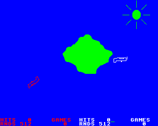
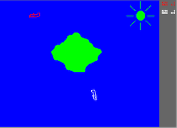
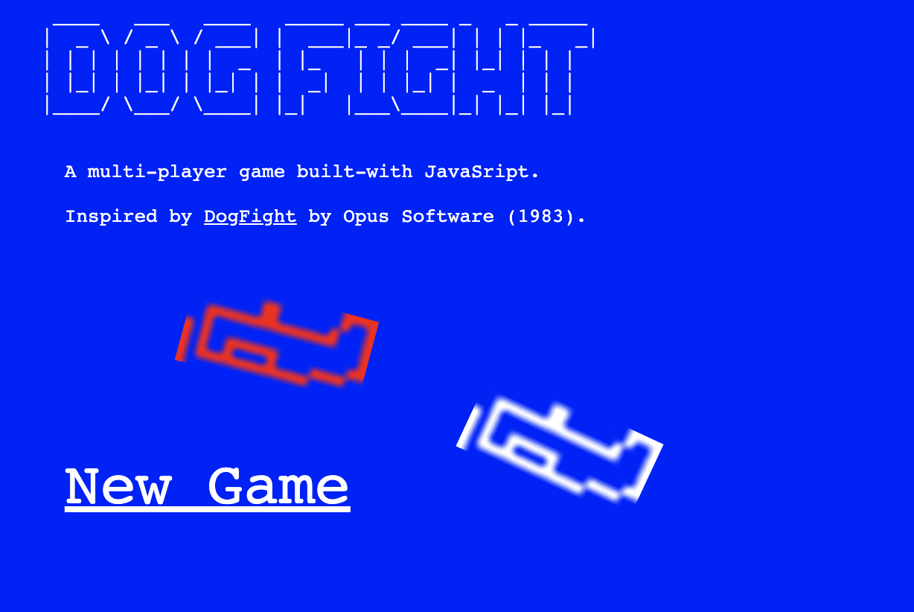

> The source code for this site is here https://github.com/glynnbird/dogfight

> Try it yourself at https://dogfight.glynnbird.com/

In 1983 I had a BBC Micro computer. One of my favourite games was [Dogfight](https://bbcmicro.co.uk/game.php?id=26).

I decided to recreate it in JavaScript.

## Screenshots

Original:

        
This version:

Homepage:

## Controls

### White plane

- left cursor - nose down
- right cursor - nose up
- space - fire

### Red plane

- Q - nose down
- W - nose up
- A - fire

## License

This is an open-source project published under the Apache-2.0 license. Feel free to build upon, reference or contribute to this project.

