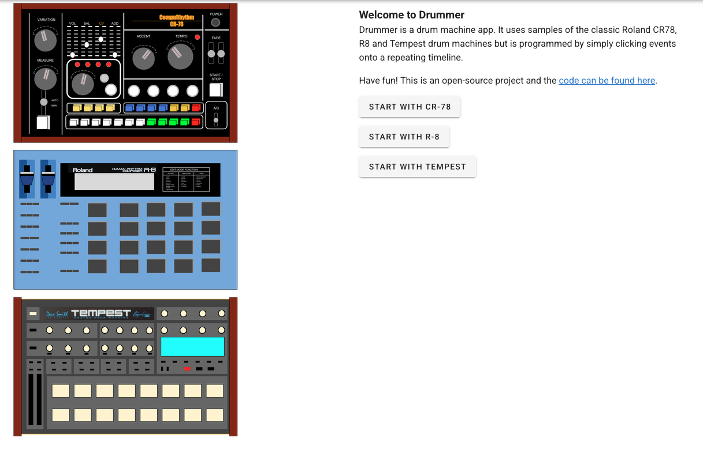

> The source code for this site is here https://github.com/glynnbird/drummer

> Try it yourself at https://drummer.glynnbird.com/

An demo that allows drum sequences to be composed and saved in a web interface.

- cr78
- r8
- tempest

The drum sounds are based on the Roland CR78, R8 & Tempest drum machines but are programmed using HTML check box controls on a time line.

It is built with the Howler JavaScript audio library and brought to life with Vue.js.

## Credits

Thanks to http://www.boxedear.com/free.html for the original samples.
