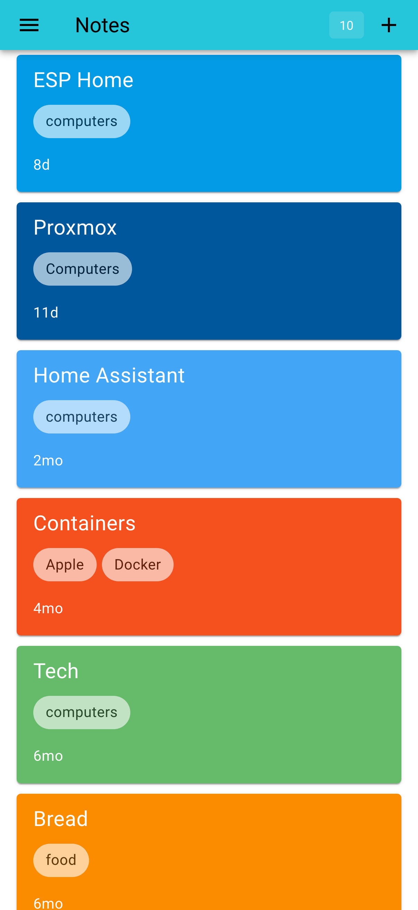

> The source code for this site is here https://github.com/glynnbird/notes

A simple markdown note taker web app built using the Cloudflare APIs.



## API calls

### Add a note

```sh
curl -X POST -H'Content-type:application/json' -H"apikey: $APIKEY" -d'{"title":"b","body":"## C\n\n Hello there!","timestamp": "2025-01-10T10:12:14.000Z"}' "https://notes.glynnbird.com/api/add"
{"ok":true,"id":"1763979632762"}
```

### Get a note

```sh
curl -X POST -H'Content-type:application/json' -H"apikey: $APIKEY" -d'{"id":"1763979632762"}' "https://notes.glynnbird.com/api/get"
{"ok":true,"doc":{"id":"1763979632762","title":"b","body":"## C\n\n Hello there!","timestamp":"2025-01-10T10:12:14.000Z","lastEdited":"1763979632762"}}
```

### List notes

```sh
curl -X POST -H'Content-type:application/json' -H"apikey: $APIKEY"  "https://notes.glynnbird.com/api/list"
{"ok":true,"list":[{"id":"1763979612816","title":"a","timestamp":"2025-01-10T10:12:13.000Z","lastEdited":"1763979612816"},{"id":"1763979632762","title":"b","timestamp":"2025-01-10T10:12:14.000Z","lastEdited":"1763979632762"}]}
```
