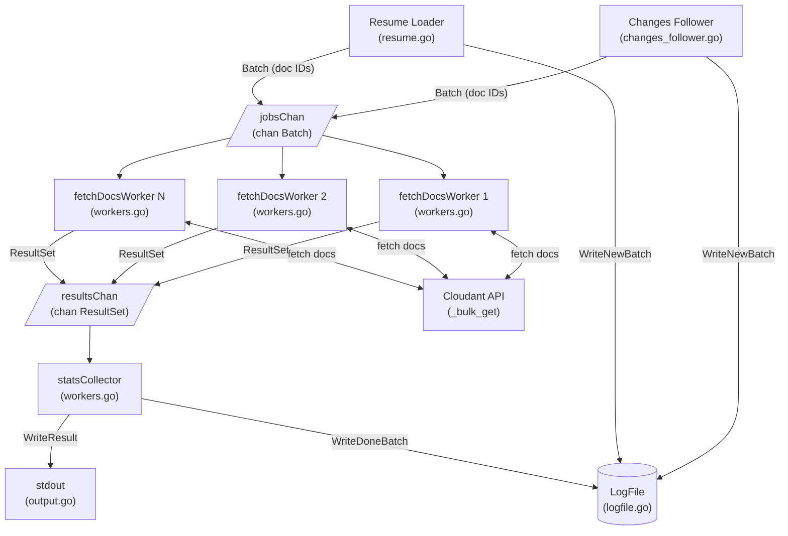

> The source code for this utility is here https://github.com/glynnbird/cloudantbackup

A backup utility for Cloudant databases.

## Installation

You will need to [download and install the Go compiler](https://go.dev/doc/install). Clone this repo then:

```sh
go build ./cmd/cloudantbackup
```

Then copy the resultant binary `cloudantbackup` (or `cloudantbackup.exe` in Windows systems) into your path.

## Configuration

`cloudantbackup` authenticates with your chosen Cloudant service using environment variables as documented [here](https://github.com/IBM/cloudant-go-sdk/blob/v0.10.8/docs/Authentication.md#authentication-with-environment-variables) e.g.

```sh
CLOUDANT_URL=https://xxxyyy.cloudantnosqldb.appdomain.cloud
CLOUDANT_APIKEY="my_api_key"
```

## Usage

Supply the name of the database to be backed up and pipe the output to a file:

```sh
cloudantbackup --db mydb > mydb.txt
```

## Parameters

- `--db` - the database name to backup (REQUIRED)
- `--parallelism` - the number of http requests in flight at any one time (default: 5)
- `--buffer-size` - the number of documents fetched with each bulk read request (default: 500)
- `--mode` - the backup mode. Either `full` or `shallow`. A `full` backup fetches all the revisions of each document, a `shallow` backup just fetches the winning revision. (default: full)
- `--log` - the filename where the backup log will be stored (not the backup data itself) (optional)
- `--resume` - a flag to indicate that a previously incomplete backup should be resumed (`--log` also required) (optional)
- `--since` - where to start the backup from (default: `0` - the beginning of time)

e.g.

```sh
cloudantbackup --db mydb --parallelism 10 --buffer-size 1000 --mode shallow > mydb.txt
```

## Output

The backup itself is written to stdout. It consists of a header line followed by one line per batch of backed-up documents:

```json
{"name":"@cloudant/couchbackup","version":"1.0.0","mode":"full"}
[{"_id":"a","_rev":"1-123","x":1}...]
```

A progress log is written to stderr:

```
025/11/25 11:37:35 saved 500 docs. Total: 500
2025/11/25 11:37:35 saved 500 docs. Total: 1000
2025/11/25 11:37:35 saved 500 docs. Total: 1500
2025/11/25 11:37:35 saved 500 docs. Total: 2000
2025/11/25 11:37:35 saved 500 docs. Total: 2500
2025/11/25 11:37:35 saved 500 docs. Total: 3000
2025/11/25 11:37:35 saved 500 docs. Total: 3500
2025/11/25 11:37:35 saved 500 docs. Total: 4000
2025/11/25 11:37:36 saved 500 docs. Total: 4500
2025/11/25 11:37:36 saved 500 docs. Total: 5000
2025/11/25 11:37:36 saved 500 docs. Total: 5500
2025/11/25 11:37:36 saved 500 docs. Total: 6000
2025/11/25 11:37:36 saved 500 docs. Total: 6500
2025/11/25 11:37:36 saved 500 docs. Total: 7000
2025/11/25 11:37:36 saved 500 docs. Total: 7500
2025/11/25 11:37:36 saved 500 docs. Total: 8000
2025/11/25 11:37:36 saved 500 docs. Total: 8500
2025/11/25 11:37:36 saved 500 docs. Total: 9000
2025/11/25 11:37:36 saved 500 docs. Total: 9500
2025/11/25 11:37:36 saved 500 docs. Total: 10000
2025/11/25 11:37:36 saved 500 docs. Total: 10500
2025/11/25 11:37:36 saved 500 docs. Total: 11000
2025/11/25 11:37:36 saved 500 docs. Total: 11500
2025/11/25 11:37:36 saved 500 docs. Total: 12000
2025/11/25 11:37:36 saved 500 docs. Total: 12500
2025/11/25 11:37:36 saved 500 docs. Total: 13000
2025/11/25 11:37:36 saved 500 docs. Total: 13500
2025/11/25 11:37:36 saved 500 docs. Total: 14000
2025/11/25 11:37:36 saved 500 docs. Total: 14500
2025/11/25 11:37:36 saved 500 docs. Total: 15000
2025/11/25 11:37:36 saved 500 docs. Total: 15500
2025/11/25 11:37:38 saved 500 docs. Total: 16000
2025/11/25 11:37:38 saved 500 docs. Total: 16500
2025/11/25 11:37:38 saved 500 docs. Total: 17000
2025/11/25 11:37:38 saved 500 docs. Total: 17500
2025/11/25 11:37:38 saved 500 docs. Total: 18000
2025/11/25 11:37:38 saved 500 docs. Total: 18500
2025/11/25 11:37:38 saved 500 docs. Total: 19000
2025/11/25 11:37:38 Changes follower complete. 23541 changes
2025/11/25 11:37:38 saved 500 docs. Total: 19500
2025/11/25 11:37:38 saved 500 docs. Total: 20000
2025/11/25 11:37:38 saved 500 docs. Total: 20500
2025/11/25 11:37:38 saved 500 docs. Total: 21000
2025/11/25 11:37:38 saved 500 docs. Total: 21500
2025/11/25 11:37:38 saved 500 docs. Total: 22000
2025/11/25 11:37:38 saved 41 docs. Total: 22041
2025/11/25 11:37:38 saved 500 docs. Total: 22541
2025/11/25 11:37:38 saved 500 docs. Total: 23041
2025/11/25 11:37:38 saved 500 docs. Total: 23541
```

## How does it work?



### Backup Execution Flow

When a backup is triggered, the following sequence of function calls occurs:

#### 1. Initialization (`backup.go`)
- **`New()`** - Creates a new CloudantBackup instance with default dependencies
  - Loads configuration via `NewAppConfig()` (from `appconfig.go`)
  - Sets up Cloudant SDK client
  - Calls `NewWithDeps()` to initialize the backup structure

#### 2. Main Execution (`backup.go`)
- **`Run(ctx)`** - Main orchestration function
  - Creates cancellable context for coordinated shutdown
  - Calls `loadResumeBatches()` to check for resume mode (from `resume.go`)
  - Calls `startWorkers()` to launch worker goroutines (from `workers.go`)
  - Calls `produceBatches()` to either resume or start fresh (from `resume.go`)
  - Calls `shutdownWorkers()` to clean up (from `workers.go`)
  - Calls `closeResources()` to flush and close files

#### 3. Batch Production (Normal Mode)
- **`produceBatches()`** (`resume.go`) - Decides between resume or fresh backup
- **`SpoolChangesFeed()`** (`backup.go`) - Coordinates changes feed processing
  - Calls `followChangesFeed()` (from `changes_follower.go`)
  - Logs completion and writes to log file

#### 4. Changes Feed Processing (`changes_follower.go`)
- **`followChangesFeed()`** - Consumes the changes feed
  - Creates changes follower via `changesFollowerFactory.New()`
  - For each change:
    - Calls `queueChange()` to buffer document IDs
    - When buffer is full, calls `dispatchBatchToWorker()`
  - On EOF, flushes remaining buffer via `dispatchBatchToWorker()`

- **`queueChange()`** - Adds document ID to buffer
  - Calls `dispatchBatchToWorker()` when buffer reaches capacity

- **`dispatchBatchToWorker()`** - Creates and sends batch to workers
  - Creates `Batch` via `NewBatch()` (from `batch.go`)
  - Writes to log file if enabled
  - Sends batch to `jobsChan` for worker processing

#### 5. Worker Goroutines (`workers.go`)
Multiple workers run concurrently, each executing:

- **`fetchDocsWorker()`** - Main worker loop
  - Calls `receiveJob()` to get next batch from `jobsChan`
  - Calls `processBatch()` to fetch and process documents
  - Calls `sendResult()` to send results to `resultsChan`

- **`processBatch()`** - Processes a single batch
  - Calls `fetchBulkDocs()` to make API call
  - Calls `extractDocuments()` to separate successful docs from errors
  - Marshals documents to JSON

- **`fetchBulkDocs()`** - Makes bulk get API call to Cloudant

- **`extractDocuments()`** - Processes bulk get results

#### 6. Results Collection (`workers.go`)
A single collector goroutine runs:

- **`statsCollector()`** - Collects and writes results
  - Writes backup header via `output.WriteHeader()` (from `output.go`)
  - For each result from `resultsChan`:
    - Writes batch to output via `output.WriteResult()`
    - Updates log file via `logFile.WriteDoneBatch()` (from `logfile.go`)
    - Logs progress to stderr

#### 7. Resume Mode (`resume.go`)
If `--resume` flag is set:

- **`loadResumeBatches()`** - Loads pending batches from log file
  - Calls `logFile.Load()` (from `logfile.go`)

- **`resumeBatches()`** - Re-enqueues pending batches
  - Sends each batch to `jobsChan` for processing

### Key Design Patterns

- **Producer-Consumer**: Changes feed produces batches, workers consume them
- **Fan-Out**: Multiple workers process batches in parallel
- **Fan-In**: Single collector aggregates results
- **Context Cancellation**: Coordinated shutdown on errors or completion
- **Buffering**: Document IDs are batched before fetching to optimize API calls

## Differences from couchbackup

- the goroutines that fetch the batches of documents execute in parallel, allowing the backup to proceed more quickly.
- the environment variables that configure the Cloudant service are those defined by the IBM Go SDK, not those used by couchbackup.
- shallow mode simply fetches winning revisions - it isn't a paginated "all docs" as in couchbackup.
- no `--attachments`
- no equivalent of couchrestore
